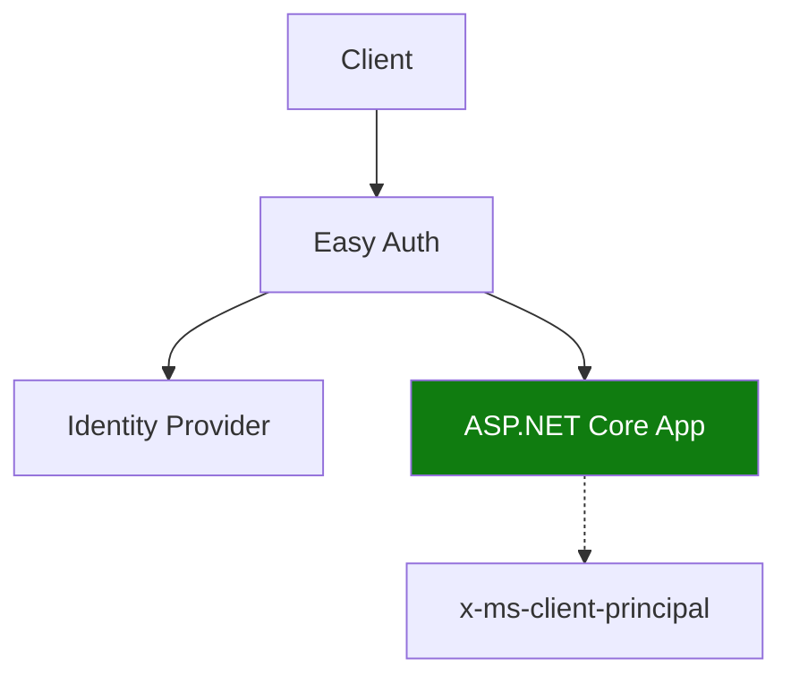

---
content_sources:
  diagrams:
    - id: use-easy-auth-to-handle-identity
      type: flowchart
      source: mslearn-adapted
      based_on:
        - https://learn.microsoft.com/azure/container-apps/authentication
        - https://learn.microsoft.com/azure/container-apps/authentication-identity-providers
---

# Recipe: Easy Auth in .NET Apps on Azure Container Apps

Use Easy Auth to handle identity at the edge, then map claims inside ASP.NET Core middleware.

<!-- diagram-id: use-easy-auth-to-handle-identity -->


## Prerequisites

- Container App (`$APP_NAME`) with ingress enabled
- Resource group (`$RG`) and identity provider registration
- Azure CLI with Container Apps extension

## Enable Easy Auth

```bash
az containerapp auth update \
  --name "$APP_NAME" \
  --resource-group "$RG" \
  --enabled true \
  --platform runtimeVersion "~1" \
  --global-validation unauthenticatedClientAction RedirectToLoginPage
```

## ASP.NET Core middleware for claims mapping

```csharp
using System.Security.Claims;
using System.Text;
using System.Text.Json;

var builder = WebApplication.CreateBuilder(args);
var app = builder.Build();

app.Use(async (context, next) =>
{
    if (context.Request.Headers.TryGetValue("x-ms-client-principal", out var headerValue))
    {
        var decoded = Encoding.UTF8.GetString(Convert.FromBase64String(headerValue!));
        using var doc = JsonDocument.Parse(decoded);
        var claims = new List<Claim>();
        foreach (var claim in doc.RootElement.GetProperty("claims").EnumerateArray())
        {
            claims.Add(new Claim(claim.GetProperty("typ").GetString()!, claim.GetProperty("val").GetString()!));
        }

        var identity = new ClaimsIdentity(claims, "EasyAuth");
        context.User = new ClaimsPrincipal(identity);
    }

    await next();
});

app.MapGet("/me", (HttpContext context) =>
{
    if (context.User.Identity?.IsAuthenticated != true)
    {
        return Results.Unauthorized();
    }
    return Results.Ok(context.User.Claims.Select(c => new { c.Type, c.Value }));
});

app.Run();
```

## Advanced Topics

- Normalize external claim names to internal policy names in one middleware stage.
- Use `RequireAuthorization` policies for role and tenant checks.
- Keep service-to-service authorization on managed identity, not user cookies.

## See Also

- [Managed Identity](managed-identity.md)
- [Key Vault Reference](key-vault-reference.md)
- [Identity and Secrets](../../../platform/identity-and-secrets/managed-identity.md)

## Sources

- [Authentication in Azure Container Apps](https://learn.microsoft.com/azure/container-apps/authentication)
- [Container Apps identity providers](https://learn.microsoft.com/azure/container-apps/authentication-identity-providers)
