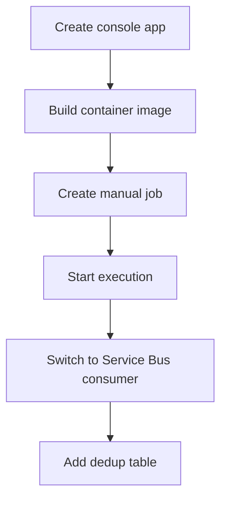

---
content_sources:
  diagrams:
    - id: dotnet-jobs-recipe-flow
      type: flowchart
      source: self-generated
      justification: Language recipe flow synthesized from Microsoft Learn Jobs guidance and .NET SDK usage patterns.
      based_on:
        - https://learn.microsoft.com/azure/container-apps/jobs
        - https://learn.microsoft.com/dotnet/api/overview/azure/identity-readme
        - https://learn.microsoft.com/dotnet/api/overview/azure/messaging.servicebus-readme
---

# Recipe: Jobs in .NET on Azure Container Apps

Use this recipe to build a .NET console Job, adapt it to process one Service Bus message, and add a dedup-table pattern for safe replay.

## Prerequisites

- Azure Container Apps environment and registry
- Azure Service Bus namespace and queue for the event-driven example
- .NET 8 SDK, Docker, and Azure CLI

```bash
export RG="rg-aca-dotnet-prod"
export ENVIRONMENT_NAME="aca-env-dotnet-prod"
export ACR_NAME="acrdotnetprod"
export JOB_NAME="job-dotnet-manual"
export EVENT_JOB_NAME="job-dotnet-servicebus"
export SERVICEBUS_NAMESPACE="sb-aca-prod"
export SERVICEBUS_QUEUE="orders"
```

## What You'll Build

- a manual .NET Job using a console entrypoint
- an event-driven Service Bus consumer that processes one message and exits
- a dedup-table example that you can later move to Azure SQL or PostgreSQL

## Steps

<!-- diagram-id: dotnet-jobs-recipe-flow -->


### 1. Create a manual .NET Job

`aca-dotnet-job.csproj`:

```xml
<Project Sdk="Microsoft.NET.Sdk">
  <PropertyGroup>
    <OutputType>Exe</OutputType>
    <TargetFramework>net8.0</TargetFramework>
    <ImplicitUsings>enable</ImplicitUsings>
    <Nullable>enable</Nullable>
  </PropertyGroup>
  <ItemGroup>
    <PackageReference Include="Azure.Identity" Version="1.12.0" />
    <PackageReference Include="Azure.Messaging.ServiceBus" Version="7.18.0" />
    <PackageReference Include="Microsoft.Data.Sqlite" Version="8.0.7" />
  </ItemGroup>
</Project>
```

`Program.cs`:

```csharp
var execution = Environment.GetEnvironmentVariable("CONTAINER_APP_JOB_EXECUTION_NAME") ?? "local";
Console.WriteLine($"{{\"event\":\"job-start\",\"execution\":\"{execution}\"}}");
Console.WriteLine("{\"event\":\"job-work\",\"message\":\"processing batch\"}");
Console.WriteLine("{\"event\":\"job-end\",\"status\":\"Succeeded\"}");
return 0;
```

`Dockerfile`:

```dockerfile
FROM mcr.microsoft.com/dotnet/sdk:8.0 AS build
WORKDIR /src
COPY aca-dotnet-job.csproj .
RUN dotnet restore
COPY Program.cs .
RUN dotnet publish --configuration Release --output /out

FROM mcr.microsoft.com/dotnet/runtime:8.0
WORKDIR /app
COPY --from=build /out .
ENTRYPOINT ["dotnet", "aca-dotnet-job.dll"]
```

Deploy the manual Job:

```bash
az acr build \
  --registry "$ACR_NAME" \
  --image "dotnet-jobs/manual:v1" \
  --file "Dockerfile" \
  "."

az containerapp job create \
  --name "$JOB_NAME" \
  --resource-group "$RG" \
  --environment "$ENVIRONMENT_NAME" \
  --trigger-type "Manual" \
  --image "$ACR_NAME.azurecr.io/dotnet-jobs/manual:v1" \
  --replica-timeout 600 \
  --replica-retry-limit 1
```

### 2. Process one Service Bus message and exit

Replace `Program.cs` with:

```csharp
using Azure.Identity;
using Azure.Messaging.ServiceBus;

var namespaceName = Environment.GetEnvironmentVariable("SERVICEBUS_NAMESPACE")!;
var queueName = Environment.GetEnvironmentVariable("SERVICEBUS_QUEUE")!;
var fullyQualifiedNamespace = $"{namespaceName}.servicebus.windows.net";

await using var client = new ServiceBusClient(fullyQualifiedNamespace, new DefaultAzureCredential());
await using var receiver = client.CreateReceiver(queueName);
var messages = await receiver.ReceiveMessagesAsync(maxMessages: 1, maxWaitTime: TimeSpan.FromSeconds(15));

if (messages.Count == 0)
{
    Console.WriteLine("{\"event\":\"empty-queue\"}");
}
else
{
    var message = messages[0];
    Console.WriteLine($"{{\"event\":\"message-received\",\"messageId\":\"{message.MessageId}\"}}");
    await receiver.CompleteMessageAsync(message);
    Console.WriteLine($"{{\"event\":\"message-completed\",\"messageId\":\"{message.MessageId}\"}}");
}
```

Create the event-driven Job:

```bash
az acr build \
  --registry "$ACR_NAME" \
  --image "dotnet-jobs/servicebus:v1" \
  --file "Dockerfile" \
  "."

az containerapp job create \
  --name "$EVENT_JOB_NAME" \
  --resource-group "$RG" \
  --environment "$ENVIRONMENT_NAME" \
  --trigger-type "Event" \
  --image "$ACR_NAME.azurecr.io/dotnet-jobs/servicebus:v1" \
  --scale-rule-name "orders-queue" \
  --scale-rule-type "azure-servicebus" \
  --scale-rule-metadata "queueName=$SERVICEBUS_QUEUE" "messageCount=1" "namespace=$SERVICEBUS_NAMESPACE.servicebus.windows.net" \
  --env-vars SERVICEBUS_NAMESPACE="$SERVICEBUS_NAMESPACE" SERVICEBUS_QUEUE="$SERVICEBUS_QUEUE"
```

### 3. Add a dedup table

For a runnable demo, use SQLite. In production, keep the same insert-if-absent pattern in a shared durable database.

```csharp
using Microsoft.Data.Sqlite;

static bool ShouldProcess(string messageId)
{
    using var connection = new SqliteConnection("Data Source=/tmp/dedup.db");
    connection.Open();

    using (var create = connection.CreateCommand())
    {
        create.CommandText = "create table if not exists processed_messages (message_id text primary key)";
        create.ExecuteNonQuery();
    }

    using var insert = connection.CreateCommand();
    insert.CommandText = "insert or ignore into processed_messages(message_id) values ($messageId)";
    insert.Parameters.AddWithValue("$messageId", messageId);
    return insert.ExecuteNonQuery() == 1;
}
```

Use it before processing:

```csharp
if (ShouldProcess(message.MessageId))
{
    Console.WriteLine($"{{\"event\":\"process-message\",\"messageId\":\"{message.MessageId}\"}}");
}
else
{
    Console.WriteLine($"{{\"event\":\"duplicate-message\",\"messageId\":\"{message.MessageId}\"}}");
}
```

## Verification

```bash
az containerapp job execution list \
  --name "$JOB_NAME" \
  --resource-group "$RG" \
  --output table

az containerapp job execution list \
  --name "$EVENT_JOB_NAME" \
  --resource-group "$RG" \
  --output table
```

## Next Steps / Clean Up

- Move the dedup table to Azure SQL or PostgreSQL.
- Add correlation IDs to all structured log events.
- Review [Jobs Operations](../../../operations/jobs/index.md) before production rollout.

## See Also

- [.NET Recipes Index](index.md)
- [Container Apps Jobs Overview](../../../platform/jobs/index.md)
- [Job Design](../../../best-practices/job-design.md)

## Sources

- [Jobs in Azure Container Apps (Microsoft Learn)](https://learn.microsoft.com/azure/container-apps/jobs)
- [Azure SDK for .NET identity](https://learn.microsoft.com/dotnet/api/overview/azure/identity-readme)
- [Azure Service Bus SDK for .NET](https://learn.microsoft.com/dotnet/api/overview/azure/messaging.servicebus-readme)
