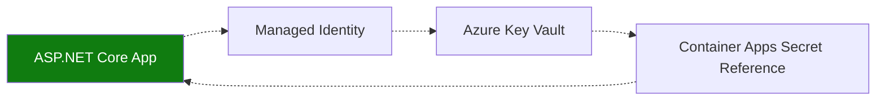

---
content_sources:
  diagrams:
    - id: use-key-vault-references-and-azure
      type: flowchart
      source: mslearn-adapted
      based_on:
        - https://learn.microsoft.com/azure/container-apps/manage-secrets
        - https://learn.microsoft.com/aspnet/core/security/key-vault-configuration
        - https://learn.microsoft.com/dotnet/api/overview/azure/security.keyvault.secrets-readme
---

# Recipe: Key Vault Reference in .NET Apps on Azure Container Apps

Use Key Vault references and Azure SDK integration to keep ASP.NET Core secrets externalized and auditable.

<!-- diagram-id: use-key-vault-references-and-azure -->


## Prerequisites

- Existing Container App (`$APP_NAME`) and resource group (`$RG`)
- Existing Key Vault (`$KEYVAULT_NAME`) with secret `db-password`
- Azure CLI with Container Apps extension

## Configure Key Vault reference in Container Apps

```bash
az containerapp identity assign \
  --name "$APP_NAME" \
  --resource-group "$RG" \
  --system-assigned

export PRINCIPAL_ID=$(az containerapp show \
  --name "$APP_NAME" \
  --resource-group "$RG" \
  --query "identity.principalId" \
  --output tsv)

az role assignment create \
  --assignee-object-id "$PRINCIPAL_ID" \
  --assignee-principal-type ServicePrincipal \
  --role "Key Vault Secrets User" \
  --scope "$(az keyvault show --name "$KEYVAULT_NAME" --query id --output tsv)"

az containerapp secret set \
  --name "$APP_NAME" \
  --resource-group "$RG" \
  --secrets "db-password=keyvaultref:https://$KEYVAULT_NAME.vault.azure.net/secrets/db-password,identityref:system"

az containerapp update \
  --name "$APP_NAME" \
  --resource-group "$RG" \
  --set-env-vars "DB_PASSWORD=secretref:db-password"
```

## ASP.NET Core configuration with Key Vault provider

```csharp
using Azure.Identity;
using Azure.Security.KeyVault.Secrets;

var builder = WebApplication.CreateBuilder(args);

var vaultUri = new Uri($"https://{builder.Configuration["KeyVaultName"]}.vault.azure.net/");
builder.Configuration.AddAzureKeyVault(vaultUri, new DefaultAzureCredential());

builder.Services.AddSingleton(new SecretClient(vaultUri, new DefaultAzureCredential()));

var app = builder.Build();
app.MapGet("/config-check", (IConfiguration config) =>
    Results.Ok(new { dbPasswordConfigured = !string.IsNullOrEmpty(config["db-password"]) }));
app.Run();
```

## Advanced Topics

- Use one vault per environment and strict RBAC scopes per app identity.
- Prefer revision rollouts after high-risk secret rotations.
- Keep both `secretref` and direct SDK access patterns for operational flexibility.

## See Also

- [Managed Identity](managed-identity.md)
- [Container Registry](container-registry.md)
- [Key Vault Platform Guide](../../../platform/identity-and-secrets/key-vault.md)

## Sources

- [Manage secrets in Azure Container Apps](https://learn.microsoft.com/azure/container-apps/manage-secrets)
- [Azure Key Vault configuration provider in ASP.NET Core](https://learn.microsoft.com/aspnet/core/security/key-vault-configuration)
- [Azure Key Vault Secrets client library for .NET](https://learn.microsoft.com/dotnet/api/overview/azure/security.keyvault.secrets-readme)
