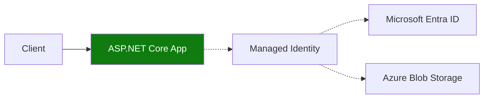

---
hide:
  - toc
content_sources:
  diagrams:
    - id: use-defaultazurecredential-and-asp-net-core-dependency
      type: flowchart
      source: mslearn-adapted
      based_on:
        - https://learn.microsoft.com/azure/container-apps/managed-identity
        - https://learn.microsoft.com/dotnet/api/overview/azure/identity-readme
---

# Recipe: Managed Identity in .NET Apps on Azure Container Apps

Use `DefaultAzureCredential` and ASP.NET Core dependency injection to access Azure resources without connection secrets.

<!-- diagram-id: use-defaultazurecredential-and-asp-net-core-dependency -->


## Prerequisites

- Existing Container App (`$APP_NAME`) in resource group (`$RG`)
- Storage account (`$STORAGE_ACCOUNT`) and container (`$STORAGE_CONTAINER`)
- Azure CLI with Container Apps extension

## Enable managed identity and RBAC

```bash
az containerapp identity assign \
  --name "$APP_NAME" \
  --resource-group "$RG" \
  --system-assigned

export PRINCIPAL_ID=$(az containerapp show \
  --name "$APP_NAME" \
  --resource-group "$RG" \
  --query "identity.principalId" \
  --output tsv)

az role assignment create \
  --assignee-object-id "$PRINCIPAL_ID" \
  --assignee-principal-type ServicePrincipal \
  --role "Storage Blob Data Reader" \
  --scope "$(az storage account show --name "$STORAGE_ACCOUNT" --resource-group "$RG" --query id --output tsv)"
```

## ASP.NET Core 8 DI pattern

```csharp
using Azure.Identity;
using Azure.Storage.Blobs;

var builder = WebApplication.CreateBuilder(args);

builder.Services.AddSingleton(_ =>
{
    var accountUrl = builder.Configuration["Storage:AccountUrl"]!;
    return new BlobServiceClient(new Uri(accountUrl), new DefaultAzureCredential());
});

var app = builder.Build();

app.MapGet("/blobs", async (BlobServiceClient blobService, IConfiguration config) =>
{
    var containerName = config["Storage:Container"] ?? "app-data";
    var container = blobService.GetBlobContainerClient(containerName);
    var names = new List<string>();
    await foreach (var blob in container.GetBlobsAsync())
    {
        names.Add(blob.Name);
    }
    return Results.Ok(new { blobs = names });
});

app.Run();
```

## Advanced Topics

- Use separate user-assigned identities for read-only and write paths.
- Add readiness checks that validate token acquisition and service authorization.
- Use policy-based authorization for resource-specific routes.

## See Also

- [Key Vault Reference](key-vault-reference.md)
- [Easy Auth](easy-auth.md)
- [Managed Identity Platform Guide](../../../platform/identity-and-secrets/managed-identity.md)

## Sources

- [Managed identities in Azure Container Apps](https://learn.microsoft.com/azure/container-apps/managed-identity)
- [Azure SDK for .NET identity](https://learn.microsoft.com/dotnet/api/overview/azure/identity-readme)
