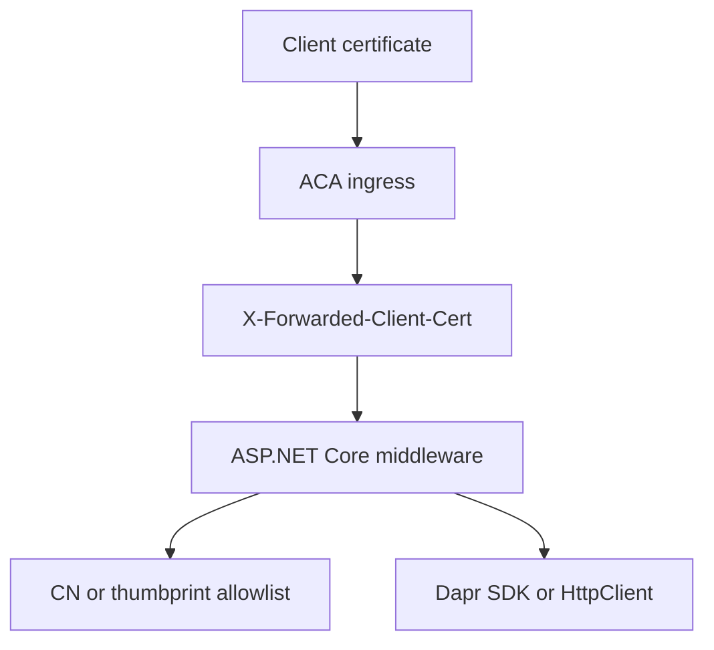

---
content_sources:
  diagrams:
    - id: aspnetcore-xfcc-validation-flow
      type: flowchart
      source: mslearn-adapted
      based_on:
        - https://learn.microsoft.com/en-us/azure/container-apps/client-certificate-authorization
        - https://learn.microsoft.com/en-us/azure/container-apps/ingress-overview
        - https://learn.microsoft.com/en-us/azure/container-apps/connect-apps
---

# Recipe: mTLS Client Certificates in .NET Apps on Azure Container Apps

Use ASP.NET Core middleware to parse `X-Forwarded-Client-Cert`, validate the leaf certificate with `X509Certificate2`, and compare Dapr SDK invocation with direct `HttpClient` calls.

<!-- diagram-id: aspnetcore-xfcc-validation-flow -->


## Prerequisites

- ASP.NET Core app deployed to Azure Container Apps.
- `clientCertificateMode` set to `require` or `accept`.
- .NET 8 SDK for local development.
- Optional Dapr sidecar enabled on both apps.

`dotnet add package` additions:

```bash
dotnet add package Dapr.Client --version 1.14.0
```

## What You'll Build

- ASP.NET Core middleware that reads and parses the leaf PEM certificate.
- Validation against a CN or thumbprint allowlist.
- Outbound calls using Dapr .NET SDK and direct `HttpClient`.

## Steps

### 1. Add the middleware and routes

```csharp
using System.Security.Cryptography;
using System.Security.Cryptography.X509Certificates;
using System.Text.RegularExpressions;
using Dapr.Client;

var builder = WebApplication.CreateBuilder(args);

builder.Services.AddSingleton(new HttpClient { BaseAddress = new Uri("http://ca-backend") });
builder.Services.AddDaprClient();

var app = builder.Build();

var allowedCommonNames = new HashSet<string>(StringComparer.OrdinalIgnoreCase)
{
    "api-client.contoso.com",
    "partner-gateway.contoso.com"
};

var allowedThumbprints = new HashSet<string>(StringComparer.OrdinalIgnoreCase);
var certificatePattern = new Regex("Cert=\"([\\s\\S]*?)\"(?:;|$)", RegexOptions.Compiled);

app.Use(async (context, next) =>
{
    if (!context.Request.Headers.TryGetValue("X-Forwarded-Client-Cert", out var headerValue))
    {
        context.Response.StatusCode = 403;
        await context.Response.WriteAsJsonAsync(new { error = "client certificate header missing" });
        return;
    }

    var match = certificatePattern.Match(headerValue!);
    if (!match.Success)
    {
        context.Response.StatusCode = 403;
        await context.Response.WriteAsJsonAsync(new { error = "leaf certificate missing from XFCC header" });
        return;
    }

    var leafPem = match.Groups[1].Value.Replace("\\n", "\n");
    var certificate = X509Certificate2.CreateFromPem(leafPem);
    var commonName = certificate.GetNameInfo(X509NameType.SimpleName, false);
    var thumbprint = Convert.ToHexString(SHA256.HashData(certificate.RawData));

    if ((allowedThumbprints.Count > 0 && allowedThumbprints.Contains(thumbprint))
        || allowedCommonNames.Contains(commonName))
    {
        context.Items["clientCommonName"] = commonName;
        context.Items["clientThumbprint"] = thumbprint;
        await next();
        return;
    }

    context.Response.StatusCode = 403;
    await context.Response.WriteAsJsonAsync(new { error = "client certificate not allowlisted" });
});

app.MapGet("/cert-info", (HttpContext context) => Results.Ok(new
{
    commonName = context.Items["clientCommonName"],
    thumbprint = context.Items["clientThumbprint"]
}));

app.MapGet("/call-backend/dapr", async (DaprClient daprClient) =>
{
    var response = await daprClient.InvokeMethodAsync<object, string>(HttpMethod.Get, "backend", "health", null);
    return Results.Ok(new { path = "dapr", status = response });
});

app.MapGet("/call-backend/direct", async (HttpClient httpClient) =>
{
    var response = await httpClient.GetStringAsync("/health");
    return Results.Ok(new { path = "direct", status = response });
});

app.Run("http://0.0.0.0:8000");
```

### 2. Configure the app

```bash
az containerapp update \
  --name "$APP_NAME" \
  --resource-group "$RG" \
  --set-env-vars \
    DIRECT_BACKEND_URL="http://ca-backend" \
    DAPR_TARGET_APP_ID="backend"
```

### 3. Test with curl

```bash
curl --include \
  --cert "./client.pem" \
  --key "./client.key" \
  "https://${FQDN}/cert-info"
```

## Verification

- `200 OK` for an allowlisted certificate.
- `403` when the header is absent or the cert is not allowlisted.
- `/call-backend/dapr` verifies sidecar-based mTLS invocation.
- `/call-backend/direct` verifies the direct internal path separately.

## See Also

- [Easy Auth](easy-auth.md)
- [Ingress Client Certificates](../../../platform/security/ingress-client-certificates.md)
- [mTLS Architecture in Azure Container Apps](../../../platform/security/mtls.md)

## Sources

- [Configure client certificate authentication in Azure Container Apps (Microsoft Learn)](https://learn.microsoft.com/en-us/azure/container-apps/client-certificate-authorization)
- [Ingress overview in Azure Container Apps (Microsoft Learn)](https://learn.microsoft.com/en-us/azure/container-apps/ingress-overview)
- [Communicate between container apps in Azure Container Apps (Microsoft Learn)](https://learn.microsoft.com/en-us/azure/container-apps/connect-apps)
