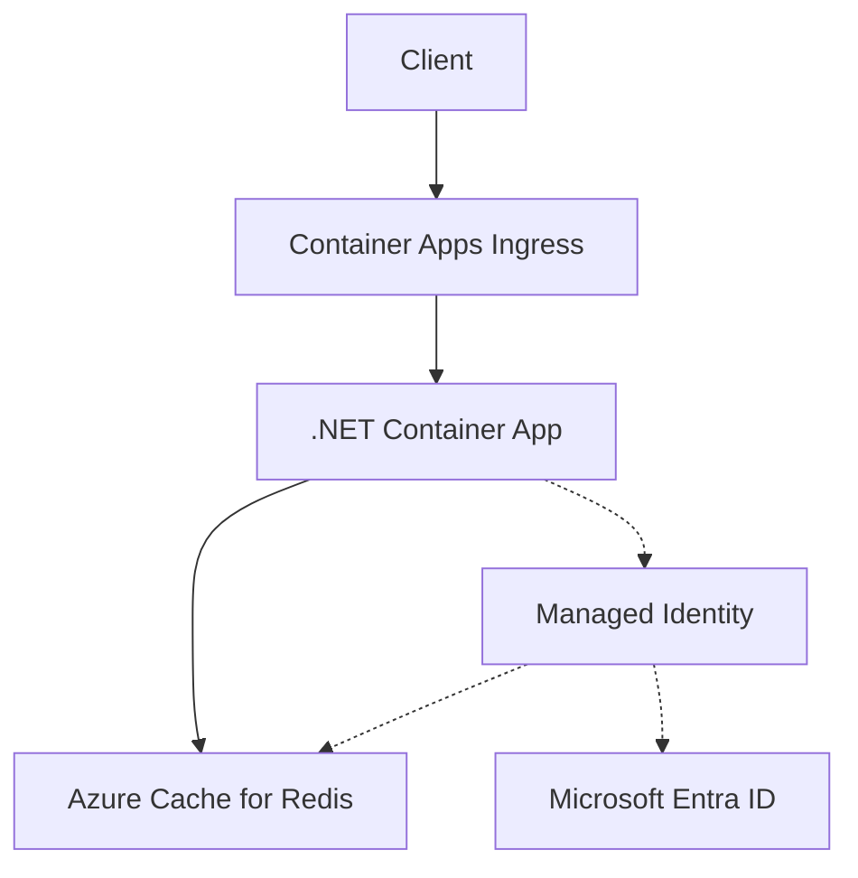

---
content_sources:
  diagrams:
    - id: architecture
      type: flowchart
      source: mslearn-adapted
      based_on:
        - https://learn.microsoft.com/azure/azure-cache-for-redis/cache-azure-active-directory-for-authentication
        - https://learn.microsoft.com/azure/redis/dotnet-get-started
---

# Azure Cache for Redis Integration (Microsoft Entra Authentication)

Use this recipe to connect Azure Container Apps to Azure Cache for Redis with Microsoft Entra authentication first and access keys only as a fallback.

## Architecture

<!-- diagram-id: architecture -->


Solid arrows show runtime data flow. Dashed arrows show identity and authentication.

## Prerequisites

- Existing Container App: `$APP_NAME` in `$RG`
- Existing Azure Cache for Redis instance with Microsoft Entra authentication enabled
- TLS access enabled on port `6380`

## Step 1: Enable managed identity on the Container App

```bash
az containerapp identity assign \
  --name "$APP_NAME" \
  --resource-group "$RG" \
  --system-assigned

export PRINCIPAL_ID=$(az containerapp show \
  --name "$APP_NAME" \
  --resource-group "$RG" \
  --query "identity.principalId" \
  --output tsv)
```

## Step 2: Assign Redis data access

```bash
az redis access-policy-assignment create \
  --name "$REDIS_NAME" \
  --resource-group "$RG" \
  --access-policy-name "Data Owner" \
  --object-id "$PRINCIPAL_ID" \
  --object-id-alias "$APP_NAME"
```

## Step 3: Configure non-secret Redis settings

```bash
az containerapp update \
  --name "$APP_NAME" \
  --resource-group "$RG" \
  --set-env-vars REDIS_HOST="$REDIS_NAME.redis.cache.windows.net" REDIS_PORT="6380"
```

## Step 4: .NET code (Microsoft Entra token authentication)

Add dependencies:

```bash
dotnet add package StackExchange.Redis
dotnet add package Microsoft.Azure.StackExchangeRedis
dotnet add package Azure.Identity
```

Use the Azure helper package to configure token-based authentication:

```csharp
using Azure.Identity;
using Microsoft.Azure.StackExchangeRedis;
using StackExchange.Redis;

var options = ConfigurationOptions.Parse($"{Environment.GetEnvironmentVariable("REDIS_HOST")}:{Environment.GetEnvironmentVariable("REDIS_PORT") ?? "6380"}");
options.Ssl = true;
options.AbortOnConnectFail = false;

if (!string.IsNullOrWhiteSpace(Environment.GetEnvironmentVariable("REDIS_ACCESS_KEY")))
{
    options.Password = Environment.GetEnvironmentVariable("REDIS_ACCESS_KEY");
}
else
{
    await options.ConfigureForAzureWithTokenCredentialAsync(new DefaultAzureCredential());
}

await using var connection = await ConnectionMultiplexer.ConnectAsync(options);
var db = connection.GetDatabase();
await db.StringSetAsync("health", "ok", TimeSpan.FromMinutes(1));
Console.WriteLine(await db.StringGetAsync("health"));
```

!!! warning
    If your current Redis tier or package version does not support the token helper pattern above exactly as shown, keep the access-key fallback and verify the Microsoft Learn guidance before standardizing the Entra pattern across all services.

## Step 5: Access key fallback

```bash
az containerapp secret set \
  --name "$APP_NAME" \
  --resource-group "$RG" \
  --secrets redis-access-key="<redis-primary-key>"

az containerapp update \
  --name "$APP_NAME" \
  --resource-group "$RG" \
  --set-env-vars REDIS_HOST="$REDIS_NAME.redis.cache.windows.net" REDIS_PORT="6380" REDIS_ACCESS_KEY=secretref:redis-access-key
```

## Verification

1. Confirm the access policy assignment exists.
2. Confirm application logs show successful Redis `SET` and `GET` operations.
3. Confirm clients are using TLS on port `6380`.

## See Also

- [Managed Identity](managed-identity.md)
- [Private Endpoints](../../../platform/networking/private-endpoints.md)
- [Networking](../../../platform/networking/vnet-integration.md)

## Sources

- [Use Microsoft Entra for cache authentication](https://learn.microsoft.com/azure/azure-cache-for-redis/cache-azure-active-directory-for-authentication)
- [Use Azure Cache for Redis with .NET](https://learn.microsoft.com/azure/redis/dotnet-get-started)
