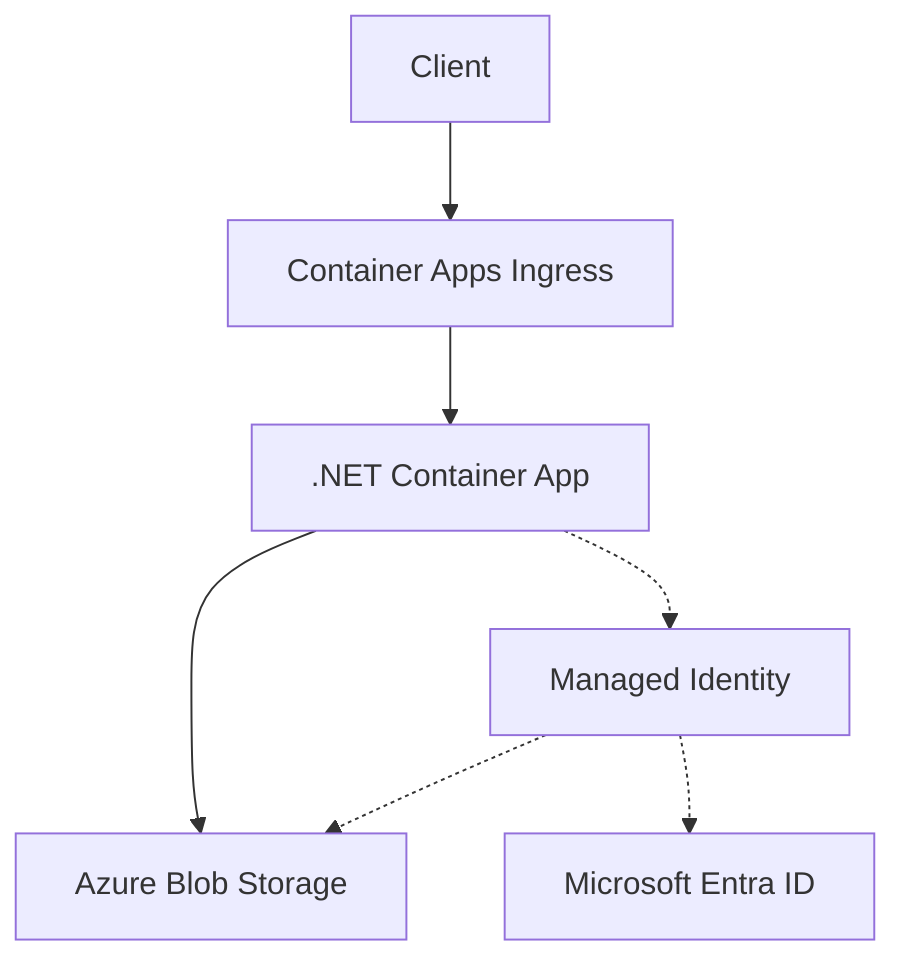

---
content_sources:
  diagrams:
    - id: architecture
      type: flowchart
      source: mslearn-adapted
      based_on:
        - https://learn.microsoft.com/azure/container-apps/storage-mounts
        - https://learn.microsoft.com/dotnet/api/overview/azure/storage.blobs-readme
---

# Blob Storage Integration (Managed Identity)

Use this recipe to connect a .NET Container App to Azure Blob Storage with managed identity first and a connection string fallback when you still depend on shared keys.

## Architecture

<!-- diagram-id: architecture -->


Solid arrows show runtime data flow. Dashed arrows show identity and authentication.

## Prerequisites

- Existing Container App: `$APP_NAME` in `$RG`
- Existing storage account and blob container
- Azure CLI with the Container Apps extension

```bash
az extension add --name containerapp --upgrade
```

## Step 1: Enable managed identity on the Container App

```bash
az containerapp identity assign \
  --name "$APP_NAME" \
  --resource-group "$RG" \
  --system-assigned

export PRINCIPAL_ID=$(az containerapp show \
  --name "$APP_NAME" \
  --resource-group "$RG" \
  --query "identity.principalId" \
  --output tsv)
```

## Step 2: Grant Blob data access

```bash
export STORAGE_ID=$(az storage account show \
  --name "$STORAGE_ACCOUNT" \
  --resource-group "$RG" \
  --query "id" \
  --output tsv)

az role assignment create \
  --assignee-object-id "$PRINCIPAL_ID" \
  --assignee-principal-type ServicePrincipal \
  --role "Storage Blob Data Contributor" \
  --scope "$STORAGE_ID"
```

## Step 3: Configure non-secret settings

```bash
az containerapp update \
  --name "$APP_NAME" \
  --resource-group "$RG" \
  --set-env-vars STORAGE_ACCOUNT_URL="https://$STORAGE_ACCOUNT.blob.core.windows.net" STORAGE_CONTAINER="$STORAGE_CONTAINER"
```

## Step 4: .NET code (managed identity)

Add dependencies:

```bash
dotnet add package Azure.Storage.Blobs
dotnet add package Azure.Identity
```

Upload and download a blob with `DefaultAzureCredential`:

```csharp
using Azure.Identity;
using Azure.Storage.Blobs;

static BlobServiceClient CreateBlobServiceClient()
{
    var connectionString = Environment.GetEnvironmentVariable("AZURE_STORAGE_CONNECTION_STRING");
    if (!string.IsNullOrWhiteSpace(connectionString))
    {
        return new BlobServiceClient(connectionString);
    }

    var accountUrl = Environment.GetEnvironmentVariable("STORAGE_ACCOUNT_URL")!;
    return new BlobServiceClient(new Uri(accountUrl), new DefaultAzureCredential());
}

var serviceClient = CreateBlobServiceClient();
var container = serviceClient.GetBlobContainerClient(Environment.GetEnvironmentVariable("STORAGE_CONTAINER"));
var blob = container.GetBlobClient("hello.txt");

await blob.UploadAsync(BinaryData.FromString("hello from aca"), overwrite: true);
var content = await blob.DownloadContentAsync();
Console.WriteLine(content.Value.Content.ToString());
```

## Step 5: Connection string fallback

```bash
az containerapp secret set \
  --name "$APP_NAME" \
  --resource-group "$RG" \
  --secrets storage-connection-string="DefaultEndpointsProtocol=https;AccountName=$STORAGE_ACCOUNT;AccountKey=<storage-account-key>;EndpointSuffix=core.windows.net"

az containerapp update \
  --name "$APP_NAME" \
  --resource-group "$RG" \
  --set-env-vars AZURE_STORAGE_CONNECTION_STRING=secretref:storage-connection-string STORAGE_CONTAINER="$STORAGE_CONTAINER"
```

## Verification

1. Confirm RBAC assignment exists.
2. Confirm the uploaded blob exists with `az storage blob list --auth-mode login`.
3. Check app logs for successful upload and download operations.

## See Also

- [Managed Identity](managed-identity.md)
- [Key Vault Reference](key-vault-reference.md)
- [.NET Tutorials](../index.md)

## Sources

- [Use storage mounts in Azure Container Apps](https://learn.microsoft.com/azure/container-apps/storage-mounts)
- [Azure Storage Blob client library for .NET](https://learn.microsoft.com/dotnet/api/overview/azure/storage.blobs-readme)
