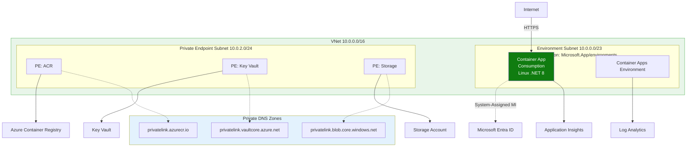
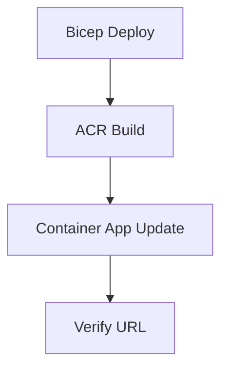

---
content_sources:
  diagrams:
    - id: this-tutorial-assumes-a-production-ready-container
      type: flowchart
      source: mslearn-adapted
      based_on:
        - https://learn.microsoft.com/en-us/azure/container-apps/get-started
        - https://learn.microsoft.com/en-us/azure/container-registry/container-registry-tutorial-quick-task
    - id: deployment-workflow
      type: flowchart
      source: mslearn-adapted
      based_on:
        - https://learn.microsoft.com/en-us/azure/container-apps/get-started
        - https://learn.microsoft.com/en-us/azure/container-registry/container-registry-tutorial-quick-task
validation:
  az_cli:
    last_tested:
    cli_version:
    result: not_tested
  bicep:
    last_tested:
    result: not_tested
---
# 02 - First Deploy to Azure Container Apps

In this step, you provision the core Azure resources, build your image in Azure Container Registry, and deploy your first revision to Azure Container Apps.

!!! info "Infrastructure Context"
    **Service**: Container Apps (Consumption) | **Network**: VNet integrated | **VNet**: ✅

    This tutorial assumes a production-ready Container Apps deployment with a custom VNet, ACR with managed identity pull, and private endpoints for backend services.

    <!-- diagram-id: this-tutorial-assumes-a-production-ready-container -->


## Deployment Workflow

<!-- diagram-id: deployment-workflow -->


## Prerequisites

- Completed [01 - Run Locally with Docker](01-local-development.md)
- Azure CLI logged in
- Bicep template at `infra/main.bicep`

## Step-by-step

1. **Set standard variables**

   ```bash
   RG="rg-dotnet-guide"
   BASE_NAME="dotnet-guide"
   LOCATION="koreacentral"
   DEPLOYMENT_NAME="main"
   ```

2. **Create a resource group**

   ```bash
   az group create --name "$RG" --location "$LOCATION"
   ```

   | Command | Why it is used |
   |---|---|
   | `az group create ...` | Creates the isolated resource group used by the example. |

   ???+ example "Expected output"
        ```json
        {
          "id": "/subscriptions/<subscription-id>/resourceGroups/rg-dotnet-guide",
          "location": "koreacentral",
          "name": "rg-dotnet-guide",
          "properties": {
            "provisioningState": "Succeeded"
          }
        }
        ```

3. **Deploy infrastructure (environment, Log Analytics, ACR, Container App)**

   ```bash
   az deployment group create \
      --name "$DEPLOYMENT_NAME" \
      --resource-group "$RG" \
      --template-file infra/main.bicep \
      --parameters baseName="$BASE_NAME" location="$LOCATION"
   ```

   | Command | Why it is used |
   |---|---|
   | `az deployment group create ...` | Deploys the Bicep or ARM template into the target resource group. |

   ???+ example "Expected output"
       This command takes 2-3 minutes to complete. When successful, it returns a JSON object containing the deployment details.

        ```json
        {
          "id": "/subscriptions/<subscription-id>/resourceGroups/rg-dotnet-guide/providers/Microsoft.Resources/deployments/main",
          "name": "main",
          "properties": {
            "provisioningState": "Succeeded",
            "outputs": {
              "containerAppName": { "type": "String", "value": "ca-dotnet-guide-<unique-suffix>" },
              "containerAppUrl": { "type": "String", "value": "https://ca-dotnet-guide-<unique-suffix>.<env-suffix>.koreacentral.azurecontainerapps.io" }
            }
          }
        }
        ```

        !!! note "Unique suffix"
            The `<unique-suffix>` is generated by `uniqueString(resourceGroup().id)` in Bicep to ensure globally unique resource names.

   !!! note "Initial revision health can appear unhealthy"
       The Bicep template creates the Container App before your custom image is built and pushed. Until you complete Step 5 and update the app image, the initial revision may show as unhealthy. This is expected.

4. **Capture generated resource names from Bicep outputs**

   ```bash
   APP_NAME=$(az deployment group show \
     --name "$DEPLOYMENT_NAME" \
     --resource-group "$RG" \
     --query "properties.outputs.containerAppName.value" \
     --output tsv)

   ACA_ENV_NAME=$(az deployment group show \
     --name "$DEPLOYMENT_NAME" \
     --resource-group "$RG" \
     --query "properties.outputs.containerAppEnvName.value" \
     --output tsv)

   ACR_NAME=$(az deployment group show \
     --name "$DEPLOYMENT_NAME" \
     --resource-group "$RG" \
     --query "properties.outputs.containerRegistryName.value" \
     --output tsv)

   ACR_LOGIN_SERVER=$(az deployment group show \
     --name "$DEPLOYMENT_NAME" \
     --resource-group "$RG" \
     --query "properties.outputs.containerRegistryLoginServer.value" \
     --output tsv)

   APP_URL=$(az deployment group show \
     --name "$DEPLOYMENT_NAME" \
     --resource-group "$RG" \
     --query "properties.outputs.containerAppUrl.value" \
     --output tsv)
   ```

| Command | Purpose |
|---|---|
| `APP_NAME=$(az deployment group show --name "$DEPLOYMENT_NAME" --resource-group "$RG" --query "properties.outputs.containerAppName.value" --output tsv)` | Captures the generated Container App resource name from the Bicep deployment so later CLI steps target the exact app that was provisioned. |
| `ACA_ENV_NAME=$(az deployment group show --name "$DEPLOYMENT_NAME" --resource-group "$RG" --query "properties.outputs.containerAppEnvName.value" --output tsv)` | Captures the generated Container Apps environment name so environment-scoped follow-up commands use the same deployment outputs. |
| `ACR_NAME=$(az deployment group show --name "$DEPLOYMENT_NAME" --resource-group "$RG" --query "properties.outputs.containerRegistryName.value" --output tsv)` | Captures the ACR resource name that stores the tutorial image tags. |
| `ACR_LOGIN_SERVER=$(az deployment group show --name "$DEPLOYMENT_NAME" --resource-group "$RG" --query "properties.outputs.containerRegistryLoginServer.value" --output tsv)` | Captures the ACR login server so later image references can be assembled without hardcoding the registry hostname. |
| `APP_URL=$(az deployment group show --name "$DEPLOYMENT_NAME" --resource-group "$RG" --query "properties.outputs.containerAppUrl.value" --output tsv)` | Captures the app URL emitted by the deployment so you can compare it with later ingress verification results. |

    | Command | Purpose |
    |---|---|
    | `APP_NAME=$(az deployment group show --name "$DEPLOYMENT_NAME" --resource-group "$RG" --query "properties.outputs.containerAppName.value" --output tsv)` | Captures the generated Container App resource name from the Bicep deployment so later CLI steps target the exact app that was provisioned. |
    | `ACA_ENV_NAME=$(az deployment group show --name "$DEPLOYMENT_NAME" --resource-group "$RG" --query "properties.outputs.containerAppEnvName.value" --output tsv)` | Captures the generated Container Apps environment name so environment-scoped follow-up commands use the same deployment outputs. |
    | `ACR_NAME=$(az deployment group show --name "$DEPLOYMENT_NAME" --resource-group "$RG" --query "properties.outputs.containerRegistryName.value" --output tsv)` | Captures the ACR resource name that stores the tutorial image tags. |
    | `ACR_LOGIN_SERVER=$(az deployment group show --name "$DEPLOYMENT_NAME" --resource-group "$RG" --query "properties.outputs.containerRegistryLoginServer.value" --output tsv)` | Captures the ACR login server so later image references can be assembled without hardcoding the registry hostname. |
    | `APP_URL=$(az deployment group show --name "$DEPLOYMENT_NAME" --resource-group "$RG" --query "properties.outputs.containerAppUrl.value" --output tsv)` | Captures the app URL emitted by the deployment so you can compare it with later ingress verification results. |

    | Command | Purpose |
    |---|---|
    | `APP_NAME=$(az deployment group show --name "$DEPLOYMENT_NAME" --resource-group "$RG" --query "properties.outputs.containerAppName.value" --output tsv)` | Captures the generated Container App resource name from the Bicep deployment so later CLI steps target the exact app that was provisioned. |
    | `ACA_ENV_NAME=$(az deployment group show --name "$DEPLOYMENT_NAME" --resource-group "$RG" --query "properties.outputs.containerAppEnvName.value" --output tsv)` | Captures the generated Container Apps environment name so environment-scoped follow-up commands use the same deployment outputs. |
    | `ACR_NAME=$(az deployment group show --name "$DEPLOYMENT_NAME" --resource-group "$RG" --query "properties.outputs.containerRegistryName.value" --output tsv)` | Captures the ACR resource name that stores the tutorial image tags. |
    | `ACR_LOGIN_SERVER=$(az deployment group show --name "$DEPLOYMENT_NAME" --resource-group "$RG" --query "properties.outputs.containerRegistryLoginServer.value" --output tsv)` | Captures the ACR login server so later image references can be assembled without hardcoding the registry hostname. |
    | `APP_URL=$(az deployment group show --name "$DEPLOYMENT_NAME" --resource-group "$RG" --query "properties.outputs.containerAppUrl.value" --output tsv)` | Captures the app URL emitted by the deployment so you can compare it with later ingress verification results. |

   ???+ example "Expected output"
       These commands capture the values silently. You can verify them by running:

       ```bash
       echo "APP_NAME=$APP_NAME"
       echo "ACA_ENV_NAME=$ACA_ENV_NAME"
       echo "ACR_NAME=$ACR_NAME"
       echo "ACR_LOGIN_SERVER=$ACR_LOGIN_SERVER"
       echo "APP_URL=$APP_URL"
       ```

       Output:
        ```text
        APP_NAME=ca-dotnet-guide-<unique-suffix>
        ACA_ENV_NAME=cae-dotnet-guide-<unique-suffix>
        ACR_NAME=crdotnetguide<unique-suffix>
        ACR_LOGIN_SERVER=crdotnetguide<unique-suffix>.azurecr.io
        APP_URL=https://ca-dotnet-guide-<unique-suffix>.<env-suffix>.koreacentral.azurecontainerapps.io
        ```

5. **Build and push container image with ACR Tasks**

   ```bash
   az acr build \
      --registry "$ACR_NAME" \
      --image "dotnet-guide:latest" \
      ./apps/dotnet-aspnetcore
   ```

   | Command | Why it is used |
   |---|---|
   | `az acr build ...` | Builds and pushes the container image to Azure Container Registry. |

   ???+ example "Expected output (az acr build)"
       The build output shows the multi-stage Docker build progress. The last few lines should look like this:

       ```text
       Step 13/13 : ENTRYPOINT ["dotnet", "AzureContainerApps.dll"]
        ---> Running in abc123
        ---> def456
       Successfully built def456
       Successfully tagged dotnet-guide:latest
       ```

   Update the Container App to use the new image:

   ```bash
   az containerapp update \
      --name "$APP_NAME" \
      --resource-group "$RG" \
      --image "$ACR_LOGIN_SERVER/dotnet-guide:latest"
   ```

   | Command | Why it is used |
   |---|---|
   | `az containerapp update ...` | Updates the existing Container App configuration without recreating the app. |

   ???+ example "Expected output (az containerapp update)"
       ```json
       {
          "latestRevision": "<your-app-name>--xxxxxxx",
          "name": "<your-app-name>",
          "provisioningState": "Succeeded"
       }
       ```

6. **Verify deployment state and URL**

   ```bash
   az containerapp show \
      --name "$APP_NAME" \
      --resource-group "$RG" \
      --query "{state:properties.provisioningState,url:properties.configuration.ingress.fqdn}"
   ```

   | Command | Why it is used |
   |---|---|
   | `az containerapp show ...` | Reads the Container App configuration so the documented setting can be verified. |

   ???+ example "Expected output"
       ```json
       {
         "state": "Succeeded",
         "url": "ca-dotnet-guide-<unique-suffix>.<env-suffix>.koreacentral.azurecontainerapps.io"
       }
       ```

   Verify the `/health` endpoint with `curl`:
   ```bash
   curl "$APP_URL/health"
   ```

    ???+ example "Expected output (health check)"
        ```json
        {"status":"healthy","timestamp":"2026-04-04T16:13:19.2964050Z"}
        ```

7. **Deploy an update (creates a new revision)**

   ```bash
   az acr build --registry "$ACR_NAME" --image "dotnet-guide:v2" ./apps/dotnet-aspnetcore

   az containerapp update \
      --name "$APP_NAME" \
      --resource-group "$RG" \
      --image "$ACR_LOGIN_SERVER/dotnet-guide:v2"
   ```

   | Command | Why it is used |
   |---|---|
   | `az acr build --registry ...` | Builds and pushes the container image to Azure Container Registry. |

    ???+ example "Expected output"
        ```json
        {
          "name": "<your-app-name>",
          "provisioningState": "Succeeded",
          "latestRevisionName": "<your-app-name>--0000002"
        }
        ```

   Confirm revision status — you should now see **two revisions**. In single-revision mode, the old revision is retained but inactive:

   ```bash
   az containerapp revision list \
      --name "$APP_NAME" \
      --resource-group "$RG" \
      --query "[].{name:name,active:properties.active,trafficWeight:properties.trafficWeight,healthState:properties.healthState,runningState:properties.runningState}"
   ```

   | Command | Why it is used |
   |---|---|
   | `az containerapp revision list ...` | Lists revisions so rollout state, traffic, and health can be verified. |

   ???+ example "Expected output (revision list)"
        ```json
        [
          {
            "name": "<your-app-name>--0000001",
            "active": false,
            "trafficWeight": 0,
            "healthState": "Healthy",
            "runningState": "Running"
          },
          {
            "name": "<your-app-name>--0000002",
            "active": true,
            "trafficWeight": 100,
            "healthState": "Healthy",
            "runningState": "Running"
          }
        ]
        ```

## What to validate

- Image exists in ACR: `dotnet-guide:latest` and `dotnet-guide:v2`
- App endpoint responds with HTTP 200 for `/health` with JSON payload
- A new revision appears after `az containerapp update`
- Kestrel is listening on the expected port (default 8000)

## Advanced Topics

- **Build optimization**: Use Docker layer caching in ACR Tasks to speed up subsequent builds.
- **Revision names**: Customize revision names for better traceability using `--revision-suffix`.
- **Private connectivity**: Use internal ingress for APIs that don't need public exposure.

## CLI Alternative (No Bicep)

Use these commands to deploy without Bicep templates. This creates the same resources imperatively.

### Step 1: Set variables

```bash
RG="rg-dotnet-containerapp"
LOCATION="koreacentral"
APP_NAME="ca-dotnet-demo"
BASE_NAME="dotnet-app"
ACA_ENV_NAME="cae-dotnet-demo"
ACR_NAME="crdotnetdemo"
LOG_NAME="log-dotnet-demo"
```

???+ example "Expected output"
    ```text
    Variables initialized for the .NET Container Apps deployment.
    ```

### Step 2: Create resource group

```bash
az group create --name $RG --location $LOCATION
```

| Command | Why it is used |
|---|---|
| `az group create ...` | Creates the isolated resource group used by the example. |

???+ example "Expected output"
    ```json
    {
      "id": "/subscriptions/<subscription-id>/resourceGroups/rg-dotnet-containerapp",
      "location": "koreacentral",
      "name": "rg-dotnet-containerapp",
      "properties": {
        "provisioningState": "Succeeded"
      }
    }
    ```

### Step 3: Create Log Analytics workspace

```bash
az monitor log-analytics workspace create --resource-group $RG --workspace-name $LOG_NAME --location $LOCATION
```

| Command | Why it is used |
|---|---|
| `az monitor log-analytics ...` | Creates or inspects Azure Monitor alerts, diagnostic settings, or metrics. |

???+ example "Expected output"
    ```json
    {
      "customerId": "b2c3d4e5-f6a7-8901-bcde-f23456789012",
      "id": "/subscriptions/<subscription-id>/resourceGroups/rg-dotnet-containerapp/providers/Microsoft.OperationalInsights/workspaces/log-dotnet-demo",
      "name": "log-dotnet-demo",
      "provisioningState": "Succeeded"
    }
    ```

### Step 4: Create Azure Container Registry

```bash
az acr create --resource-group $RG --name $ACR_NAME --sku Basic
```

| Command | Why it is used |
|---|---|
| `az acr create --resource-group ...` | Creates Azure Container Registry for container image storage. |

???+ example "Expected output"
    ```json
    {
      "id": "/subscriptions/<subscription-id>/resourceGroups/rg-dotnet-containerapp/providers/Microsoft.ContainerRegistry/registries/crdotnetdemo",
      "loginServer": "crdotnetdemo.azurecr.io",
      "name": "crdotnetdemo",
      "provisioningState": "Succeeded"
    }
    ```

### Step 5: Create Container Apps environment

```bash
LOG_ID=$(az monitor log-analytics workspace show --resource-group $RG --workspace-name $LOG_NAME --query customerId --output tsv)
LOG_KEY=$(az monitor log-analytics workspace get-shared-keys --resource-group $RG --workspace-name $LOG_NAME --query primarySharedKey --output tsv)
az containerapp env create --resource-group $RG --name $ACA_ENV_NAME --location $LOCATION --logs-workspace-id $LOG_ID --logs-workspace-key $LOG_KEY
```

| Command | Why it is used |
|---|---|
| `az monitor log-analytics ...` | Creates or inspects Azure Monitor alerts, diagnostic settings, or metrics. |

???+ example "Expected output"
    ```json
    {
      "id": "/subscriptions/<subscription-id>/resourceGroups/rg-dotnet-containerapp/providers/Microsoft.App/managedEnvironments/cae-dotnet-demo",
      "name": "cae-dotnet-demo",
      "provisioningState": "Succeeded"
    }
    ```

### Step 6: Build and push image with ACR Tasks

```bash
az acr build --registry $ACR_NAME --image $BASE_NAME:v1 ./apps/dotnet-aspnetcore
```

| Command | Why it is used |
|---|---|
| `az acr build --registry ...` | Builds and pushes the container image to Azure Container Registry. |

???+ example "Expected output"
    ```text
    Packing source code into tar to upload...
    Queued a build with ID: cg1
    Run ID: cg1 was successful after 1m 05s
    ```

### Step 7: Create Container App

```bash
az containerapp create --resource-group $RG --name $APP_NAME --environment $ACA_ENV_NAME --image $ACR_NAME.azurecr.io/$BASE_NAME:v1 --target-port 8000 --ingress external --query "properties.configuration.ingress.fqdn"
```

| Command | Why it is used |
|---|---|
| `az containerapp create --resource-group ...` | Creates the Container App with the documented image, ingress, scale, and environment settings. |

???+ example "Expected output"
    ```text
    "<container-app-fqdn>"
    ```

### Step 8: Verify deployment

```bash
FQDN=$(az containerapp show --resource-group $RG --name $APP_NAME --query "properties.configuration.ingress.fqdn" --output tsv)
curl https://$FQDN/health
```

| Command | Purpose |
|---|---|
| `FQDN=$(az containerapp show --resource-group $RG --name $APP_NAME --query "properties.configuration.ingress.fqdn" --output tsv)` | Reads the app's live ingress hostname from Azure so the verification request targets the actual deployed endpoint instead of a copied URL. |
| `curl https://$FQDN/health` | Calls the health endpoint exposed by the deployed .NET app to confirm the revision is reachable and healthy over ingress. |

???+ example "Expected output"
    ```json
    {"status":"healthy","timestamp":"2026-04-09T09:24:33.5123345Z"}
    ```

### Step 9: Verify deployment in Azure Portal

![ca-dotnet-d38538 | Container App | Overview | Stop | Refresh | Delete | Send us your feedback | Essentials | Resource group | rg-aca-basics-d38538 | Status | Running | Location | Korea Central | Subscription | Visual Studio Enterprise Subscription | Subscription ID | 00000000-0000-0000-0000-000000000000 | Aspire Dashboard | Not yet active | Tags | Add tags | Application Url | https://<app-name>.<unique-id>.<region>.azurecontainerapps.io | Container Apps Environment | cae-basics-d38538 | Environment type | Workload profiles | Log Analytics | law-basics-d38538 | Development stack | Generic | View Cost | JSON View | Get started | Properties | Monitoring | Discover Azure Container Apps Features | Upload artifact | Manage your app with revisions | Set up continuous deployment | Application | Revisions and replicas | Containers | Scale | Volumes | Networking | Ingress | Custom domains | CORS | Security | Settings | Monitoring | Log stream | Logs | Console | Alerts | Metrics](../../../assets/language-guides/dotnet/tutorial/02-container-app-overview-after-deploy.png)

**[Observed]** `ca-dotnet-d38538 | Container App` `Overview` `Stop` `Refresh` `Delete` `Send us your feedback` `Essentials` `Resource group` `rg-aca-basics-d38538` `Status` `Running` `Location` `Korea Central` `Subscription` `Visual Studio Enterprise Subscription` `Subscription ID` `00000000-0000-0000-0000-000000000000` `Aspire Dashboard` `Not yet active` `Tags` `Add tags` `Application Url` `https://<app-name>.<unique-id>.<region>.azurecontainerapps.io` `Container Apps Environment` `cae-basics-d38538` `Environment type` `Workload profiles` `Log Analytics` `law-basics-d38538` `Development stack` `Generic` `View Cost` `JSON View` `Get started` `Properties` `Monitoring` `Discover Azure Container Apps Features` `Upload artifact` `Manage your app with revisions` `Set up continuous deployment` `Application` `Revisions and replicas` `Containers` `Scale` `Volumes` `Networking` `Ingress` `Custom domains` `CORS` `Security` `Settings` `Monitoring` `Log stream` `Logs` `Console` `Alerts` `Metrics`.

**[Inferred]** The `Status` field value of `Running` appears consistent with the `state:properties.provisioningState` of `Succeeded` returned by the CLI verification in [Step 8: Verify deployment](#step-8-verify-deployment). The `Application Url` value `https://<app-name>.<unique-id>.<region>.azurecontainerapps.io` appears to surface the same `properties.configuration.ingress.fqdn` value queried in [Step 7: Create Container App](#step-7-create-container-app). The `Container Apps Environment` link value `cae-basics-d38538` appears to map to the `$ACA_ENV_NAME` value supplied to `--environment` in [Step 7: Create Container App](#step-7-create-container-app). The left-navigation entries `Containers`, `Scale`, `Ingress`, and `Logs` are consistent with the artifacts created across [Step 5: Create Container Apps environment](#step-5-create-container-apps-environment) and [Step 7: Create Container App](#step-7-create-container-app).

**[Not Proven]** Additional runtime detail and revision detail are not visible on this view.

## See Also
- [05 - Infrastructure as Code with Bicep](05-infrastructure-as-code.md)
- [07 - Revisions and Traffic Splitting](07-revisions-traffic.md)
- [.NET Runtime Reference](../dotnet-runtime.md)

## Sources
- [Get started (Microsoft Learn)](https://learn.microsoft.com/en-us/azure/container-apps/get-started)
- [Build and push an image with ACR Tasks (Microsoft Learn)](https://learn.microsoft.com/en-us/azure/container-registry/container-registry-tutorial-quick-task)
