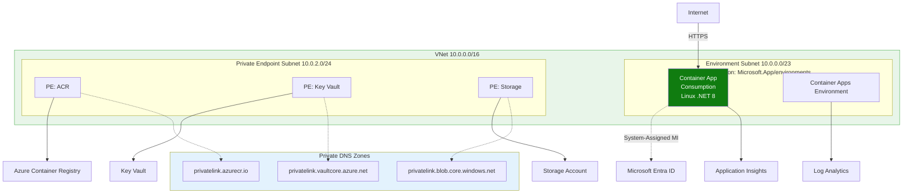
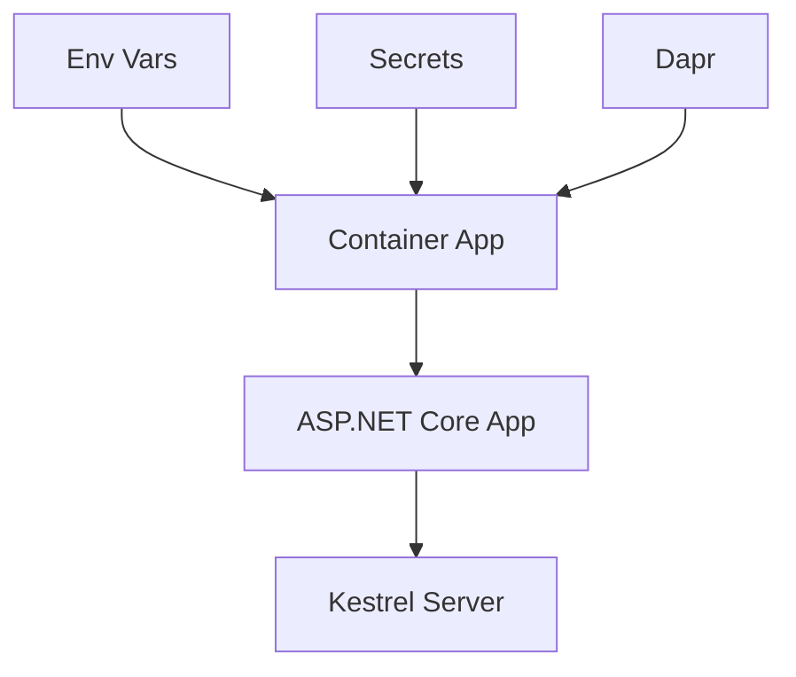

---
content_sources:
  diagrams:
  - id: this-tutorial-assumes-a-production-ready-container
    type: flowchart
    source: mslearn-adapted
    based_on:
    - https://learn.microsoft.com/aspnet/core/fundamentals/configuration/
    - https://learn.microsoft.com/azure/container-apps/manage-secrets
  - id: configuration-flow
    type: flowchart
    source: mslearn-adapted
    based_on:
    - https://learn.microsoft.com/aspnet/core/fundamentals/configuration/
    - https://learn.microsoft.com/azure/container-apps/manage-secrets
validation:
  az_cli:
    last_tested: null
    cli_version: null
    result: not_tested
  bicep:
    last_tested: null
    result: not_tested
---
# 03 - Configuration, Secrets, and Dapr

This step configures runtime settings in Azure Container Apps for your .NET application, including environment variables, secrets, KEDA scaling rules, and Dapr sidecar options.

!!! info "Infrastructure Context"
    **Service**: Container Apps (Consumption) | **Network**: VNet integrated | **VNet**: ✅

    This tutorial assumes a production-ready Container Apps deployment with a custom VNet, ACR with managed identity pull, and private endpoints for backend services.

    <!-- diagram-id: this-tutorial-assumes-a-production-ready-container -->


## Configuration Flow

<!-- diagram-id: configuration-flow -->


## Prerequisites

- Completed [02 - First Deploy to Azure Container Apps](02-first-deploy.md)
- A running Container App (deployed in [02 - First Deploy](02-first-deploy.md))

## Step-by-step

1. **Set standard variables (reuse Bicep outputs from Step 02)**

   ```bash
   RG="rg-dotnet-guide"
   DEPLOYMENT_NAME="main"

   APP_NAME=$(az deployment group show \
     --name "$DEPLOYMENT_NAME" \
     --resource-group "$RG" \
     --query "properties.outputs.containerAppName.value" \
     --output tsv)

   ACR_NAME=$(az deployment group show \
     --name "$DEPLOYMENT_NAME" \
     --resource-group "$RG" \
     --query "properties.outputs.containerRegistryName.value" \
     --output tsv)
   ```

2. **Set environment variables**

   ASP.NET Core automatically reads environment variables into its configuration system.

   ```bash
   az containerapp update \
     --name "$APP_NAME" \
     --resource-group "$RG" \
     --set-env-vars "Logging__LogLevel__Default=Information" "FeatureManagement__NewUI=true"
   ```

   | Command | Why it is used |
   |---|---|
   | `az containerapp update ...` | Updates the existing Container App configuration without recreating the app. |

   ???+ example "Expected output"
       ```json
       {
         "name": "<your-app-name>",
         "provisioningState": "Succeeded"
       }
       ```

3. **Store and reference a secret**

   ```bash
   az containerapp secret set \
     --name "$APP_NAME" \
     --resource-group "$RG" \
     --secrets "db-connection-string=Server=tcp:sql.database.windows.net;Database=mydb;"
   ```

   | Command | Why it is used |
   |---|---|
   | `az containerapp secret set ...` | Manages Container Apps secrets without exposing secret values in plain configuration. |

   ???+ example "Expected output"
       ```text
       Containerapp must be restarted in order for secret changes to take effect.
       ```
       ```json
       [
         {
           "name": "db-connection-string"
         }
       ]
       ```

   Map the secret to an environment variable:

   ```bash
   az containerapp update \
     --name "$APP_NAME" \
     --resource-group "$RG" \
     --set-env-vars "ConnectionStrings__DefaultConnection=secretref:db-connection-string"
   ```

   | Command | Why it is used |
   |---|---|
   | `az containerapp update ...` | Updates the existing Container App configuration without recreating the app. |

4. **Configure KEDA HTTP autoscaling**

   ```bash
   az containerapp update \
     --name "$APP_NAME" \
     --resource-group "$RG" \
     --min-replicas 0 \
     --max-replicas 10 \
     --scale-rule-name "http-scale" \
     --scale-rule-type "http" \
     --scale-rule-http-concurrency 50
   ```

   | Command | Why it is used |
   |---|---|
   | `az containerapp update ...` | Updates the existing Container App configuration without recreating the app. |

   ???+ example "Expected output"
       ```json
       {
         "name": "<your-app-name>",
         "provisioningState": "Succeeded"
       }
       ```

5. **Enable Dapr sidecar**

   ```bash
   az containerapp dapr enable \
     --name "$APP_NAME" \
     --resource-group "$RG" \
     --dapr-app-id "dotnet-api" \
     --dapr-app-port 8000
   ```

   | Command | Why it is used |
   |---|---|
   | `az containerapp dapr enable ...` | Configures Dapr sidecar settings for the Container App. |

   ???+ example "Expected output"
       ```json
       {
         "appId": "dotnet-api",
         "appPort": 8000,
         "appProtocol": "http",
         "enabled": true
       }
       ```

### Verify configuration in Azure Portal

![ca-dotnet-d38538 | Container App | Containers | Refresh | Send us your feedback | Container | Properties | Environment variables | Health probes | Volume mounts | Container details | Name | ca-dotnet-d38538 | Image source | Azure Container Registry | Authentication | Managed identity | Subscription | Visual Studio Enterprise Subscription | Registry | acrbasicsd38538.azurecr.io | Image | dotnet-sample | Image tag | v1 | Command override | Arguments override | Application | Revisions and replicas | Containers | Scale | Volumes | Settings | Networking | Ingress | Custom domains | CORS | Security | Monitoring | Log stream | Logs | Console | Alerts | Metrics](../../../assets/language-guides/dotnet/tutorial/03-containers-blade.png)

**[Observed]** `ca-dotnet-d38538`. `Container App`. `Containers`. `Refresh`. `Send us your feedback`. `Container`. `Properties`. `Environment variables`. `Health probes`. `Volume mounts`. `Container details`. `Name`. `ca-dotnet-d38538`. `Image source`. `Azure Container Registry`. `Docker Hub or other registries`. `Authentication`. `Managed identity`. `Secrets`. `Identity`. `System assigned`. `Subscription`. `Visual Studio Enterprise Subscription`. `Registry`. `acrbasicsd38538.azurecr.io`. `Image`. `dotnet-sample`. `Image tag`. `v1`. `Command override`. `Arguments override`. `Application`. `Revisions and replicas`. `Containers`. `Scale`. `Volumes`. `Settings`. `Networking`. `Ingress`. `Custom domains`. `CORS`. `Security`. `Monitoring`. `Log stream`. `Logs`. `Console`. `Alerts`. `Metrics`.

**[Inferred]** The `Environment variables` tab appears to map to the same `name=value` pairs supplied via `--set-env-vars` in [Step-by-step](#step-by-step). The `Image` field value `dotnet-sample` and `Image tag` value `v1` appear consistent with the `--image` reference set across [Step-by-step](#step-by-step). The `Registry` field value `acrbasicsd38538.azurecr.io` is consistent with the ACR login server referenced throughout [Step-by-step](#step-by-step). The left-navigation entry `Scale` is consistent with the `--scale-rule-*` levers configurable via the operations referenced in [Step-by-step](#step-by-step).

**[Not Proven]** Additional configuration detail and runtime parameter detail are not visible on this view.

## .NET example: read config safely

ASP.NET Core's `IConfiguration` makes it easy to read these values.

```csharp
// In Program.cs or a Controller
var logLevel = configuration["Logging:LogLevel:Default"];
var isNewUIEnabled = configuration.GetValue<bool>("FeatureManagement:NewUI");
var connectionString = configuration.GetConnectionString("DefaultConnection");
```

!!! tip "Environment Variable Naming"
    Use double underscores (`__`) in environment variable names to represent hierarchical configuration keys in .NET (e.g., `Logging__LogLevel__Default` maps to `Logging:LogLevel:Default`).

## Advanced Topics

- **Managed Identity**: Use `DefaultAzureCredential` from the Azure Identity SDK to access Key Vault without managing client secrets.
- **KEDA Scalers**: Explore .NET specific scalers like `azure-servicebus` or `rabbitmq` for background processing.
- **Dapr SDK**: Use the `Dapr.Client` NuGet package for advanced Dapr features like state store and pub/sub.

## See Also

- [04 - Logging, Monitoring, and Observability](04-logging-monitoring.md)
- [.NET Runtime Reference](../dotnet-runtime.md)
- [Recipes Index](../recipes/index.md)

## Sources
- [Configuration in ASP.NET Core (Microsoft Learn)](https://learn.microsoft.com/aspnet/core/fundamentals/configuration/)
- [Manage secrets in Azure Container Apps (Microsoft Learn)](https://learn.microsoft.com/azure/container-apps/manage-secrets)
