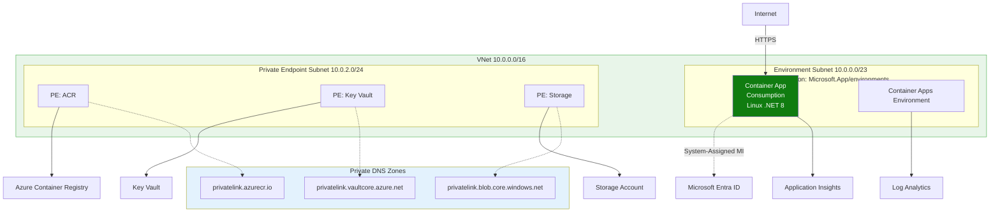
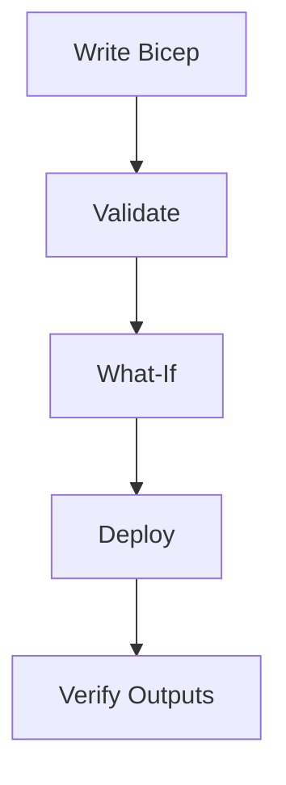
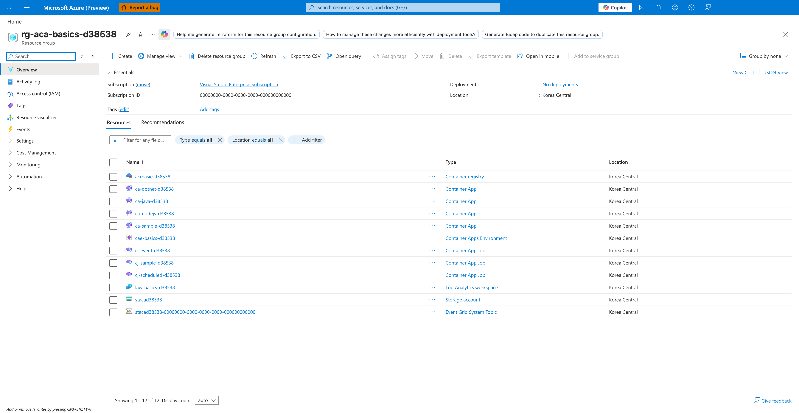

---
content_sources:
  diagrams:
    - id: this-tutorial-assumes-a-production-ready-container
      type: flowchart
      source: mslearn-adapted
      based_on:
        - https://learn.microsoft.com/en-us/azure/templates/microsoft.app/containerapps
        - https://learn.microsoft.com/en-us/azure/container-apps/azure-resource-manager-api-spec
    - id: infrastructure-lifecycle
      type: flowchart
      source: mslearn-adapted
      based_on:
        - https://learn.microsoft.com/en-us/azure/templates/microsoft.app/containerapps
        - https://learn.microsoft.com/en-us/azure/container-apps/azure-resource-manager-api-spec
validation:
  az_cli:
    last_tested:
    cli_version:
    result: not_tested
  bicep:
    last_tested:
    result: not_tested
---
# 05 - Infrastructure as Code with Bicep

Use Bicep to define your .NET application infrastructure consistently across environments. This step focuses on repeatable provisioning and safe updates of Azure Container Apps resources.

!!! info "Infrastructure Context"
    **Service**: Container Apps (Consumption) | **Network**: VNet integrated | **VNet**: ✅

    This tutorial assumes a production-ready Container Apps deployment with a custom VNet, ACR with managed identity pull, and private endpoints for backend services.

    <!-- diagram-id: this-tutorial-assumes-a-production-ready-container -->


## Infrastructure Lifecycle

<!-- diagram-id: infrastructure-lifecycle -->


## Prerequisites

- Completed [04 - Logging, Monitoring, and Observability](04-logging-monitoring.md)
- Bicep files under `infra/` (e.g., `main.bicep`)
- Azure CLI with Bicep installed

!!! info "Naming Convention"
    The shared `infra/main.bicep` template generates unique resource names using `uniqueString(resourceGroup().id)` (e.g., `ca-dotnet-guide-abc123def`). Earlier tutorials in this guide use simplified names like `ca-dotnet-guide` for readability. When deploying via Bicep, always capture actual names from deployment outputs using `az deployment group show`.

!!! tip "Run validate and what-if before every apply"
    Treat `az deployment group validate` and `az deployment group what-if` as required safety checks to prevent accidental production-impacting infrastructure changes.

## Step-by-step

1. **Set standard variables**

   ```bash
   RG="rg-dotnet-guide"
   BASE_NAME="dotnet-guide"
   LOCATION="koreacentral"
   DEPLOYMENT_NAME="main"
   ```

2. **Validate the Bicep template**

   ```bash
   az deployment group validate \
      --resource-group "$RG" \
      --template-file infra/main.bicep \
      --parameters baseName="$BASE_NAME" location="$LOCATION"
   ```

   | Command | Why it is used |
   |---|---|
   | `az deployment group validate ...` | Runs the Azure CLI operation required by the documented step. |

   ???+ example "Expected output"
       ```json
       {
         "status": "Succeeded",
         "error": null
       }
       ```

3. **Preview changes with what-if**

   ```bash
   az deployment group what-if \
      --resource-group "$RG" \
      --template-file infra/main.bicep \
      --parameters baseName="$BASE_NAME" location="$LOCATION"
   ```

   | Command | Why it is used |
   |---|---|
   | `az deployment group what-if ...` | Previews resource changes before deployment. |

   ???+ example "Expected output"
       ```text
       Resource and property changes are indicated with these symbols:
         + Create
         ~ Modify

       The deployment will update the following scope:
       Scope: /subscriptions/<subscription-id>/resourceGroups/rg-dotnet-guide

         ~ Microsoft.App/containerApps/<your-app-name> [2024-03-01]
           ~ properties.template.containers[0].image: "<acr-name>.azurecr.io/dotnet-guide:latest"
       ```

4. **Deploy infrastructure**

   ```bash
   az deployment group create \
      --name "$DEPLOYMENT_NAME" \
      --resource-group "$RG" \
      --template-file infra/main.bicep \
      --parameters baseName="$BASE_NAME" location="$LOCATION"
   ```

   | Command | Why it is used |
   |---|---|
   | `az deployment group create ...` | Deploys the Bicep or ARM template into the target resource group. |

   ???+ example "Expected output"
       ```json
       {
         "id": "/subscriptions/<subscription-id>/resourceGroups/rg-dotnet-guide/providers/Microsoft.Resources/deployments/main",
         "name": "main",
         "properties": {
           "provisioningState": "Succeeded",
           "outputs": {
             "containerAppName": { "type": "String", "value": "ca-dotnet-guide-<unique-suffix>" },
             "containerAppUrl": { "type": "String", "value": "https://ca-dotnet-guide-<unique-suffix>.<env-suffix>.koreacentral.azurecontainerapps.io" }
           }
         }
       }
       ```

       !!! note "Unique suffix"
           The `<unique-suffix>` is generated by `uniqueString(resourceGroup().id)` in Bicep to ensure globally unique resource names.

5. **Verify outputs and key resources**

   ```bash
   az deployment group show \
      --resource-group "$RG" \
      --name "$DEPLOYMENT_NAME" \
      --query properties.outputs
   ```

   | Command | Why it is used |
   |---|---|
   | `az deployment group show ...` | Reads deployment output and provisioning state for verification. |

   ???+ example "Expected output"
       ```json
       {
         "containerAppName": {
           "type": "String",
           "value": "ca-dotnet-guide-<unique-suffix>"
         },
         "containerAppEnvName": {
           "type": "String",
           "value": "cae-dotnet-guide-<unique-suffix>"
         },
         "containerRegistryName": {
           "type": "String",
           "value": "crdotnetguide<unique-suffix>"
         },
         "containerAppUrl": {
           "type": "String",
           "value": "https://ca-dotnet-guide-<unique-suffix>.<env-suffix>.koreacentral.azurecontainerapps.io"
         }
       }
       ```

## Example Bicep snippet (.NET App with Health Probes)

```bicep
resource containerApp 'Microsoft.App/containerApps@2024-03-01' = {
  name: 'ca-${baseName}'
  location: location
  properties: {
    managedEnvironmentId: environment.id
    configuration: {
      ingress: {
        external: true
        targetPort: 8000
      }
    }
    template: {
      containers: [
        {
          name: 'app'
          image: '${acr.properties.loginServer}/${imageName}'
          probes: [
            {
              type: 'Liveness'
              httpGet: {
                path: '/health'
                port: 8000
              }
              initialDelaySeconds: 5
              periodSeconds: 10
            }
            {
              type: 'Readiness'
              httpGet: {
                path: '/health'
                port: 8000
              }
              initialDelaySeconds: 5
              periodSeconds: 10
            }
          ]
        }
      ]
    }
  }
}
```

## Advanced Topics

- **Modular Bicep**: Split your templates into reusable modules for networking, storage, and identity.
- **Deployment Scripts**: Use `Microsoft.Resources/deploymentScripts` to perform post-deployment tasks like database migrations.
- **Resource Locking**: Apply `Microsoft.Authorization/locks` to prevent accidental deletion of critical infrastructure.

!!! warning "Avoid out-of-band portal edits"
    Manual portal changes can create drift from your Bicep templates. Prefer template updates and redeployment so environments remain reproducible and auditable.

## CLI Alternative (No Bicep)

Use these commands when you need an imperative deployment path without Bicep.

### Step 1: Set variables

```bash
RG="rg-dotnet-containerapp"
LOCATION="koreacentral"
APP_NAME="ca-dotnet-demo"
BASE_NAME="dotnet-app"
ACA_ENV_NAME="cae-dotnet-demo"
ACR_NAME="crdotnetdemo"
LOG_NAME="log-dotnet-demo"
```

???+ example "Expected output"
    ```text
    Variables exported for resource group, workspace, registry, environment, and app.
    ```

### Step 2: Create resource group and Log Analytics workspace

```bash
az group create --name $RG --location $LOCATION
az monitor log-analytics workspace create --resource-group $RG --workspace-name $LOG_NAME --location $LOCATION
```

| Command | Why it is used |
|---|---|
| `az group create ...` | Creates the isolated resource group used by the example. |

???+ example "Expected output"
    ```text
    {
      "name": "rg-dotnet-containerapp",
      "properties": {
        "provisioningState": "Succeeded"
      }
    }
    {
      "name": "log-dotnet-demo",
      "customerId": "b2c3d4e5-f6a7-8901-bcde-f23456789012",
      "id": "/subscriptions/<subscription-id>/resourceGroups/rg-dotnet-containerapp/providers/Microsoft.OperationalInsights/workspaces/log-dotnet-demo"
    }
    ```

### Step 3: Create ACR and Container Apps environment

```bash
az acr create --resource-group $RG --name $ACR_NAME --sku Basic
LOG_ID=$(az monitor log-analytics workspace show --resource-group $RG --workspace-name $LOG_NAME --query customerId --output tsv)
LOG_KEY=$(az monitor log-analytics workspace get-shared-keys --resource-group $RG --workspace-name $LOG_NAME --query primarySharedKey --output tsv)
az containerapp env create --resource-group $RG --name $ACA_ENV_NAME --location $LOCATION --logs-workspace-id $LOG_ID --logs-workspace-key $LOG_KEY
```

| Command | Why it is used |
|---|---|
| `az acr create --resource-group ...` | Creates Azure Container Registry for container image storage. |

???+ example "Expected output"
    ```text
    {
      "name": "crdotnetdemo",
      "loginServer": "crdotnetdemo.azurecr.io",
      "provisioningState": "Succeeded"
    }
    {
      "name": "cae-dotnet-demo",
      "id": "/subscriptions/<subscription-id>/resourceGroups/rg-dotnet-containerapp/providers/Microsoft.App/managedEnvironments/cae-dotnet-demo",
      "provisioningState": "Succeeded"
    }
    ```

### Step 4: Create Container App with environment variables

```bash
az containerapp create --resource-group $RG --name $APP_NAME --environment $ACA_ENV_NAME --image $ACR_NAME.azurecr.io/$BASE_NAME:v1 --target-port 8000 --ingress external --env-vars ASPNETCORE_ENVIRONMENT=Production --query "properties.configuration.ingress.fqdn"
```

| Command | Why it is used |
|---|---|
| `az containerapp create --resource-group ...` | Creates the Container App with the documented image, ingress, scale, and environment settings. |

???+ example "Expected output"
    ```text
    "<container-app-fqdn>"
    ```

### Step 5: Validate configuration

```bash
az containerapp show --resource-group $RG --name $APP_NAME --query "{fqdn:properties.configuration.ingress.fqdn,targetPort:properties.configuration.ingress.targetPort,environmentVariables:properties.template.containers[0].env}"
```

| Command | Why it is used |
|---|---|
| `az containerapp show --resource-group ...` | Reads the Container App configuration so the documented setting can be verified. |

???+ example "Expected output"
    ```json
    {
      "environmentVariables": [
        {
          "name": "ASPNETCORE_ENVIRONMENT",
          "value": "Production"
        }
      ],
      "fqdn": "<container-app-fqdn>",
      "targetPort": 8000
    }
    ```

### Verify resource group in Azure Portal



**[Observed]** `Microsoft Azure (Preview)`. `Report a bug`. `Search resources, services, and docs (G+/)`. `Copilot`. `Home`. `rg-aca-basics-d38538`. `Resource group`. `Help me generate Terraform for this resource group configuration.`. `How to manage these changes more efficiently with deployment tools?`. `Generate Bicep code to duplicate this resource group.`. `Create`. `Manage view`. `Delete resource group`. `Refresh`. `Export to CSV`. `Open query`. `Assign tags`. `Move`. `Delete`. `Export template`. `Open in mobile`. `Add to service group`. `Group by none`. `Essentials`. `Subscription (move)`. `Visual Studio Enterprise Subscription`. `Subscription ID`. `00000000-0000-0000-0000-000000000000`. `Deployments`. `No deployments`. `Location`. `Korea Central`. `Tags (edit)`. `Add tags`. `View Cost`. `JSON View`. `Resources`. `Recommendations`. `Filter for any field...`. `Type equals all`. `Location equals all`. `Add filter`. `Name`. `Type`. `acrbasicsd38538`. `Container registry`. `ca-dotnet-d38538`. `Container App`. `ca-java-d38538`. `ca-nodejs-d38538`. `ca-sample-d38538`. `cae-basics-d38538`. `Container Apps Environment`. `cj-event-d38538`. `Container App Job`. `cj-sample-d38538`. `cj-scheduled-d38538`. `law-basics-d38538`. `Log Analytics workspace`. `stacad38538`. `Storage account`. `stacad38538-00000000-0000-0000-0000-000000000000`. `Event Grid System Topic`. `Overview`. `Activity log`. `Access control (IAM)`. `Tags`. `Resource visualizer`. `Events`. `Settings`. `Cost Management`. `Monitoring`. `Automation`. `Help`. `Showing 1 - 12 of 12`.

**[Inferred]** The `Container App` row `ca-dotnet-d38538` appears consistent with the ASP.NET Core Container App resource provisioned by `az containerapp create` in [Step 4: Create Container App with environment variables](#step-4-create-container-app-with-environment-variables). The `Container Apps Environment` row `cae-basics-d38538` appears consistent with the environment resource provisioned in [Step 3: Create ACR and Container Apps environment](#step-3-create-acr-and-container-apps-environment). The `Container registry` row `acrbasicsd38538` appears consistent with the ACR resource provisioned by `az acr create` in [Step 3: Create ACR and Container Apps environment](#step-3-create-acr-and-container-apps-environment). The `Log Analytics workspace` row `law-basics-d38538` appears consistent with the workspace resource provisioned by `az monitor log-analytics workspace create` in [Step 2: Create resource group and Log Analytics workspace](#step-2-create-resource-group-and-log-analytics-workspace).

**[Not Proven]** Additional template body, deployment command, and deployment history detail are not visible on this view.

## See Also
- [02 - First Deploy to Azure Container Apps](02-first-deploy.md)
- [06 - CI/CD with GitHub Actions](06-ci-cd.md)
- [Bicep Documentation (Microsoft Learn)](https://learn.microsoft.com/en-us/azure/azure-resource-manager/bicep/)

## Sources
- [Bicep resource definition: Microsoft.App/containerApps (Microsoft Learn)](https://learn.microsoft.com/en-us/azure/templates/microsoft.app/containerapps)
- [Bicep and Azure Container Apps (Microsoft Learn)](https://learn.microsoft.com/en-us/azure/container-apps/azure-resource-manager-api-spec)
