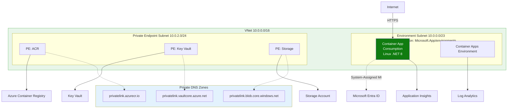
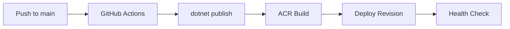

---
content_sources:
  diagrams:
    - id: this-tutorial-assumes-a-production-ready-container
      type: flowchart
      source: mslearn-adapted
      based_on:
        - https://learn.microsoft.com/azure/container-apps/github-actions
    - id: ci-cd-pipeline-flow
      type: flowchart
      source: mslearn-adapted
      based_on:
        - https://learn.microsoft.com/azure/container-apps/github-actions
---

# 06 - CI/CD with GitHub Actions

Automate the build and deployment of your .NET application so every commit produces a new Container App revision. This tutorial uses GitHub Actions, Azure Container Registry (ACR), and the Azure Container Apps deploy action.

!!! info "Infrastructure Context"
    **Service**: Container Apps (Consumption) | **Network**: VNet integrated | **VNet**: ✅

    This tutorial assumes a production-ready Container Apps deployment with a custom VNet, ACR with managed identity pull, and private endpoints for backend services.

    <!-- diagram-id: this-tutorial-assumes-a-production-ready-container -->


## CI/CD Pipeline Flow

<!-- diagram-id: ci-cd-pipeline-flow -->


## Prerequisites

- Completed [05 - Infrastructure as Code with Bicep](05-infrastructure-as-code.md)
- GitHub repository with your .NET source code
- Azure service principal stored as a GitHub secret

!!! warning "Never expose credentials in workflow logs"
    Keep all credential material in GitHub Secrets and avoid printing secret-derived values in shell steps. Use masked placeholders in documentation and workflow examples.

## Step-by-step

1. **Configure repository variables and secrets**

   - **Variables**: `RESOURCE_GROUP`, `APP_NAME`, `ACR_NAME`
   - **Secrets**: `AZURE_CREDENTIALS`, `REGISTRY_USERNAME`, `REGISTRY_PASSWORD`

   Example `AZURE_CREDENTIALS` JSON (masked):

   ```json
   {
     "clientId": "xxxxxxxx-xxxx-xxxx-xxxx-xxxxxxxxxxxx",
     "clientSecret": "<client-secret>",
     "subscriptionId": "<subscription-id>",
     "tenantId": "<tenant-id>"
   }
   ```

2. **Create the GitHub Actions workflow file**

   Save this as `.github/workflows/deploy.yml`:

   ```yaml
   name: Deploy .NET App to ACA

   on:
     push:
       branches: [ main ]
     workflow_dispatch:

   jobs:
     build-and-deploy:
       runs-on: ubuntu-latest
       steps:
         - name: Checkout code
           uses: actions/checkout@v4

         - name: Setup .NET
           uses: actions/setup-dotnet@v4
           with:
             dotnet-version: '8.0.x'

         - name: Azure Login
           uses: azure/login@v2
           with:
             creds: ${{ secrets.AZURE_CREDENTIALS }}

         - name: Build and Push to ACR
           uses: azure/docker-login@v2
           with:
             login-server: ${{ vars.ACR_NAME }}.azurecr.io
             username: ${{ secrets.REGISTRY_USERNAME }}
             password: ${{ secrets.REGISTRY_PASSWORD }}

         - name: Build container image
           run: |
             docker build -t ${{ vars.ACR_NAME }}.azurecr.io/${{ vars.APP_NAME }}:${{ github.sha }} ./apps/dotnet-aspnetcore
             docker push ${{ vars.ACR_NAME }}.azurecr.io/${{ vars.APP_NAME }}:${{ github.sha }}

         - name: Deploy to Container App
           uses: azure/container-apps-deploy-action@v1
           with:
             imageToDeploy: ${{ vars.ACR_NAME }}.azurecr.io/${{ vars.APP_NAME }}:${{ github.sha }}
             resourceGroup: ${{ vars.RESOURCE_GROUP }}
             containerAppName: ${{ vars.APP_NAME }}
   ```

3. **Add unit tests to the pipeline (Recommended)**

   Before building the container, ensure your .NET tests pass:

   ```yaml
         - name: Run Tests
           run: dotnet test ./apps/dotnet-aspnetcore/AzureContainerApps.csproj --configuration Release
   ```

4. **Validate rollout behavior**

     - Trigger the workflow by pushing a change to `main`.
     - Confirm a new revision was created in the Azure Portal or via CLI.
     - Confirm traffic moved to the healthy new revision.

     ```bash
     az containerapp revision list \
       --name "$APP_NAME" \
       --resource-group "$RESOURCE_GROUP" \
       --query "[].{name:name,active:properties.active,trafficWeight:properties.trafficWeight,healthState:properties.healthState}"
     ```

     ???+ example "Expected output"
         ```json
         [
           {
             "name": "<your-app-name>--<sha>",
             "active": true,
             "trafficWeight": 100,
             "healthState": "Healthy"
           }
         ]
         ```

## Advanced Topics

- **Environment-based deployments**: Use GitHub Environments with protection rules for manual approval before deploying to production.
- **Bicep integration**: Run `az deployment group create` within the workflow to ensure infrastructure stays in sync with code.
- **Canary releases**: Use the `azure/container-apps-deploy-action` to deploy with 0% traffic initially, then gradually ramp up after verification.

!!! tip "Use immutable image tags"
    Always tag your images with `${{ github.sha }}` or a semantic version. This ensures that every revision in Container Apps can be traced back to a specific commit in your repository.

## See Also
- [02 - First Deploy to Azure Container Apps](02-first-deploy.md)
- [05 - Infrastructure as Code with Bicep](05-infrastructure-as-code.md)
- [GitHub Actions for Azure (Microsoft Learn)](https://learn.microsoft.com/azure/developer/github/github-actions-for-azure)

## Sources
- [GitHub Actions for Azure Container Apps (Microsoft Learn)](https://learn.microsoft.com/azure/container-apps/github-actions)
- [setup-dotnet action (GitHub)](https://github.com/actions/setup-dotnet)
