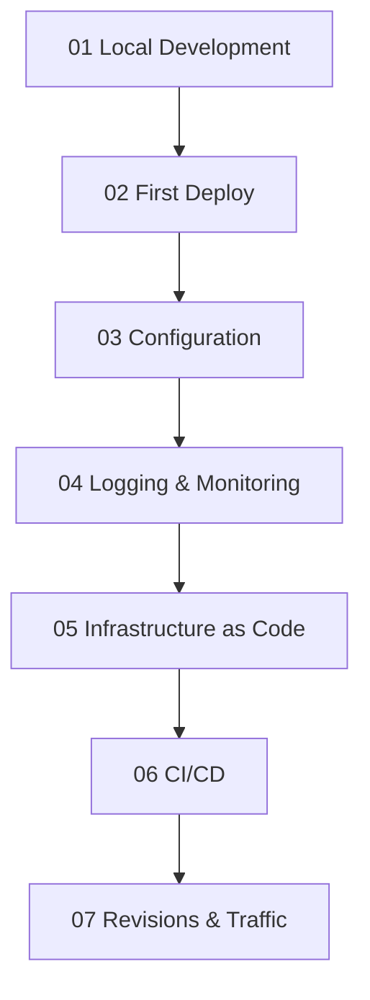

---
content_sources:
  diagrams:
    - id: tutorial-progression
      type: flowchart
      source: mslearn-adapted
      based_on:
        - https://learn.microsoft.com/azure/container-apps/
        - https://learn.microsoft.com/azure/container-apps/dotnet-overview
---

# .NET Tutorial Index

This tutorial path walks you from local development to safe production rollout for .NET apps on Azure Container Apps.

## Prerequisites

Before starting, install and verify:

- .NET 8 SDK
- Docker
- Azure CLI

## Tutorial Progression

<!-- diagram-id: tutorial-progression -->

## Steps

| Step | Title | Purpose |
|---|---|---|
| [01-local-development](./01-local-development.md) | Local Development | Build and run the app locally with Docker. |
| [02-first-deploy](./02-first-deploy.md) | First Deploy | Publish the container image and create the first Container App. |
| [03-configuration](./03-configuration.md) | Configuration | Set environment variables and secrets safely. |
| [04-logging-monitoring](./04-logging-monitoring.md) | Logging & Monitoring | Collect logs, metrics, and traces for the app. |
| [05-infrastructure-as-code](./05-infrastructure-as-code.md) | Infrastructure as Code | Provision the environment with Bicep. |
| [06-ci-cd](./06-ci-cd.md) | CI/CD | Automate build and deployment with GitHub Actions. |
| [07-revisions-traffic](./07-revisions-traffic.md) | Revisions & Traffic | Use revisions and traffic splitting for safe releases. |

## Related Guides

- [.NET guide overview](../index.md)
- [.NET runtime reference](../dotnet-runtime.md)
- [.NET recipes index](../recipes/index.md)
