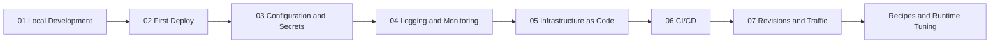

---
hide:
  - toc
---

# Language Guides: Step-by-Step Implementation

Language Guides provide a tailored experience for developers working with specific runtimes on Azure Container Apps. Each guide is a complete learning path from local development to production operations.

## Purpose

These guides are designed to help you build applications that are "platform-native." Instead of just showing how to "deploy an app," they explain how to implement patterns that make your application resilient, observable, and easy to manage.

## Available Language Guides

-   **[Python (Flask)](python/index.md)**: Flask with Gunicorn, health endpoints, structured logging, and integration recipes.
-   **[Node.js (Express)](nodejs/index.md)**: Express with structured logging, health endpoints, and Node.js-specific patterns.
-   **[Java (Spring Boot)](java/index.md)**: Spring Boot with Actuator, Logback JSON logging, and JVM optimization.
-   **[.NET (ASP.NET Core)](dotnet/index.md)**: ASP.NET Core with health checks middleware, JSON logging, and Kestrel configuration.

## Language Support Matrix

| Language | Runtime | Status | Tutorial Count | Recipes |
|---|---|---|---:|---:|
| Python | Flask + Gunicorn on `python:3.11-slim` | ✅ Complete | 7 (`01`-`07`) | 14 |
| Node.js | Express on `node:20-slim` | ✅ Complete | 7 (`01`-`07`) | Index |
| Java | Spring Boot on `eclipse-temurin:21-jre-alpine` | ✅ Complete | 7 (`01`-`07`) | Index |
| .NET | ASP.NET Core on `mcr.microsoft.com/dotnet/aspnet:8.0-alpine` | ✅ Complete | 7 (`01`-`07`) | Index |

## Tutorial Progression Model

## What Each Language Guide Includes

Every language-specific path is structured the same way:

1. **Tutorial Steps**: A numbered sequence from `01-local-development` to `07-revisions-traffic`.
2. **Runtime Guide**: Details on specific runtime settings (e.g., Gunicorn workers, Node.js heap size, JVM tuning, Kestrel limits).
3. **Recipes**: "Copy-pasteable" patterns for connecting to Cosmos DB, Redis, Key Vault, and more.

## Common Patterns Across All Languages

While the implementation details vary, every application in this guide follows these core patterns:

-   **Health Endpoints**: Exposing `/health` for liveness and readiness probes.
-   **Structured Logging**: Writing logs in JSON format for Azure Log Analytics.
-   **Managed Identity**: Authenticating to Azure services without passwords or connection strings.
-   **Revision-Safe Behavior**: Handling SIGTERM for graceful shutdown.
-   **Port Binding**: Listening on port 8000 (configurable via environment variable).

## How to Choose Your Starting Path

| Goal | Recommended starting point | Why |
|---|---|---|
| Python Flask deployment | [Python Step 01](python/01-local-development.md) | Production-hardened Flask reference |
| Node.js Express deployment | [Node.js Step 01](nodejs/01-local-development.md) | Express with async/await patterns |
| Java Spring Boot deployment | [Java Step 01](java/01-local-development.md) | Spring Boot with Actuator health endpoints |
| .NET ASP.NET Core deployment | [.NET Step 01](dotnet/01-local-development.md) | ASP.NET Core with health checks middleware |
| Full lifecycle understanding | Any language index page | Covers complete operating model |

## Reference Applications

Each language guide has a corresponding reference application in the `apps/` directory:

| Language | Reference App | Key Features |
|---|---|---|
| Python | `apps/python/` | Flask, Gunicorn, OpenTelemetry |
| Node.js | `apps/nodejs/` | Express, structured logging |
| Java | `apps/java-springboot/` | Spring Boot, Actuator, Logback |
| .NET | `apps/dotnet-aspnetcore/` | ASP.NET Core, health checks, JSON logging |

## See Also

- [Python Guide](python/index.md)
- [Node.js Guide](nodejs/index.md)
- [Java Guide](java/index.md)
- [.NET Guide](dotnet/index.md)
- [Start Here - Learning Paths](../start-here/learning-paths.md)
- [Platform - Architecture](../platform/index.md)

## Sources

- [Azure Container Apps documentation (Microsoft Learn)](https://learn.microsoft.com/azure/container-apps/)
- [Python on Azure Container Apps (Microsoft Learn)](https://learn.microsoft.com/azure/container-apps/python-overview)
- [Dapr documentation](https://docs.dapr.io/)
- [KEDA documentation](https://keda.sh/)
