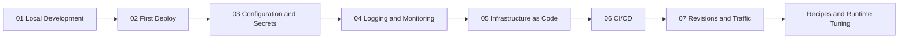

# Language Guides: Step-by-Step Implementation

Language Guides provide a tailored experience for developers working with specific runtimes on Azure Container Apps. Each guide is a complete learning path from local development to production operations.

## Purpose

These guides are designed to help you build applications that are "platform-native." Instead of just showing how to "deploy an app," they explain how to implement patterns that make your application resilient, observable, and easy to manage.

## Currently Available

-   **[Python (Flask)](python/01-local-development.md)**: A comprehensive guide covering Flask with Gunicorn, health endpoints, structured logging, and common integration recipes.

## Language Support Matrix

| Language | Runtime | Status | Tutorial Count | Recipes |
|---|---|---|---:|---:|
| Python | Flask + Gunicorn on `python:3.11-slim` | Available now | 7 (`01`-`07`) | 13+
| Node.js | Express/Fastify on Node LTS | Planned | 0 (planned) | 0 (planned)
| Java | Spring Boot / Quarkus | Planned | 0 (planned) | 0 (planned)
| C# | ASP.NET Core / Minimal API (.NET 8+) | Planned | 0 (planned) | 0 (planned)

!!! tip "Start with Python for the full end-to-end path"
    Python is currently the most complete language track in this repository, including local development, first deployment, configuration/secrets, observability, IaC, CI/CD, revisions/traffic, runtime guidance, and integration recipes.

## Tutorial Progression Model

## Coming Soon (Roadmap)

-   **Node.js (Express)**: Best practices for async performance, memory management, and package optimization.
-   **Java (Spring Boot / Quarkus)**: Guides for optimizing startup times with Native Image, JVM tuning, and Dapr SDK.
-   **C# (.NET 8+)**: Minimal APIs, health check middleware, and managed identity integration.

Roadmap principles used for new language tracks:

1. Start with a production-ready reference app under `apps/<language>/`.
2. Publish the 7-step tutorial sequence (`01` to `07`) before adding advanced recipes.
3. Add runtime tuning guidance and troubleshooting playbooks after baseline tutorials stabilize.

!!! note "Contributions are welcome for planned languages"
    If you want to help build Node.js, Java, or C# tracks, open an issue with a proposed scope (runtime, tutorial step, or recipe). Prioritize parity with the Python structure so users can transfer the same operational model across languages.

## What Each Language Guide Includes

Every language-specific path is structured the same way:

1. **Tutorial Steps**: A numbered sequence from `01-local-run` to `07-revisions-traffic`.
2. **Runtime Guide**: Details on specific runtime settings (e.g., Gunicorn workers, memory limits, port binding).
3. **Recipes**: "Copy-pasteable" patterns for connecting to Cosmos DB, Redis, Key Vault, and more.

## Common Patterns Across All Languages

While the implementation details vary, every application in this hub follows these core patterns:

-   **Health Endpoints**: Exposing `/health` for liveness and readiness probes.
-   **Structured Logging**: Writing logs in JSON format for Azure Log Analytics.
-   **Managed Identity**: Authenticating to Azure services without passwords or connection strings.
-   **Revision-Safe Behavior**: Handling SIGTERM for graceful shutdown and stateful handoffs.
-   **Port Binding**: Listening on the port specified by the platform (defaulting to 8000).

## How to Choose Your Starting Path

| Goal | Recommended starting point | Why |
|---|---|---|
| First deployment this week | [Python Step 01](python/01-local-development.md) | Fastest validated path in this repository |
| Team platform alignment | [Python index](python/index.md) | Covers full lifecycle and operating model |
| Runtime tuning focus | [Python runtime](python/python-runtime.md) | Concentrated Gunicorn/container guidance |
| Service integration focus | [Python recipes](python/recipes/index.md) | Task-oriented patterns for data, identity, and ingress |

## See Also

- [Python Guide](python/01-local-development.md)
- [Python Language Guide Index](python/index.md)
- [Python Recipes Index](python/recipes/index.md)
- [Start Here - Learning Paths](../start-here/learning-paths.md)
- [Platform - Architecture](../platform/index.md)

## Sources

- [Azure Container Apps documentation (Microsoft Learn)](https://learn.microsoft.com/azure/container-apps/)
- [Dapr documentation](https://docs.dapr.io/)
- [KEDA documentation](https://keda.sh/)
