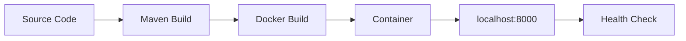

---
hide:
  - toc
content_sources:
  diagrams:
    - id: this-tutorial-assumes-a-production-ready-container
      type: flowchart
      source: mslearn-adapted
      based_on:
        - https://learn.microsoft.com/azure/container-apps/containers#configuration
    - id: local-development-workflow
      type: flowchart
      source: mslearn-adapted
      based_on:
        - https://learn.microsoft.com/azure/container-apps/containers#configuration
---

# 01 - Run Locally with Docker

Before deploying to Azure Container Apps, validate your Java app in a container locally. This catches image, dependency, and port issues early.

!!! info "Infrastructure Context"
    **Service**: Container Apps (Consumption) | **Network**: VNet integrated | **VNet**: ✅

    This tutorial assumes a production-ready Container Apps deployment with a custom VNet, ACR with managed identity pull, and private endpoints for backend services.

    <!-- diagram-id: this-tutorial-assumes-a-production-ready-container -->
    ```mermaid
    flowchart TD
        INET[Internet] -->|HTTPS| CA["Container App\nConsumption\nLinux Java 17"]

        subgraph VNET["VNet 10.0.0.0/16"]
            subgraph ENV_SUB["Environment Subnet 10.0.0.0/23\nDelegation: Microsoft.App/environments"]
                CAE[Container Apps Environment]
                CA
            end
            subgraph PE_SUB["Private Endpoint Subnet 10.0.2.0/24"]
                PE_ACR[PE: ACR]
                PE_KV[PE: Key Vault]
                PE_ST[PE: Storage]
            end
        end

        PE_ACR --> ACR[Azure Container Registry]
        PE_KV --> KV[Key Vault]
        PE_ST --> ST[Storage Account]

        subgraph DNS[Private DNS Zones]
            DNS_ACR[privatelink.azurecr.io]
            DNS_KV[privatelink.vaultcore.azure.net]
            DNS_ST[privatelink.blob.core.windows.net]
        end

        PE_ACR -.-> DNS_ACR
        PE_KV -.-> DNS_KV
        PE_ST -.-> DNS_ST

        CA -.->|System-Assigned MI| ENTRA[Microsoft Entra ID]
        CAE --> LOG[Log Analytics]
        CA --> AI[Application Insights]

        style CA fill:#107c10,color:#fff
        style VNET fill:#E8F5E9,stroke:#4CAF50
        style DNS fill:#E3F2FD
    ```

## Local Development Workflow

<!-- diagram-id: local-development-workflow -->


## Prerequisites

- Docker Engine or Docker Desktop
- Source code with a `pom.xml` and `Dockerfile`
- JDK 21 and Maven (optional, if building without Docker)

!!! tip "Aim for local-cloud parity"
    Keep local container port mapping and environment variable names aligned with your Azure deployment settings. This reduces revision failures caused by mismatched runtime assumptions.

## Step-by-step

1. **Build the container image**

    The reference application uses a multi-stage Dockerfile that builds the application using Maven before creating the final JRE-based image.

    ```bash
    cd apps/java-springboot
    docker build --tag aca-java-guide .
    ```

    ???+ example "Expected output"
        ```text
        [+] Building 42.5s (12/12) FINISHED
         => [internal] load build definition from Dockerfile
         => [internal] load .dockerignore
         => [build 1/5] FROM docker.io/library/maven:3.9-eclipse-temurin-21@sha256:xxx
         => [build 2/5] WORKDIR /app
         => [build 3/5] COPY pom.xml .
         => [build 4/5] RUN mvn dependency:go-offline -B
         => [build 5/5] COPY src ./src
         => [build 6/6] RUN mvn package -DskipTests -B
         => [stage-1 1/3] FROM docker.io/library/eclipse-temurin:21-jre-alpine@sha256:xxx
         => [stage-1 2/3] WORKDIR /app
         => [stage-1 3/3] COPY --from=build /app/target/*.jar app.jar
         => exporting to image
         => naming to docker.io/library/aca-java-guide
        ```

2. **Run the container locally**

    ```bash
    docker run --publish 8000:8000 --name java-guide aca-java-guide
    ```

    ???+ example "Expected output"
        ```text
          .   ____          _            __ _ _
         /\\ / ___'_ __ _ _(_)_ __  __ _ \ \ \ \
        ( ( )\___ | '_ | '_| | '_ \/ _` | \ \ \ \
         \\/  ___)| |_)| | | | | || (_| |  ) ) ) )
          '  |____| .__|_| |_|_| |_\__, | / / / /
         =========|_|==============|___/=/_/_/_/
         :: Spring Boot ::                (v3.2.4)

        2026-04-04T16:12:50.123Z  INFO 1 --- [           main] com.example.demo.DemoApplication        : Starting DemoApplication v1.0.0 using Java 21.0.10
        2026-04-04T16:12:54.456Z  INFO 1 --- [           main] o.s.b.w.embedded.tomcat.TomcatWebServer  : Tomcat initialized with port 8000 (http)
        2026-04-04T16:12:58.789Z  INFO 1 --- [           main] com.example.demo.DemoApplication        : Started DemoApplication in 8.67 seconds (process running for 9.12)
        ```

3. **Verify health endpoint**

    Spring Boot applications typically use Actuator for health monitoring. In the reference app, a custom endpoint is provided at `/health`.

    ```bash
    curl http://localhost:8000/health
    ```

    ???+ example "Expected output"
        ```json
        {"status":"healthy","timestamp":"2026-04-04T16:12:58.973766483Z"}
        ```

    You can also verify runtime metadata:

    ```bash
    curl http://localhost:8000/info
    ```

    ???+ example "Expected output"
        ```json
        {"runtime":{"vendor":"Eclipse Adoptium","java":"21.0.10"},"app":"azure-container-apps-java-guide","version":"1.0.0"}
        ```

4. **Inspect application logs**

    ```bash
    docker logs java-guide
    ```

    To find all containers: `docker ps -a`

## Local parity checklist

- Application listens on port `8000` (matches `EXPOSE 8000` in Dockerfile)
- Required environment variables are present (if any)
- `/health` returns HTTP 200
- No startup exceptions (e.g., `BeanCreationException`, `ApplicationContextException`) in container logs

!!! warning "Do not commit local secret files"
    If you create a local `.env` file for testing, keep sensitive values out of source control and use placeholder values in shared examples.

## Advanced Topics

- **Actuator Health**: Configure `management.endpoint.health.show-details=always` for more detailed local health diagnostics.
- **Remote Debugging**: Attach your IDE to the local container using JVM debug flags (`-agentlib:jdwp=transport=dt_socket,server=y,suspend=n,address=*:5005`).
- **Memory Limits**: Test how the JVM responds to container memory limits by adding `--memory="512m"` to `docker run`.

## See Also
- [02 - First Deploy to Azure Container Apps](02-first-deploy.md)
- [03 - Configuration and Secrets](03-configuration.md)
- [Java Runtime Reference](java-runtime.md)

## Sources
- [Spring Boot with Docker](https://spring.io/guides/topicals/spring-boot-docker/)
- [Eclipse Temurin Documentation](https://adoptium.net/docs/)
- [Dockerfile requirements for Azure Container Apps (Microsoft Learn)](https://learn.microsoft.com/azure/container-apps/containers#configuration)
