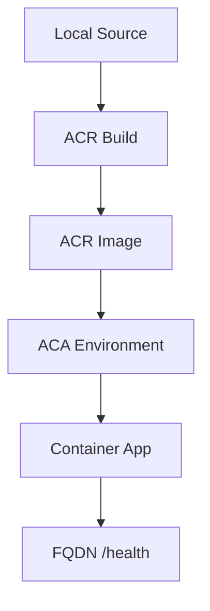

---
hide:
  - toc
---

# 02 - First Deploy to Azure

This guide walks you through the initial deployment of your Spring Boot application to Azure Container Apps. We'll use the Azure CLI to create a Container Registry, build the image in the cloud, and provision a Container App environment.

## Deployment Workflow



## Prerequisites

- Azure CLI 2.57+
- Active Azure Subscription
- Terminal with common variables set

## Step 1: Environment Setup

Before running commands, set your common variables to ensure consistency.

```bash
# Variables
RG="rg-java-guide"
LOCATION="koreacentral"
ENVIRONMENT_NAME="cae-java-guide"
ACR_NAME="crjava$(date +%s)"
APP_NAME="ca-java-guide"
```

## Step 2: Create Infrastructure

1. **Create a Resource Group**

    ```bash
    az group create --name $RG --location $LOCATION
    ```

2. **Create a Container Registry (ACR)**

    ```bash
    az acr create --resource-group $RG --name $ACR_NAME --sku Basic
    ```

3. **Create a Container Apps Environment**

    ```bash
    az containerapp env create --resource-group $RG --name $ENVIRONMENT_NAME --location $LOCATION
    ```

## Step 3: Build and Push Image

Instead of building locally and pushing, use ACR Tasks to build the image directly in Azure from your source code.

```bash
cd apps/java-springboot
az acr build --registry $ACR_NAME --image java-guide:latest .
```

???+ example "Expected output"
    ```text
    Packing source code into tar to upload...
    Uploading 1.23 MB to registry...
    Building image...
    [build 1/5] FROM docker.io/library/maven:3.9-eclipse-temurin-21
    ... (Maven build output)
    [stage-1 3/3] COPY --from=build /app/target/*.jar app.jar
    Run ID: ce1 was successful after 1m 15s
    ```

## Step 4: Create the Container App

Deploy the application using the image from your ACR. We'll configure it to listen on port `8000` with public ingress.

```bash
az containerapp create \
  --resource-group $RG \
  --name $APP_NAME \
  --environment $ENVIRONMENT_NAME \
  --image $ACR_NAME.azurecr.io/java-guide:latest \
  --target-port 8000 \
  --ingress external \
  --query "properties.configuration.ingress.fqdn"
```

???+ example "Expected output"
    ```text
    "<your-app-name>.<environment-hash>.<region>.azurecontainerapps.io"
    ```

## Step 5: Verification

1. **Check the application URL**

    Visit the FQDN returned by the previous command. You should see the application's home page.

2. **Verify health endpoint**

    ```bash
    FQDN=$(az containerapp show --resource-group $RG --name $APP_NAME --query "properties.configuration.ingress.fqdn" --output tsv)
    curl https://$FQDN/health
    ```

    ???+ example "Expected output"
        ```json
        {"timestamp":"2026-04-04T16:12:58.973766483Z","status":"healthy"}
        ```

3. **Verify info endpoint**

    ```bash
    curl https://$FQDN/info
    ```

    ???+ example "Expected output"
        ```json
        {"runtime":{"vendor":"Eclipse Adoptium","java":"21.0.10"},"app":"azure-container-apps-java-guide","version":"1.0.0"}
        ```

## Deployment Verification Checklist

- [x] ACR Image build succeeded
- [x] Container App is in `Provisioned` state
- [x] Ingress FQDN is accessible
- [x] `/health` returns HTTP 200

!!! note "Managed Identity for ACR Pull"
    In this first deployment, the CLI handles authentication between ACR and ACA. For production-ready templates, use a User-Assigned Managed Identity for the container app to pull images from the registry.

## See Also
- [03 - Configuration and Secrets](03-configuration.md)
- [05 - Infrastructure as Code (Bicep)](05-infrastructure-as-code.md)
- [Operations Guide](../../operations/index.md)

## Sources
- [Quickstart: Build and deploy from source to Azure Container Apps (Microsoft Learn)](https://learn.microsoft.com/azure/container-apps/quickstart-code-to-cloud)
- [Manage ACR from Azure Container Apps (Microsoft Learn)](https://learn.microsoft.com/azure/container-apps/managed-identity-acr)
