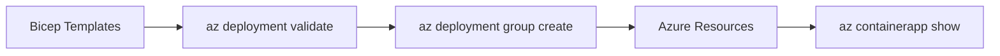

# 05 - Infrastructure as Code

Azure Bicep provides a declarative way to define and manage your Azure Container Apps resources. This guide covers how to define your Spring Boot environment, registry, and application using Bicep templates.

## IaC Workflow



## Prerequisites

- Existing Azure Subscription
- Azure CLI 2.57+
- Bicep CLI (included in Azure CLI)

## Defining the Container App Environment

The environment provides the networking and logging boundary for your container apps.

```bicep
// Container Apps Environment with Log Analytics
resource logAnalyticsWorkspace 'Microsoft.OperationalInsights/workspaces@2022-10-01' = {
  name: 'law-${baseName}'
  location: location
  properties: {
    sku: { name: 'PerGB2018' }
    retentionInDays: 30
  }
}

resource environment 'Microsoft.App/managedEnvironments@2023-05-01' = {
  name: 'cae-${baseName}'
  location: location
  properties: {
    appLogsConfiguration: {
      destination: 'log-analytics'
      logAnalyticsConfiguration: {
        customerId: logAnalyticsWorkspace.properties.customerId
        sharedKey: logAnalyticsWorkspace.listKeys().primarySharedKey
      }
    }
  }
}
```

## Defining the Spring Boot Container App

Configure the container app with appropriate CPU, memory, and port settings for a Java application.

```bicep
// Container App for Spring Boot
resource containerApp 'Microsoft.App/containerApps@2023-05-01' = {
  name: 'ca-${baseName}'
  location: location
  identity: {
    type: 'SystemAssigned'
  }
  properties: {
    managedEnvironmentId: environment.id
    configuration: {
      ingress: {
        external: true
        targetPort: 8000
      }
      secrets: [
        {
          name: 'db-password'
          value: dbPassword
        }
      ]
    }
    template: {
      containers: [
        {
          name: 'java-app'
          image: '${acrName}.azurecr.io/java-guide:latest'
          resources: {
            cpu: json('0.5')
            memory: '1.0Gi'
          }
          env: [
            {
              name: 'SPRING_PROFILES_ACTIVE'
              value: 'prod'
            }
            {
              name: 'DB_PASSWORD'
              secretRef: 'db-password'
            }
          ]
          probes: [
            {
              type: 'Liveness'
              httpGet: {
                path: '/health'
                port: 8000
              }
            }
            {
              type: 'Readiness'
              httpGet: {
                path: '/health'
                port: 8000
              }
            }
          ]
        }
      ]
    }
  }
}
```

## Deploying with the Azure CLI

1. **Create a Bicep template file**

    Create a `main.bicep` file with the environment and container app resources defined above, or use the shared `infra/main.bicep` template in this repository as a reference.

2. **Validate the deployment**

    ```bash
    az deployment group validate \
      --resource-group $RG \
      --template-file infra/main.bicep \
      --parameters baseName="java-guide"
    ```

3. **Deploy the infrastructure**

    ```bash
    az deployment group create \
      --resource-group $RG \
      --template-file infra/main.bicep \
      --parameters baseName="java-guide"
    ```

???+ example "Expected output"
    ```text
    Starting deployment...
    (Resources being created: ACR, Workspace, Environment, Container App)
    Deployment Name: main-2026-04-05
    State: Succeeded
    ```

## Infrastructure Checklist

- [x] ACA Environment is defined with Log Analytics
- [x] Container App specifies `targetPort: 8000`
- [x] Liveness and readiness probes point to `/health`
- [x] System-assigned managed identity is enabled for Key Vault or ACR access
- [x] Parameters are used for environment-specific values (e.g., SKU, region)

!!! tip "Use what-if to preview changes"
    Before deploying updates, use `az deployment group what-if` to see exactly what resources will be created, modified, or deleted without actually making the changes.

## See Also

- [06 - CI/CD with GitHub Actions](06-ci-cd.md)
- [Bicep Documentation (Microsoft Learn)](https://learn.microsoft.com/azure/azure-resource-manager/bicep/)

## Sources
- [Bicep template for Azure Container Apps (Microsoft Learn)](https://learn.microsoft.com/azure/container-apps/get-started-xml-bicep?tabs=azure-cli)
- [Bicep resource reference (Microsoft Learn)](https://learn.microsoft.com/azure/templates/microsoft.app/containerapps)
