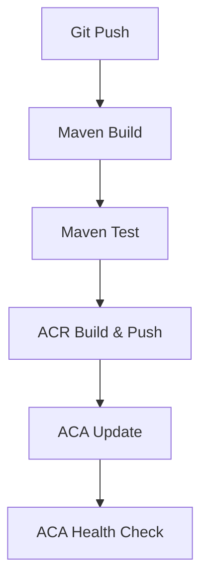

---
hide:
  - toc
---

# 06 - CI/CD with GitHub Actions

Automating the build and deployment of your Spring Boot application ensures consistent, repeatable releases to Azure Container Apps. This guide covers how to set up a GitHub Actions workflow to build, push, and deploy your Java app on every commit.

!!! info "Infrastructure Context"
    **Service**: Container Apps (Consumption) | **Network**: VNet integrated | **VNet**: ✅

    This tutorial assumes a production-ready Container Apps deployment with a custom VNet, ACR with managed identity pull, and private endpoints for backend services.

    ```mermaid
    flowchart TD
        INET[Internet] -->|HTTPS| CA["Container App\nConsumption\nLinux Java 17"]

        subgraph VNET["VNet 10.0.0.0/16"]
            subgraph ENV_SUB["Environment Subnet 10.0.0.0/23\nDelegation: Microsoft.App/environments"]
                CAE[Container Apps Environment]
                CA
            end
            subgraph PE_SUB["Private Endpoint Subnet 10.0.2.0/24"]
                PE_ACR[PE: ACR]
                PE_KV[PE: Key Vault]
                PE_ST[PE: Storage]
            end
        end

        PE_ACR --> ACR[Azure Container Registry]
        PE_KV --> KV[Key Vault]
        PE_ST --> ST[Storage Account]

        subgraph DNS[Private DNS Zones]
            DNS_ACR[privatelink.azurecr.io]
            DNS_KV[privatelink.vaultcore.azure.net]
            DNS_ST[privatelink.blob.core.windows.net]
        end

        PE_ACR -.-> DNS_ACR
        PE_KV -.-> DNS_KV
        PE_ST -.-> DNS_ST

        CA -.->|System-Assigned MI| ENTRA[Microsoft Entra ID]
        CAE --> LOG[Log Analytics]
        CA --> AI[Application Insights]

        style CA fill:#107c10,color:#fff
        style VNET fill:#E8F5E9,stroke:#4CAF50
        style DNS fill:#E3F2FD
    ```

## CI/CD Workflow



## Prerequisites

- GitHub repository with your source code
- Existing Azure Container App and Container Registry (created in [02 - First Deploy](02-first-deploy.md))
- Azure CLI 2.57+

## Setting up GitHub Secrets

To allow GitHub Actions to authenticate with Azure, you must store credentials as [GitHub Secrets](https://docs.github.com/en/actions/security-guides/encrypted-secrets).

1. **Create a Service Principal**

    ```bash
    az ad sp create-for-rbac \
      --name "gh-actions-sp-java" \
      --role Contributor \
      --scopes /subscriptions/<subscription-id>/resourceGroups/$RG \
      --json-auth
    ```

2. **Add Secrets to GitHub**

    Add the following secrets in your GitHub repository's `Settings > Secrets and variables > Actions`:

    - `AZURE_CREDENTIALS`: The entire JSON output from the service principal command.
    - `AZURE_RG`: Your resource group name.
    - `ACR_NAME`: Your Azure Container Registry name.
    - `ACA_NAME`: Your Azure Container App name.

## Creating the Workflow File

Create a file named `.github/workflows/deploy.yml` in your repository.

```yaml
name: Build and Deploy Java to ACA

on:
  push:
    branches:
      - main
    paths:
      - 'apps/java-springboot/**'

jobs:
  build:
    runs-on: ubuntu-latest
    steps:
      - name: Checkout Code
        uses: actions/checkout@v4

      - name: Set up JDK 21
        uses: actions/setup-java@v4
        with:
          java-version: '21'
          distribution: 'temurin'
          cache: 'maven'

      - name: Build and Test with Maven
        run: |
          cd apps/java-springboot
          mvn package -DskipTests

      - name: Azure Login
        uses: azure/login@v2
        with:
          creds: ${{ secrets.AZURE_CREDENTIALS }}

      - name: Build and Push to ACR
        run: |
          cd apps/java-springboot
          az acr build \
            --registry ${{ secrets.ACR_NAME }} \
            --image java-guide:${{ github.sha }} \
            --file Dockerfile .

      - name: Deploy to ACA
        run: |
          az containerapp update \
            --resource-group ${{ secrets.AZURE_RG }} \
            --name ${{ secrets.ACA_NAME }} \
            --image ${{ secrets.ACR_NAME }}.azurecr.io/java-guide:${{ github.sha }}
```

## Verifying the Deployment

1. **Check the GitHub Actions tab**

    Navigate to the `Actions` tab in your repository and verify that the workflow has run successfully.

2. **Verify the new revision**

    ```bash
    az containerapp revision list \
      --resource-group $RG \
      --name $APP_NAME \
      --query "[0].name" --output tsv
    ```

    ???+ example "Expected output"
        ```text
        <your-app-name>--xxxxxxx
        ```

3. **Verify the application health**

    ```bash
    curl https://<your-aca-fqdn>/health
    ```

## CI/CD Checklist

- [x] Service principal has `Contributor` permissions on the resource group
- [x] Maven cache is enabled in GitHub Actions to speed up builds
- [x] Workflow uses specific commit SHAs for container image tags (avoid `latest`)
- [x] Workflow triggers only on changes to the application's source path
- [x] Deployment is verified by a health check endpoint

!!! info "Using Federated Credentials (OIDC)"
    For enhanced security, consider using [Workload Identity Federation](https://learn.microsoft.com/azure/developer/github/connect-from-azure?tabs=azure-portal%2Clinux) (OIDC) instead of storing secrets in GitHub. This removes the need for long-lived service principal keys.

## See Also
- [07 - Revisions and Traffic](07-revisions-traffic.md)
- [02 - First Deploy to Azure](02-first-deploy.md)
- [GitHub Actions for Azure (Microsoft Learn)](https://learn.microsoft.com/azure/container-apps/github-actions-repo-auth)

## Sources
- [Deploy to Azure Container Apps with GitHub Actions (Microsoft Learn)](https://learn.microsoft.com/azure/container-apps/github-actions-repo-auth)
- [Setup Java Action (GitHub Marketplace)](https://github.com/marketplace/actions/setup-java-jdk-binaries)
