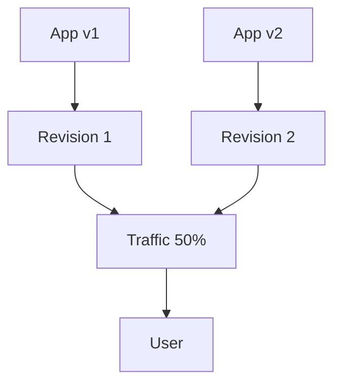

# 07 - Revisions and Traffic

Azure Container Apps supports multiple revisions, allowing you to run multiple versions of your Spring Boot application simultaneously. This guide covers how to manage revisions and split traffic between them for zero-downtime releases and safe rollouts.

## Revision Workflow



## Prerequisites

- Existing Azure Container App (created in [02 - First Deploy](02-first-deploy.md))
- Azure CLI 2.57+

## Revision Modes

By default, Container Apps are in `Single` revision mode, where only one revision is active at a time. To enable multiple revisions, switch to `Multiple` mode.

```bash
az containerapp revision set-mode \
  --resource-group $RG \
  --name $APP_NAME \
  --mode multiple
```

???+ example "Expected output"
    ```text
    Setting multiple revision mode...
    Revision mode set successfully.
    ```

## Creating New Revisions

Every time you update the container image or configuration, a new revision is created.

```bash
az containerapp update \
  --resource-group $RG \
  --name $APP_NAME \
  --image $ACR_NAME.azurecr.io/java-guide:v2
```

???+ example "Expected output"
    ```text
    (New revision created: <your-app-name>--xxxxxxx)
    (New revision is now ACTIVE)
    ```

## Managing Traffic Splitting

When multiple revisions are active, you can split traffic between them by percentage or name.

### 1. Simple 50/50 Split

```bash
az containerapp ingress traffic set \
  --resource-group $RG \
  --name $APP_NAME \
  --traffic-weight "$APP_NAME--0000001=50" "$APP_NAME--0000002=50"
```

???+ example "Expected output"
    ```text
    Traffic weight updated.
    Revision 1: 50%
    Revision 2: 50%
    ```

### 2. Full Rollout (100% to Latest)

```bash
az containerapp ingress traffic set \
  --resource-group $RG \
  --name $APP_NAME \
  --traffic-weight "latest=100"
```

### 3. Canary Deployment (10% to New)

```bash
az containerapp ingress traffic set \
  --resource-group $RG \
  --name $APP_NAME \
  --traffic-weight "$APP_NAME--0000001=90" "$APP_NAME--0000002=10"
```

## Cleaning Up Old Revisions

Deactivate old revisions to save resources and keep your environment clean.

```bash
az containerapp revision deactivate \
  --resource-group $RG \
  --name $APP_NAME \
  --revision $APP_NAME--0000001
```

## Revision Checklist

- [x] Revision mode is set to `Multiple`
- [x] Every deployment creates a unique revision name
- [x] Traffic weight sums up to 100%
- [x] New revisions are verified via their unique URL before receiving production traffic
- [x] Old revisions are deactivated after a successful rollout

!!! tip "Use unique labels for testing"
    Assign a label to a specific revision to test it independently of production traffic. Use `az containerapp ingress traffic set --label testing=$APP_NAME--xxxxxxx` and visit `https://testing---$APP_NAME.<random-suffix>.<region>.azurecontainerapps.io`.

## See Also
- [06 - CI/CD with GitHub Actions](06-ci-cd.md)
- [02 - First Deploy to Azure](02-first-deploy.md)
- [Revision management (Microsoft Learn)](https://learn.microsoft.com/azure/container-apps/revisions)

## Sources
- [Traffic splitting in Azure Container Apps (Microsoft Learn)](https://learn.microsoft.com/azure/container-apps/traffic-splitting)
- [Application lifecycle management (Microsoft Learn)](https://learn.microsoft.com/azure/container-apps/application-lifecycle-management)
