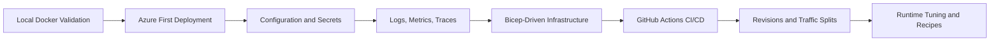

---
content_sources:
  diagrams:
    - id: end-to-end-learning-flow
      type: flowchart
      source: mslearn-adapted
      based_on:
        - https://learn.microsoft.com/azure/container-apps/
        - https://learn.microsoft.com/azure/developer/java/fundamentals/java-on-azure-container-apps
---

# Java (Spring Boot) on Azure Container Apps

This guide provides a comprehensive reference implementation for running Java applications on Azure Container Apps (ACA). We use a production-ready Spring Boot application to demonstrate best practices for cloud-native deployment, security, and observability on the Azure platform.

## Reference Application

The reference Java application is located in the `apps/java-springboot/` directory. It is a production-hardened Spring Boot implementation designed to showcase modern cloud-native patterns.

Key features demonstrated in the reference app:

- **Spring Boot Actuator**: Native support for health checks, metrics, and application info through Actuator endpoints.
- **Multi-stage Docker Builds**: Optimized container images using Maven for build and Eclipse Temurin JRE for the runtime layer.
- **Structured Logging**: Logback configuration optimized for Azure Log Analytics and Application Insights.
- **Graceful Shutdown**: Native Spring Boot support for handling SIGTERM to ensure zero-downtime deployments.
- **Managed Identity**: Configuration patterns for passwordless authentication to Azure services.
- **Dapr-ready**: Prepared for service invocation, state management, and pub/sub patterns using the Dapr sidecar model.

## Prerequisites

Before you begin the tutorial, ensure you have the following tools and resources available:

- **Java 21 (JDK)**: Recommended for local development and testing. The reference app uses Eclipse Temurin 21.
- **Maven 3.9+**: Required for building the application and managing dependencies.
- **Docker Engine**: Essential for building, testing, and validating container images locally.
- **Azure CLI 2.57+**: The primary tool for provisioning and managing Azure Container Apps and related infrastructure.
- **Azure Subscription**: An active subscription with sufficient permissions to create Resource Groups and Container Apps environments.

## Tutorial Steps

Follow these step-by-step guides to master the deployment of Java applications on Azure Container Apps:

1.  [**Local Development**](./tutorial/01-local-development.md) — Learn how to containerize and run your Spring Boot app in Docker on your local machine.
2.  [**First Deployment**](./tutorial/02-first-deploy.md) — Push your container image to Azure Container Registry and create your first Container App.
3.  [**Configuration & Secrets**](./tutorial/03-configuration.md) — Securely manage environment variables and integrate with Azure Key Vault.
4.  [**Logging & Monitoring**](./tutorial/04-logging-monitoring.md) — Configure structured logging and visualize metrics in the Azure Portal.
5.  [**Infrastructure as Code**](./tutorial/05-infrastructure-as-code.md) — Define and deploy your application environment using Bicep templates.
6.  [**CI/CD with GitHub Actions**](./tutorial/06-ci-cd.md) — Build automated pipelines to test and deploy your code on every commit.
7.  [**Revisions & Traffic**](./tutorial/07-revisions-traffic.md) — Master advanced deployment strategies like blue-green and canary releases.

## Java Guide Progress Snapshot

| Area | Coverage | Primary Asset |
|---|---|---|
| Build and run locally | Complete | [01-local-development](./tutorial/01-local-development.md) |
| First cloud deployment | Complete | [02-first-deploy](./tutorial/02-first-deploy.md) |
| Config and secrets | Complete | [03-configuration](./tutorial/03-configuration.md) |
| Observability | Complete | [04-logging-monitoring](./tutorial/04-logging-monitoring.md) |
| Infrastructure as Code | Complete | [05-infrastructure-as-code](./tutorial/05-infrastructure-as-code.md) |
| CI/CD automation | Complete | [06-ci-cd](./tutorial/06-ci-cd.md) |
| Safe rollout strategy | Complete | [07-revisions-traffic](./tutorial/07-revisions-traffic.md) |
| Runtime tuning | Complete | [java-runtime](./java-runtime.md) |
| Integration recipes | Complete | [recipes/index](./recipes/index.md) |

## End-to-End Learning Flow

<!-- diagram-id: end-to-end-learning-flow -->

!!! tip "Use this order for fastest production readiness"
    Complete tutorials `01` through `07` sequentially first, then use runtime and recipe pages for optimization and integration. This prevents configuration drift and keeps your revisions reproducible.

## Runtime Guide

For detailed technical information on how the Java runtime is configured and optimized for Azure Container Apps, see the [Java Runtime Reference](./java-runtime.md).

This guide covers:
- JVM memory management and container limits (Cgroups).
- Environment variable overrides for Spring Boot.
- Multi-stage Docker build strategies for minimized image size.

## Recipes

Accelerate your development process with these common integration patterns and production recipes:

- [**Recipes Overview**](./recipes/index.md) — Access common integration patterns for Java applications on ACA.

## What You'll Learn

By completing this guide, you will gain the following capabilities:

- Building production-grade Java Docker images using multi-stage builds.
- Implementing "Zero-Trust" security by using Managed Identity instead of connection strings.
- Designing for high availability with liveness and readiness probes using Spring Boot Actuator.
- Troubleshooting distributed systems using platform-native logs and KQL queries.
- Managing the full application lifecycle through infrastructure-as-code and automated CI/CD.

!!! note "Use standard variables consistently"
    For command consistency across tutorials and recipes, use `$RG`, `$APP_NAME`, `$ENVIRONMENT_NAME`, `$ACR_NAME`, and `$LOCATION` in your shell session before running commands.

!!! info "Architecture Best Practices"
    The patterns shown in this guide follow the Azure Well-Architected Framework. We prioritize security via Managed Identity, reliability via Health Probes, and operational excellence via automated deployments.

## See Also

- [Platform Architecture](../../platform/index.md) — Understand the underlying ACA infrastructure.
- [Operations Guide](../../operations/index.md) — Production operations.
- [Troubleshooting Methodology](../../troubleshooting/index.md) — Systematic approach to debugging issues.
- [CLI Reference](../../troubleshooting/first-10-minutes/cli-reference.md) — Quick lookup for CLI commands and limits.

## Sources

- [Azure Container Apps documentation (Microsoft Learn)](https://learn.microsoft.com/azure/container-apps/)
- [Java on Azure Container Apps overview (Microsoft Learn)](https://learn.microsoft.com/azure/developer/java/fundamentals/java-on-azure-container-apps)
