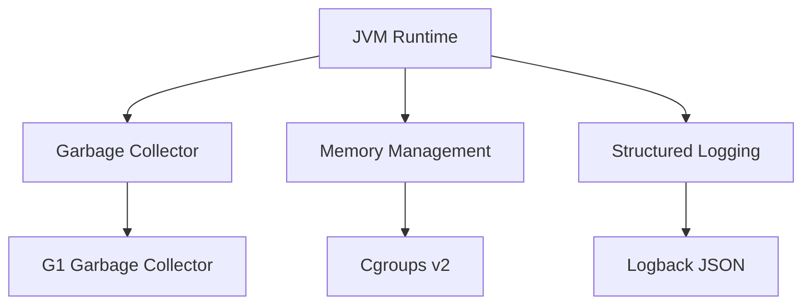

# Java Runtime Reference

This guide provides technical details on the Java runtime environment and optimization strategies for running Spring Boot applications on Azure Container Apps.

## Runtime Environment

Azure Container Apps uses the [Eclipse Temurin](https://adoptium.net/temurin/) distribution for the OpenJDK runtime. The reference application uses **Java 21 (LTS)**.



## JVM Memory Management

Java applications on Azure Container Apps are aware of the container's memory limits (Cgroups v2). The JVM automatically adjusts its heap size based on the available container memory.

### 1. Default Memory Settings

By default, the JVM sets the maximum heap size to approximately **25%** of the container's memory limit.

| Container Memory | Default Max Heap (approx.) |
| --- | --- |
| 512 MiB | 128 MiB |
| 1 GiB | 256 MiB |
| 2 GiB | 512 MiB |

### 2. Customizing Memory Limits

You can override the default JVM behavior using the `JAVA_TOOL_OPTIONS` environment variable.

```bash
az containerapp update \
  --resource-group $RG \
  --name $APP_NAME \
  --set-env-vars "JAVA_TOOL_OPTIONS=-Xms512m -Xmx1024m"
```

## Multi-stage Docker Build Optimization

To minimize the container image size and improve deployment speed, use a multi-stage Docker build.

### 1. Build Stage

Uses a full JDK and Maven to compile the application.

```dockerfile
FROM docker.io/library/maven:3.9-eclipse-temurin-21 AS build
WORKDIR /app
COPY pom.xml .
RUN mvn dependency:go-offline -B
COPY src ./src
RUN mvn package -DskipTests -B
```

### 2. Runtime Stage

Uses a lightweight JRE (Java Runtime Environment) for the final image.

```dockerfile
FROM docker.io/library/eclipse-temurin:21-jre-alpine
WORKDIR /app
COPY --from=build /app/target/*.jar app.jar
EXPOSE 8000
ENTRYPOINT ["java", "-jar", "app.jar"]
```

## Spring Boot Best Practices

- **Spring Profiles**: Use `SPRING_PROFILES_ACTIVE=prod` for production workloads.
- **Actuator Endpoints**: Enable `health` and `info` endpoints for platform integration.
- **Graceful Shutdown**: Enable `server.shutdown=graceful` in `application.yml` to handle SIGTERM signals.
- **Logback JSON**: Use the `LogstashLogbackEncoder` for structured, parseable logs in Log Analytics.

## Runtime Verification

You can verify the runtime details by calling the `/info` endpoint of the reference application.

```bash
curl https://$FQDN/info
```

???+ example "Expected output"
    ```json
    {
      "runtime": {
        "vendor": "Eclipse Adoptium",
        "java": "21.0.10"
      },
      "app": "azure-container-apps-java-guide",
      "version": "1.0.0"
    }
    ```

## Runtime Checklist

- [x] Application uses a supported LTS version of Java (17 or 21)
- [x] Dockerfile uses multi-stage builds to minimize image size
- [x] JVM is aware of container memory limits (Cgroups v2)
- [x] Graceful shutdown is enabled for zero-downtime releases
- [x] Structured logging is enabled for better observability

!!! note "Choosing the right memory limit"
    Spring Boot applications typically require at least **512 MiB** of container memory to run efficiently. For production workloads, **1 GiB** or more is recommended to avoid OutOfMemory (OOM) errors during startup or under load.

## See Also
- [01 - Local Development](01-local-development.md)
- [04 - Logging and Monitoring](04-logging-monitoring.md)
- [Java on Azure (Microsoft Learn)](https://learn.microsoft.com/azure/developer/java/)

## Sources
- [Eclipse Temurin Container Images](https://hub.docker.com/_/eclipse-temurin)
- [JVM Memory Management in Containers (Eclipse Adoptium)](https://adoptium.net/blog/2021/11/jvm-container-awareness/)
- [Spring Boot Production-ready features](https://docs.spring.io/spring-boot/docs/current/reference/html/actuator.html)
