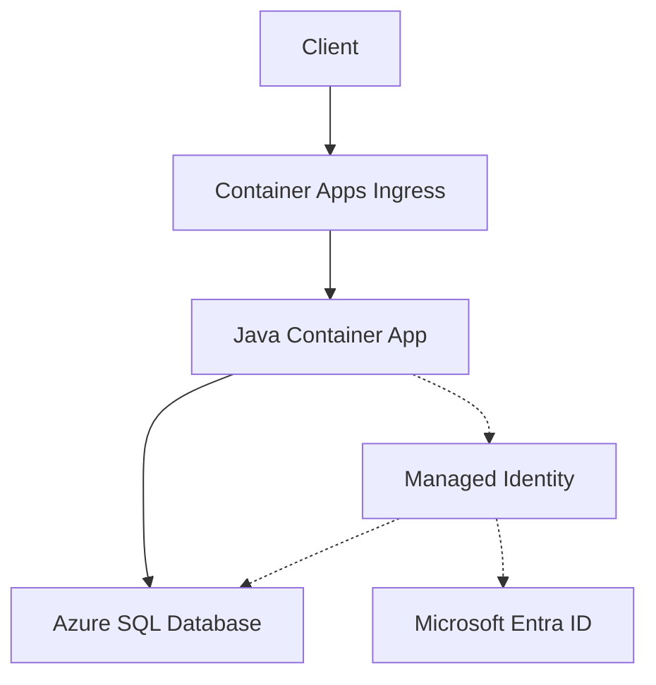

---
content_sources:
  diagrams:
    - id: architecture
      type: flowchart
      source: mslearn-adapted
      based_on:
        - https://learn.microsoft.com/azure/azure-sql/database/authentication-aad-overview
        - https://learn.microsoft.com/sql/connect/jdbc/connecting-to-an-azure-sql-database
---

# Azure SQL Integration (Managed Identity)

Use this recipe to connect Azure Container Apps to Azure SQL Database with Microsoft Entra authentication first and SQL authentication only as a fallback.

## Architecture

<!-- diagram-id: architecture -->


Solid arrows show runtime data flow. Dashed arrows show identity and authentication.

## Prerequisites

- Existing Container App: `$APP_NAME` in `$RG`
- Existing Azure SQL logical server and database
- Azure SQL server configured with a Microsoft Entra admin
- Firewall rules, VNet integration, or Private Link already configured for your connectivity model

## Step 1: Enable managed identity on the Container App

```bash
az containerapp identity assign \
  --name "$APP_NAME" \
  --resource-group "$RG" \
  --system-assigned
```

## Step 2: Grant SQL access to the app identity

From a Microsoft Entra-authenticated SQL session, create a contained user for the managed identity.

```sql
CREATE USER [<container-app-name>] FROM EXTERNAL PROVIDER;
ALTER ROLE db_datareader ADD MEMBER [<container-app-name>];
ALTER ROLE db_datawriter ADD MEMBER [<container-app-name>];
```

## Step 3: Configure non-secret settings

```bash
az containerapp update \
  --name "$APP_NAME" \
  --resource-group "$RG" \
  --set-env-vars SQL_SERVER="$SQL_SERVER.database.windows.net" SQL_DATABASE="$SQL_DATABASE"
```

## Step 4: Java code (managed identity)

Add the Microsoft JDBC Driver dependency:

```xml
<dependency>
  <groupId>com.microsoft.sqlserver</groupId>
  <artifactId>mssql-jdbc</artifactId>
</dependency>
```

Use the driver-managed authentication mode for managed identity:

```java
import java.sql.Connection;
import java.sql.DriverManager;
import java.sql.ResultSet;
import java.sql.Statement;

public class AzureSqlRecipe {
    public static void main(String[] args) throws Exception {
        String server = System.getenv("SQL_SERVER");
        String database = System.getenv("SQL_DATABASE");

        String url;
        if (System.getenv("SQL_USER") != null && System.getenv("SQL_PASSWORD") != null) {
            url = String.format(
                "jdbc:sqlserver://%s:1433;database=%s;encrypt=true;hostNameInCertificate=*.database.windows.net;loginTimeout=30;user=%s;password=%s;",
                server,
                database,
                System.getenv("SQL_USER"),
                System.getenv("SQL_PASSWORD")
            );
        } else {
            url = String.format(
                "jdbc:sqlserver://%s:1433;database=%s;encrypt=true;hostNameInCertificate=*.database.windows.net;loginTimeout=30;authentication=ActiveDirectoryManagedIdentity;",
                server,
                database
            );
        }

        try (Connection connection = DriverManager.getConnection(url);
             Statement statement = connection.createStatement();
             ResultSet resultSet = statement.executeQuery("SELECT TOP (1) name FROM sys.tables ORDER BY name")) {
            while (resultSet.next()) {
                System.out.println(resultSet.getString(1));
            }
        }
    }
}
```

!!! warning
    If you use a user-assigned managed identity, add the client ID parameter required by your JDBC driver version before relying on the `ActiveDirectoryManagedIdentity` connection string in production.

## Step 5: SQL authentication fallback

```bash
az containerapp secret set \
  --name "$APP_NAME" \
  --resource-group "$RG" \
  --secrets sql-password="<sql-password>"

az containerapp update \
  --name "$APP_NAME" \
  --resource-group "$RG" \
  --set-env-vars SQL_SERVER="$SQL_SERVER.database.windows.net" SQL_DATABASE="$SQL_DATABASE" SQL_USER="$SQL_USER" SQL_PASSWORD=secretref:sql-password
```

## Verification

1. Confirm identity is assigned to the app.
2. Confirm runtime connectivity by checking application logs.
3. Confirm Azure SQL firewall or private endpoint connectivity before blaming authentication.

## See Also

- [Managed Identity](managed-identity.md)
- [VNet Integration](../../../platform/networking/vnet-integration.md)
- [Private Endpoints](../../../platform/networking/private-endpoints.md)

## Sources

- [Azure SQL and Microsoft Entra authentication overview](https://learn.microsoft.com/azure/azure-sql/database/authentication-aad-overview)
- [Connect to Azure SQL Database by using JDBC](https://learn.microsoft.com/sql/connect/jdbc/connecting-to-an-azure-sql-database)
