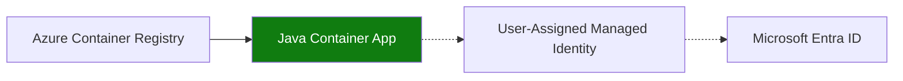

---
hide:
  - toc
---

# Recipe: Container Registry in Java Apps on Azure Container Apps

Pull private Spring Boot images from Azure Container Registry using managed identity in Azure Container Apps.



## Prerequisites

- Container Apps environment (`$ENVIRONMENT_NAME`) and app name (`$APP_NAME`)
- Resource group (`$RG`), region (`$LOCATION`), registry (`$ACR_NAME`)
- Azure CLI with Container Apps extension and Docker

## Create ACR and pull identity

```bash
az acr create \
  --name "$ACR_NAME" \
  --resource-group "$RG" \
  --location "$LOCATION" \
  --sku Standard

az identity create \
  --name "id-$APP_NAME" \
  --resource-group "$RG" \
  --location "$LOCATION"

export UAMI_ID=$(az identity show --name "id-$APP_NAME" --resource-group "$RG" --query id --output tsv)
export UAMI_PRINCIPAL_ID=$(az identity show --name "id-$APP_NAME" --resource-group "$RG" --query principalId --output tsv)
export ACR_ID=$(az acr show --name "$ACR_NAME" --resource-group "$RG" --query id --output tsv)

az role assignment create \
  --assignee-object-id "$UAMI_PRINCIPAL_ID" \
  --assignee-principal-type ServicePrincipal \
  --role "AcrPull" \
  --scope "$ACR_ID"
```

## Multi-stage Dockerfile for Spring Boot

```dockerfile
FROM maven:3.9-eclipse-temurin-21 AS build
WORKDIR /src
COPY pom.xml .
COPY src ./src
RUN mvn --batch-mode --no-transfer-progress clean package -DskipTests

FROM eclipse-temurin:21-jre
WORKDIR /app
COPY --from=build /src/target/*.jar app.jar
EXPOSE 8080
ENTRYPOINT ["java", "-jar", "/app/app.jar"]
```

```bash
az acr login --name "$ACR_NAME"
docker build --file Dockerfile --tag "$ACR_NAME.azurecr.io/java-api:latest" .
docker push "$ACR_NAME.azurecr.io/java-api:latest"
```

## Configure registry access for the app

```bash
az containerapp create \
  --name "$APP_NAME" \
  --resource-group "$RG" \
  --environment "$ENVIRONMENT_NAME" \
  --image "$ACR_NAME.azurecr.io/java-api:latest" \
  --registry-server "$ACR_NAME.azurecr.io" \
  --registry-identity "$UAMI_ID" \
  --user-assigned "$UAMI_ID" \
  --ingress external \
  --target-port 8080
```

## Advanced Topics

- Cache Maven layers by copying `pom.xml` before source for faster incremental builds.
- Use immutable tags and staged revisions for safer rollouts.
- Add container image scanning before publishing to ACR.

## See Also

- [Managed Identity](managed-identity.md)
- [Operations: Image Pull and Registry](../../../operations/image-pull-and-registry/index.md)
- [Private Endpoints](../../../platform/networking/private-endpoints.md)

## Sources

- [Managed identity image pull for Azure Container Apps](https://learn.microsoft.com/azure/container-apps/managed-identity-image-pull)
- [Push and pull images with Azure Container Registry](https://learn.microsoft.com/azure/container-registry/container-registry-get-started-docker-cli)
