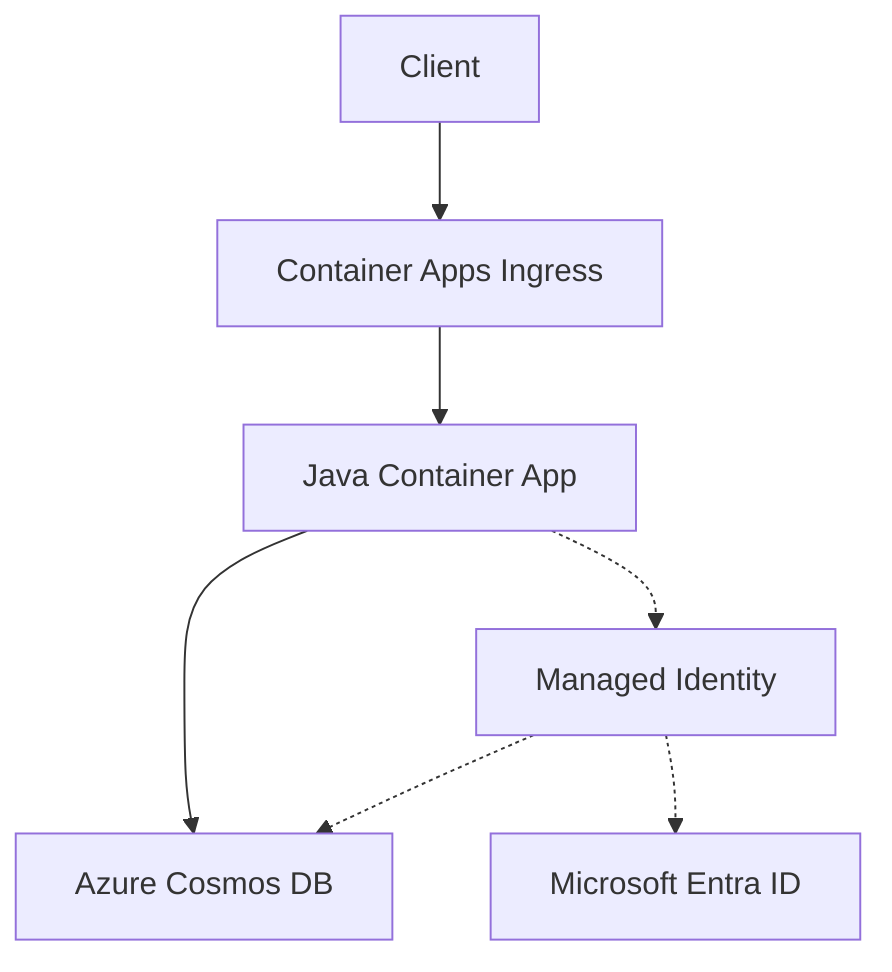

---
content_sources:
  diagrams:
    - id: architecture
      type: flowchart
      source: mslearn-adapted
      based_on:
        - https://learn.microsoft.com/azure/cosmos-db/nosql/how-to-connect-role-based-access-control
        - https://learn.microsoft.com/azure/cosmos-db/nosql/quickstart-java
---

# Cosmos DB Integration (Managed Identity)

Use this recipe to connect a Java Container App to Azure Cosmos DB for NoSQL with managed identity first and a connection string fallback only when you cannot use RBAC yet.

## Architecture

<!-- diagram-id: architecture -->


Solid arrows show runtime data flow. Dashed arrows show identity and authentication.

## Prerequisites

- Existing Container App: `$APP_NAME` in resource group `$RG`
- Existing Azure Cosmos DB account, SQL database, and container
- Azure CLI with Container Apps and Cosmos extensions

```bash
az extension add --name containerapp --upgrade
az extension add --name cosmosdb-preview --upgrade
```

## Step 1: Enable managed identity on the Container App

```bash
az containerapp identity assign \
  --name "$APP_NAME" \
  --resource-group "$RG" \
  --system-assigned

export PRINCIPAL_ID=$(az containerapp show \
  --name "$APP_NAME" \
  --resource-group "$RG" \
  --query "identity.principalId" \
  --output tsv)
```

## Step 2: Grant Cosmos DB data-plane access

```bash
export COSMOS_ACCOUNT_ID=$(az cosmosdb show \
  --name "$COSMOS_ACCOUNT" \
  --resource-group "$RG" \
  --query "id" \
  --output tsv)

az role assignment create \
  --assignee-object-id "$PRINCIPAL_ID" \
  --assignee-principal-type ServicePrincipal \
  --role "Cosmos DB Built-in Data Contributor" \
  --scope "$COSMOS_ACCOUNT_ID"
```

## Step 3: Configure non-secret settings in Container Apps

Azure Container Apps does **not** inject Cosmos DB connection settings automatically. Store non-secret values as environment variables, and store fallback secrets in `secrets[]` with `secretref:`.

```bash
az containerapp update \
  --name "$APP_NAME" \
  --resource-group "$RG" \
  --set-env-vars COSMOS_ENDPOINT="https://$COSMOS_ACCOUNT.documents.azure.com:443/" COSMOS_DATABASE="$COSMOS_DATABASE" COSMOS_CONTAINER="$COSMOS_CONTAINER"
```

## Step 4: Java code (managed identity)

Add dependencies:

```xml
<dependency>
  <groupId>com.azure</groupId>
  <artifactId>azure-cosmos</artifactId>
</dependency>
<dependency>
  <groupId>com.azure</groupId>
  <artifactId>azure-identity</artifactId>
</dependency>
<dependency>
  <groupId>com.fasterxml.jackson.core</groupId>
  <artifactId>jackson-databind</artifactId>
</dependency>
```

Use `DefaultAzureCredentialBuilder` when `COSMOS_CONNECTION_STRING` is not present:

```java
import com.azure.cosmos.CosmosClient;
import com.azure.cosmos.CosmosClientBuilder;
import com.azure.cosmos.CosmosContainer;
import com.azure.cosmos.CosmosDatabase;
import com.azure.cosmos.models.CosmosItemResponse;
import com.azure.cosmos.models.PartitionKey;
import com.azure.identity.DefaultAzureCredentialBuilder;
import com.fasterxml.jackson.databind.node.JsonNodeFactory;
import com.fasterxml.jackson.databind.node.ObjectNode;

public class CosmosRecipe {
    private static CosmosClient createClient() {
        String connectionString = System.getenv("COSMOS_CONNECTION_STRING");
        CosmosClientBuilder builder = new CosmosClientBuilder();

        if (connectionString != null && !connectionString.isBlank()) {
            return builder.connectionString(connectionString).buildClient();
        }

        return builder
            .endpoint(System.getenv("COSMOS_ENDPOINT"))
            .credential(new DefaultAzureCredentialBuilder().build())
            .buildClient();
    }

    public static void main(String[] args) {
        try (CosmosClient client = createClient()) {
            CosmosDatabase database = client.getDatabase(System.getenv("COSMOS_DATABASE"));
            CosmosContainer container = database.getContainer(System.getenv("COSMOS_CONTAINER"));

            ObjectNode item = JsonNodeFactory.instance.objectNode();
            item.put("id", "order-1001");
            item.put("partitionKey", "order-1001");
            item.put("type", "order");
            item.put("status", "created");

            container.upsertItem(item, new PartitionKey(item.get("partitionKey").asText()), null);
            CosmosItemResponse<ObjectNode> response = container.readItem(
                "order-1001",
                new PartitionKey("order-1001"),
                ObjectNode.class
            );

            System.out.println(response.getItem().toPrettyString());
        }
    }
}
```

## Step 5: Connection string fallback

Only use this pattern when you cannot enable RBAC yet.

```bash
az containerapp secret set \
  --name "$APP_NAME" \
  --resource-group "$RG" \
  --secrets cosmos-connection-string="AccountEndpoint=https://$COSMOS_ACCOUNT.documents.azure.com:443/;AccountKey=<cosmos-account-key>;"

az containerapp update \
  --name "$APP_NAME" \
  --resource-group "$RG" \
  --set-env-vars COSMOS_CONNECTION_STRING=secretref:cosmos-connection-string COSMOS_DATABASE="$COSMOS_DATABASE" COSMOS_CONTAINER="$COSMOS_CONTAINER"
```

## Verification

1. Confirm identity assignment:

```bash
az containerapp show \
  --name "$APP_NAME" \
  --resource-group "$RG" \
  --query "identity" \
  --output json
```

2. Confirm role assignment exists:

```bash
az role assignment list \
  --assignee "$PRINCIPAL_ID" \
  --scope "$COSMOS_ACCOUNT_ID" \
  --output table
```

3. Check app logs for successful upsert and read operations.

## See Also

- [Managed Identity](managed-identity.md)
- [Key Vault Reference](key-vault-reference.md)
- [Private Endpoints](../../../platform/networking/private-endpoints.md)

## Sources

- [Azure Cosmos DB for NoSQL RBAC](https://learn.microsoft.com/azure/cosmos-db/nosql/how-to-connect-role-based-access-control)
- [Azure Cosmos DB for NoSQL Java quickstart](https://learn.microsoft.com/azure/cosmos-db/nosql/quickstart-java)
