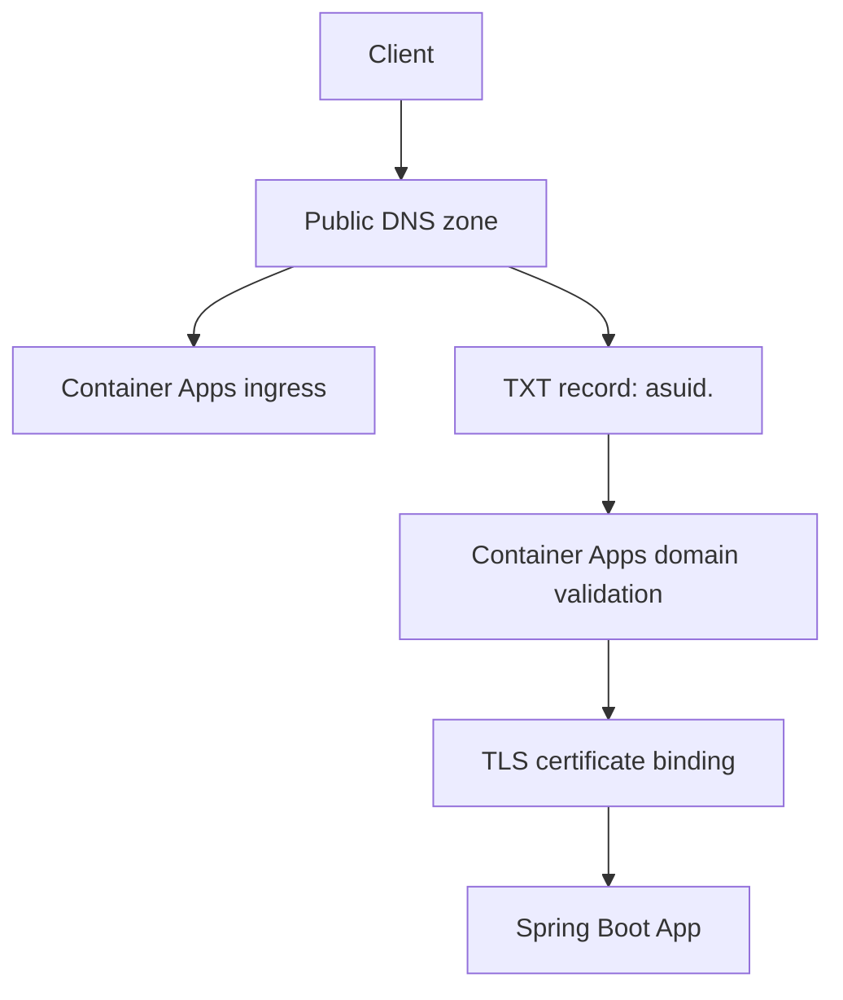

---
content_sources:
  diagrams:
    - id: architecture
      type: flowchart
      source: mslearn-adapted
      based_on:
        - https://learn.microsoft.com/en-us/azure/container-apps/custom-domains-managed-certificates
        - https://learn.microsoft.com/en-us/azure/container-apps/private-endpoints-with-dns
---
# Custom Domains and Certificates

Azure Container Apps supports custom hostnames and TLS certificates so you can serve Spring Boot applications on your own domain instead of the default `azurecontainerapps.io` address.

## Architecture

<!-- diagram-id: architecture -->


## Prerequisites

- Existing Container App: `$APP_NAME` in `$RG`
- Existing Container Apps environment: `$ENVIRONMENT_NAME`
- Public DNS zone you control for the target domain
- Azure CLI with the Container Apps extension

```bash
az extension add --name containerapp --upgrade
```

| Command | Why it is used |
|---|---|
| `az extension add ...` | Installs or updates the Container Apps Azure CLI extension. |

## Step 1: Get the app and environment values

```bash
export ENV_STATIC_IP=$(az containerapp env show \
  --name "$ENVIRONMENT_NAME" \
  --resource-group "$RG" \
  --query "properties.staticIp" \
  --output tsv)

export APP_FQDN=$(az containerapp show \
  --name "$APP_NAME" \
  --resource-group "$RG" \
  --query "properties.configuration.ingress.fqdn" \
  --output tsv)

export CUSTOM_DOMAIN_VERIFICATION_ID=$(az containerapp show \
  --name "$APP_NAME" \
  --resource-group "$RG" \
  --query "properties.customDomainVerificationId" \
  --output tsv)
```

## Step 2: Create DNS records

```bash
az network dns record-set cname set-record \
  --resource-group "$DNS_RG" \
  --zone-name "contoso.com" \
  --record-set-name "www" \
  --cname "$APP_FQDN"

az network dns record-set txt add-record \
  --resource-group "$DNS_RG" \
  --zone-name "contoso.com" \
  --record-set-name "asuid.www" \
  --value "$CUSTOM_DOMAIN_VERIFICATION_ID"
```

| Command | Why it is used |
|---|---|
| `az network dns record-set ...` | Creates or inspects networking resources such as VNets, DNS zones, routes, or private endpoints. |

## Step 3: Add the hostname to the Container App

```bash
az containerapp hostname add \
  --name "$APP_NAME" \
  --resource-group "$RG" \
  --hostname "www.contoso.com"
```

| Command | Why it is used |
|---|---|
| `az containerapp hostname add ...` | Manages custom hostname bindings for ingress. |

## Step 4: Bind a certificate

```bash
az containerapp hostname bind \
  --name "$APP_NAME" \
  --resource-group "$RG" \
  --hostname "www.contoso.com" \
  --environment "$ENVIRONMENT_NAME" \
  --validation-method CNAME
```

| Command | Why it is used |
|---|---|
| `az containerapp hostname bind ...` | Manages custom hostname bindings for ingress. |

For bring-your-own certificates, upload the PFX to the environment first and bind the uploaded certificate name.

## Step 5: Configure Spring Boot for forwarded headers

Container Apps terminates TLS before traffic reaches Spring Boot. Honor the forwarded host and protocol headers so generated redirects and absolute URLs stay correct.

```properties
server.forward-headers-strategy=framework
```

## Verification

```bash
az containerapp hostname list \
  --name "$APP_NAME" \
  --resource-group "$RG" \
  --output table

az containerapp env certificate list \
  --name "$ENVIRONMENT_NAME" \
  --resource-group "$RG" \
  --output table

curl --verbose https://www.contoso.com/
```

| Command | Why it is used |
|---|---|
| `az containerapp hostname list ...` | Manages custom hostname bindings for ingress. |

## See Also

- [Easy Auth](easy-auth.md)
- [Networking](../../../platform/networking/vnet-integration.md)
- [Private Endpoints](../../../platform/networking/private-endpoints.md)

## Sources

- [Custom domains and managed certificates in Azure Container Apps](https://learn.microsoft.com/en-us/azure/container-apps/custom-domains-managed-certificates)
- [Configure custom DNS suffix for Azure Container Apps environment](https://learn.microsoft.com/en-us/azure/container-apps/private-endpoints-with-dns)
