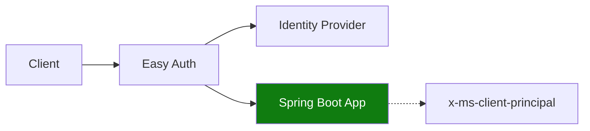

---
hide:
  - toc
---

# Recipe: Easy Auth in Java Apps on Azure Container Apps

Enable Easy Auth in Azure Container Apps and parse authenticated principal claims in a Spring Boot filter.



## Prerequisites

- Container App (`$APP_NAME`) with ingress enabled
- Resource group (`$RG`) and identity provider registration
- Azure CLI with Container Apps extension

## Enable Easy Auth

```bash
az containerapp auth update \
  --name "$APP_NAME" \
  --resource-group "$RG" \
  --enabled true \
  --platform runtimeVersion "~1" \
  --global-validation unauthenticatedClientAction RedirectToLoginPage
```

## Spring Boot filter for principal headers

```java
import com.fasterxml.jackson.databind.JsonNode;
import com.fasterxml.jackson.databind.ObjectMapper;
import jakarta.servlet.FilterChain;
import jakarta.servlet.ServletException;
import jakarta.servlet.http.HttpServletRequest;
import jakarta.servlet.http.HttpServletResponse;
import org.springframework.stereotype.Component;
import org.springframework.web.filter.OncePerRequestFilter;

import java.io.IOException;
import java.nio.charset.StandardCharsets;
import java.util.Base64;

@Component
public class ClientPrincipalFilter extends OncePerRequestFilter {
    private static final ObjectMapper MAPPER = new ObjectMapper();

    @Override
    protected void doFilterInternal(HttpServletRequest request, HttpServletResponse response, FilterChain filterChain)
            throws ServletException, IOException {
        String header = request.getHeader("x-ms-client-principal");
        if (header != null && !header.isBlank()) {
            String decoded = new String(Base64.getDecoder().decode(header), StandardCharsets.UTF_8);
            JsonNode principal = MAPPER.readTree(decoded);
            request.setAttribute("userId", principal.path("userId").asText());
            request.setAttribute("identityProvider", principal.path("identityProvider").asText());
            request.setAttribute("claims", principal.path("claims"));
        }
        filterChain.doFilter(request, response);
    }
}
```

## Advanced Topics

- Keep identity enforcement in Easy Auth and authorization rules in Spring components.
- Validate expected claim types before mapping to internal roles.
- Use separate identity-provider app registrations per environment.

## See Also

- [Managed Identity](managed-identity.md)
- [Key Vault Reference](key-vault-reference.md)
- [Identity and Secrets](../../../platform/identity-and-secrets/managed-identity.md)

## Sources

- [Authentication in Azure Container Apps](https://learn.microsoft.com/azure/container-apps/authentication)
- [Container Apps identity providers](https://learn.microsoft.com/azure/container-apps/authentication-identity-providers)
