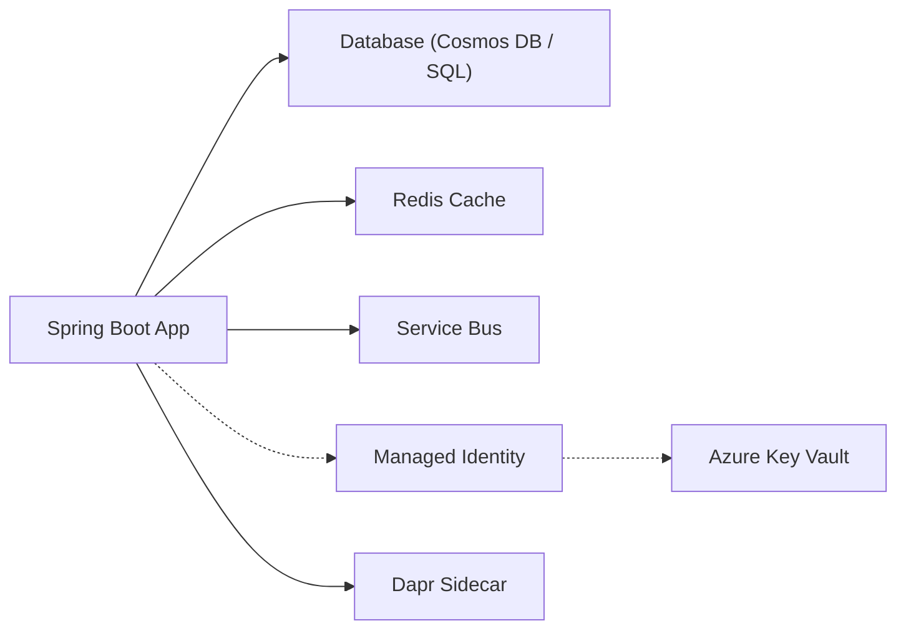

---
content_sources:
  diagrams:
    - id: accelerate-your-development-process-with-these
      type: flowchart
      source: mslearn-adapted
      based_on:
        - https://learn.microsoft.com/azure/developer/java/spring-framework/spring-cloud-azure
        - https://learn.microsoft.com/azure/developer/java/sdk/overview
---

# Java Recipes Overview

Accelerate your development process with these common integration patterns and production recipes for Java (Spring Boot) applications on Azure Container Apps.

<!-- diagram-id: accelerate-your-development-process-with-these -->

## Integration Patterns

Azure Container Apps provides a flexible platform for building distributed systems. These recipes demonstrate how to integrate your Spring Boot application with other Azure services and platform features.

### 1. Database Integration

- **Azure Cosmos DB** (Coming Soon): Securely connect to NoSQL databases using Managed Identity and Spring Data Cosmos.
- **Azure SQL** (Coming Soon): Relational database integration with passwordless authentication and Spring Data JPA.

### 2. Messaging and Caching

- **Redis Cache** (Coming Soon): High-performance distributed caching and session state management with Spring Data Redis.
- **Service Bus** (Coming Soon): Reliable messaging for asynchronous communication and event-driven architectures.

### 3. Platform Features

- **Dapr Integration** (Coming Soon): Building distributed microservices using the Dapr framework for service invocation and state management.
- **Custom Domains** (Coming Soon): Mapping your own branded URLs and SSL certificates to your Java apps.
- **Storage Integration** (Coming Soon): Cloud file storage and persistent volume mounts for containers using Azure Blob Storage.

### 4. Security and Identity

- **Key Vault Integration** (Coming Soon): Securing application secrets and configuration using Azure Key Vault.
- **Managed Identity** (Coming Soon): Implementing "Zero-Trust" security by removing connection strings and using Azure RBAC.

## Choosing the Right Recipe

| Need | Recommended Recipe |
| --- | --- |
| Storing relational data | Azure SQL |
| Scaling distributed caches | Redis Cache |
| Implementing microservices | Dapr Integration |
| Securing secrets | Key Vault Integration |

## Best Practices for Java Recipes

- **Spring Cloud Azure**: Use the [Spring Cloud Azure](https://azure.microsoft.com/en-us/products/spring-cloud-azure/) libraries for seamless integration with Azure services.
- **Passwordless Auth**: Always prioritize Managed Identity over connection strings and API keys.
- **Auto-configuration**: Leverage Spring Boot's auto-configuration to reduce boilerplate code for service integrations.

!!! tip "Use Spring Initializr for quick starts"
    When building new microservices, use [Spring Initializr](https://start.spring.io/) to add the necessary Azure dependencies to your `pom.xml` from the start.

## See Also

- [03 - Configuration and Secrets](../tutorial/03-configuration.md)
- [04 - Logging and Monitoring](../tutorial/04-logging-monitoring.md)
- [Java Guide Index](../index.md)

## Sources

- [Spring Cloud Azure Documentation (Microsoft Learn)](https://learn.microsoft.com/azure/developer/java/spring-framework/spring-cloud-azure)
- [Azure SDK for Java (Microsoft Learn)](https://learn.microsoft.com/azure/developer/java/sdk/overview)
