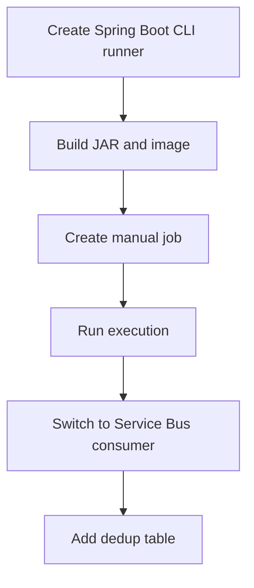

---
content_sources:
  diagrams:
    - id: java-jobs-recipe-flow
      type: flowchart
      source: self-generated
      justification: Language recipe flow synthesized from Microsoft Learn Jobs guidance and Java SDK usage patterns.
      based_on:
        - https://learn.microsoft.com/azure/container-apps/jobs
        - https://learn.microsoft.com/java/api/overview/azure/identity-readme
        - https://learn.microsoft.com/java/api/overview/azure/messaging-servicebus-readme
---

# Recipe: Jobs in Java on Azure Container Apps

Use this recipe to build a Spring Boot CLI runner for manual Jobs, adapt it to process one Service Bus message, and add a dedup-table pattern.

## Prerequisites

- Azure Container Apps environment and registry
- Azure Service Bus namespace and queue for the event-driven example
- Java 21, Maven, Docker, and Azure CLI

```bash
export RG="rg-aca-java-prod"
export ENVIRONMENT_NAME="aca-env-java-prod"
export ACR_NAME="acrjavaprod"
export JOB_NAME="job-java-manual"
export EVENT_JOB_NAME="job-java-servicebus"
export SERVICEBUS_NAMESPACE="sb-aca-prod"
export SERVICEBUS_QUEUE="orders"
```

## What You'll Build

- a Spring Boot CommandLineRunner Job
- an event-driven Service Bus consumer that processes one message and exits
- a dedup-table example using an embedded table you can later move to a shared database

## Steps

<!-- diagram-id: java-jobs-recipe-flow -->


### 1. Create a manual Spring Boot Job

`pom.xml`:

```xml
<project xmlns="http://maven.apache.org/POM/4.0.0" xmlns:xsi="http://www.w3.org/2001/XMLSchema-instance"
         xsi:schemaLocation="http://maven.apache.org/POM/4.0.0 https://maven.apache.org/xsd/maven-4.0.0.xsd">
  <modelVersion>4.0.0</modelVersion>
  <groupId>com.contoso.jobs</groupId>
  <artifactId>aca-java-job</artifactId>
  <version>1.0.0</version>
  <parent>
    <groupId>org.springframework.boot</groupId>
    <artifactId>spring-boot-starter-parent</artifactId>
    <version>3.3.2</version>
  </parent>
  <properties>
    <java.version>21</java.version>
  </properties>
  <dependencies>
    <dependency>
      <groupId>org.springframework.boot</groupId>
      <artifactId>spring-boot-starter</artifactId>
    </dependency>
    <dependency>
      <groupId>com.azure</groupId>
      <artifactId>azure-identity</artifactId>
      <version>1.13.2</version>
    </dependency>
    <dependency>
      <groupId>com.azure</groupId>
      <artifactId>azure-messaging-servicebus</artifactId>
      <version>7.17.7</version>
    </dependency>
    <dependency>
      <groupId>org.springframework.boot</groupId>
      <artifactId>spring-boot-starter-jdbc</artifactId>
    </dependency>
    <dependency>
      <groupId>com.h2database</groupId>
      <artifactId>h2</artifactId>
      <scope>runtime</scope>
    </dependency>
  </dependencies>
  <build>
    <plugins>
      <plugin>
        <groupId>org.springframework.boot</groupId>
        <artifactId>spring-boot-maven-plugin</artifactId>
      </plugin>
    </plugins>
  </build>
</project>
```

`src/main/java/com/contoso/jobs/JobApplication.java`:

```java
package com.contoso.jobs;

import org.springframework.boot.CommandLineRunner;
import org.springframework.boot.SpringApplication;
import org.springframework.boot.autoconfigure.SpringBootApplication;
import org.springframework.context.annotation.Bean;

@SpringBootApplication
public class JobApplication {
    public static void main(String[] args) {
        SpringApplication.run(JobApplication.class, args);
    }

    @Bean
    CommandLineRunner manualRunner() {
        return args -> {
            String execution = System.getenv().getOrDefault("CONTAINER_APP_JOB_EXECUTION_NAME", "local");
            System.out.println("{\"event\":\"job-start\",\"execution\":\"" + execution + "\"}");
            System.out.println("{\"event\":\"job-end\",\"status\":\"Succeeded\"}");
            System.exit(0);
        };
    }
}
```

`Dockerfile`:

```dockerfile
FROM maven:3.9-eclipse-temurin-21 AS build
WORKDIR /src
COPY pom.xml .
COPY src ./src
RUN mvn --batch-mode --quiet package -DskipTests

FROM eclipse-temurin:21-jre
WORKDIR /app
COPY --from=build /src/target/aca-java-job-1.0.0.jar app.jar
ENTRYPOINT ["java", "-jar", "/app/app.jar"]
```

Deploy the manual Job:

```bash
az acr build \
  --registry "$ACR_NAME" \
  --image "java-jobs/manual:v1" \
  --file "Dockerfile" \
  "."

az containerapp job create \
  --name "$JOB_NAME" \
  --resource-group "$RG" \
  --environment "$ENVIRONMENT_NAME" \
  --trigger-type "Manual" \
  --image "$ACR_NAME.azurecr.io/java-jobs/manual:v1" \
  --replica-timeout 600 \
  --replica-retry-limit 1
```

### 2. Receive one Service Bus message and exit

Replace the runner bean with:

```java
@Bean
CommandLineRunner serviceBusRunner() {
    return args -> {
        var namespace = System.getenv("SERVICEBUS_NAMESPACE") + ".servicebus.windows.net";
        var queueName = System.getenv("SERVICEBUS_QUEUE");

        var client = new com.azure.messaging.servicebus.ServiceBusClientBuilder()
            .credential(namespace, new com.azure.identity.DefaultAzureCredentialBuilder().build())
            .receiver()
            .queueName(queueName)
            .buildClient();

        var messages = client.receiveMessages(1, java.time.Duration.ofSeconds(15));
        for (var message : messages) {
            System.out.println("{\"event\":\"message-received\",\"messageId\":\"" + message.getMessageId() + "\"}");
            client.complete(message);
        }
        client.close();
        System.exit(0);
    };
}
```

Create the event-driven Job:

```bash
az acr build \
  --registry "$ACR_NAME" \
  --image "java-jobs/servicebus:v1" \
  --file "Dockerfile" \
  "."

az containerapp job create \
  --name "$EVENT_JOB_NAME" \
  --resource-group "$RG" \
  --environment "$ENVIRONMENT_NAME" \
  --trigger-type "Event" \
  --image "$ACR_NAME.azurecr.io/java-jobs/servicebus:v1" \
  --scale-rule-name "orders-queue" \
  --scale-rule-type "azure-servicebus" \
  --scale-rule-metadata "queueName=$SERVICEBUS_QUEUE" "messageCount=1" "namespace=$SERVICEBUS_NAMESPACE.servicebus.windows.net" \
  --env-vars SERVICEBUS_NAMESPACE="$SERVICEBUS_NAMESPACE" SERVICEBUS_QUEUE="$SERVICEBUS_QUEUE"
```

### 3. Add a dedup table

For a runnable demo, use an embedded H2 table. In production, move the same insert-if-absent logic to a shared database.

```java
@Bean
CommandLineRunner dedupRunner(org.springframework.jdbc.core.JdbcTemplate jdbcTemplate) {
    return args -> {
        jdbcTemplate.execute("create table if not exists processed_messages (message_id varchar(200) primary key)");
        int inserted = jdbcTemplate.update(
            "merge into processed_messages key(message_id) values (?)",
            "message-123"
        );
        if (inserted > 0) {
            System.out.println("{\"event\":\"process-message\",\"messageId\":\"message-123\"}");
        } else {
            System.out.println("{\"event\":\"duplicate-message\",\"messageId\":\"message-123\"}");
        }
        System.exit(0);
    };
}
```

## Verification

```bash
az containerapp job execution list \
  --name "$JOB_NAME" \
  --resource-group "$RG" \
  --output table

az containerapp job execution list \
  --name "$EVENT_JOB_NAME" \
  --resource-group "$RG" \
  --output table
```

## Next Steps / Clean Up

- Move the dedup table to Azure SQL or PostgreSQL.
- Add explicit execution IDs to every structured log line.
- Review [Jobs Operations](../../../operations/jobs/index.md) before production rollout.

## See Also

- [Java Recipes Index](index.md)
- [Container Apps Jobs Overview](../../../platform/jobs/index.md)
- [Job Design](../../../best-practices/job-design.md)

## Sources

- [Jobs in Azure Container Apps (Microsoft Learn)](https://learn.microsoft.com/azure/container-apps/jobs)
- [Azure Identity library for Java](https://learn.microsoft.com/java/api/overview/azure/identity-readme)
- [Azure Service Bus library for Java](https://learn.microsoft.com/java/api/overview/azure/messaging-servicebus-readme)
