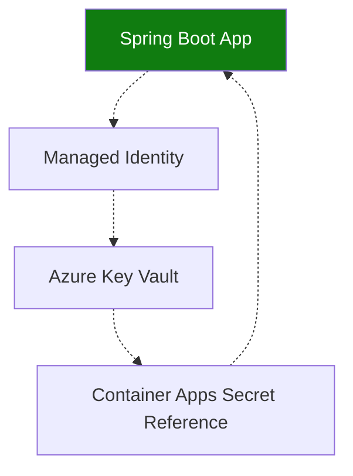

---
content_sources:
  diagrams:
    - id: use-azure-key-vault-with-managed
      type: flowchart
      source: mslearn-adapted
      based_on:
        - https://learn.microsoft.com/azure/container-apps/manage-secrets
        - https://learn.microsoft.com/azure/developer/java/spring-framework/configure-spring-boot-starter-java-app-with-azure-key-vault
        - https://learn.microsoft.com/java/api/overview/azure/security-keyvault-secrets-readme
---

# Recipe: Key Vault Reference in Java Apps on Azure Container Apps

Use Azure Key Vault with managed identity and Spring Boot to externalize secrets for Java workloads on Azure Container Apps.

<!-- diagram-id: use-azure-key-vault-with-managed -->


## Prerequisites

- Existing Container App (`$APP_NAME`) in resource group (`$RG`)
- Existing Key Vault (`$KEYVAULT_NAME`) with secret `db-password`
- Azure CLI with Container Apps extension

## Configure identity and secret reference

```bash
az containerapp identity assign \
  --name "$APP_NAME" \
  --resource-group "$RG" \
  --system-assigned

export PRINCIPAL_ID=$(az containerapp show \
  --name "$APP_NAME" \
  --resource-group "$RG" \
  --query "identity.principalId" \
  --output tsv)

az role assignment create \
  --assignee-object-id "$PRINCIPAL_ID" \
  --assignee-principal-type ServicePrincipal \
  --role "Key Vault Secrets User" \
  --scope "$(az keyvault show --name "$KEYVAULT_NAME" --query id --output tsv)"

az containerapp secret set \
  --name "$APP_NAME" \
  --resource-group "$RG" \
  --secrets "db-password=keyvaultref:https://$KEYVAULT_NAME.vault.azure.net/secrets/db-password,identityref:system"

az containerapp update \
  --name "$APP_NAME" \
  --resource-group "$RG" \
  --set-env-vars "DB_PASSWORD=secretref:db-password"
```

## Spring Boot Key Vault integration

Add dependency:

```xml
<dependency>
  <groupId>com.azure.spring</groupId>
  <artifactId>spring-cloud-azure-starter-keyvault-secrets</artifactId>
</dependency>
```

`application.properties`:

```properties
spring.cloud.azure.keyvault.secret.endpoint=https://${KEYVAULT_NAME}.vault.azure.net/
```

SDK access example:

```java
import com.azure.identity.DefaultAzureCredentialBuilder;
import com.azure.security.keyvault.secrets.SecretClient;
import com.azure.security.keyvault.secrets.SecretClientBuilder;

SecretClient client = new SecretClientBuilder()
    .vaultUrl("https://" + System.getenv("KEYVAULT_NAME") + ".vault.azure.net/")
    .credential(new DefaultAzureCredentialBuilder().build())
    .buildClient();

String password = client.getSecret("db-password").getValue();
```

## Advanced Topics

- Separate vaults by environment and data sensitivity tier.
- Use revision-based rollout after secret rotations for controlled changes.
- Prefer managed identity plus RBAC over app-managed credentials.

## See Also

- [Managed Identity](managed-identity.md)
- [Container Registry](container-registry.md)
- [Key Vault Platform Guide](../../../platform/identity-and-secrets/key-vault.md)

## Sources

- [Manage secrets in Azure Container Apps](https://learn.microsoft.com/azure/container-apps/manage-secrets)
- [Spring Cloud Azure Key Vault secrets](https://learn.microsoft.com/azure/developer/java/spring-framework/configure-spring-boot-starter-java-app-with-azure-key-vault)
- [Azure Key Vault Secrets SDK for Java](https://learn.microsoft.com/java/api/overview/azure/security-keyvault-secrets-readme)
