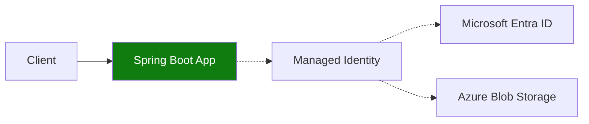

---
hide:
  - toc
content_sources:
  diagrams:
    - id: use-managed-identity-with-spring-boot
      type: flowchart
      source: mslearn-adapted
      based_on:
        - https://learn.microsoft.com/azure/container-apps/managed-identity
        - https://learn.microsoft.com/java/api/overview/azure/identity-readme
---

# Recipe: Managed Identity in Java Apps on Azure Container Apps

Use managed identity with Spring Boot so Java applications can access Azure services without client secrets.

<!-- diagram-id: use-managed-identity-with-spring-boot -->


## Prerequisites

- Existing Container App (`$APP_NAME`) and resource group (`$RG`)
- Storage account (`$STORAGE_ACCOUNT`) and container (`$STORAGE_CONTAINER`)
- Azure CLI with Container Apps extension

```bash
az extension add --name containerapp --upgrade
```

## Enable managed identity and role assignment

```bash
az containerapp identity assign \
  --name "$APP_NAME" \
  --resource-group "$RG" \
  --system-assigned

export PRINCIPAL_ID=$(az containerapp show \
  --name "$APP_NAME" \
  --resource-group "$RG" \
  --query "identity.principalId" \
  --output tsv)

az role assignment create \
  --assignee-object-id "$PRINCIPAL_ID" \
  --assignee-principal-type ServicePrincipal \
  --role "Storage Blob Data Reader" \
  --scope "$(az storage account show --name "$STORAGE_ACCOUNT" --resource-group "$RG" --query id --output tsv)"
```

## Spring Boot configuration

```properties
spring.cloud.azure.active-directory.managed-identity.client-id=${AZURE_CLIENT_ID:}
storage.account-url=https://${STORAGE_ACCOUNT}.blob.core.windows.net
storage.container=${STORAGE_CONTAINER:app-data}
```

## Java example with `DefaultAzureCredentialBuilder`

```java
import com.azure.identity.DefaultAzureCredentialBuilder;
import com.azure.storage.blob.BlobContainerClient;
import com.azure.storage.blob.BlobServiceClientBuilder;
import org.springframework.beans.factory.annotation.Value;
import org.springframework.web.bind.annotation.GetMapping;
import org.springframework.web.bind.annotation.RestController;

@RestController
public class BlobController {
    @Value("${storage.account-url}")
    private String accountUrl;

    @Value("${storage.container}")
    private String container;

    @GetMapping("/blobs")
    public Iterable<String> blobs() {
        var credential = new DefaultAzureCredentialBuilder().build();
        var service = new BlobServiceClientBuilder().endpoint(accountUrl).credential(credential).buildClient();
        BlobContainerClient containerClient = service.getBlobContainerClient(container);
        return containerClient.listBlobs().stream().map(item -> item.getName()).toList();
    }
}
```

## Advanced Topics

- Use user-assigned identities when one identity must be reused across services.
- Scope RBAC at the narrowest resource level (container, vault, database).
- Add health checks that validate downstream token and authorization readiness.

## See Also

- [Key Vault Reference](key-vault-reference.md)
- [Easy Auth](easy-auth.md)
- [Managed Identity Platform Guide](../../../platform/identity-and-secrets/managed-identity.md)

## Sources

- [Managed identities in Azure Container Apps](https://learn.microsoft.com/azure/container-apps/managed-identity)
- [Azure Identity library for Java](https://learn.microsoft.com/java/api/overview/azure/identity-readme)
