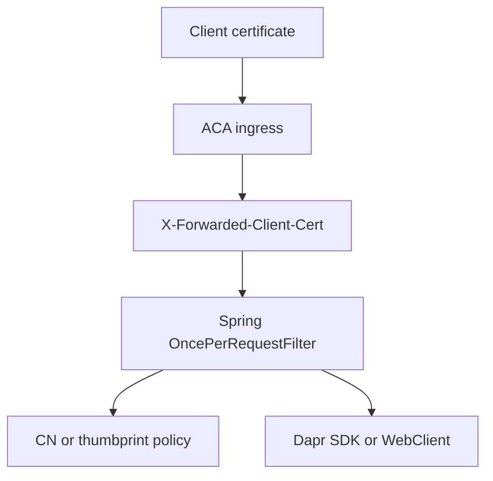

---
content_sources:
  diagrams:
    - id: spring-xfcc-validation-flow
      type: flowchart
      source: mslearn-adapted
      based_on:
        - https://learn.microsoft.com/en-us/azure/container-apps/client-certificate-authorization
        - https://learn.microsoft.com/en-us/azure/container-apps/ingress-overview
        - https://learn.microsoft.com/en-us/azure/container-apps/connect-apps
---

# Recipe: mTLS Client Certificates in Java Apps on Azure Container Apps

Use a Spring Boot filter to decode the forwarded client certificate, apply a CN or thumbprint allowlist, and compare Dapr Java SDK invocation with direct `WebClient` calls.

<!-- diagram-id: spring-xfcc-validation-flow -->


## Prerequisites

- Spring Boot app with ingress enabled on Azure Container Apps.
- `clientCertificateMode` set to `require` or `accept`.
- Java 21 or later.
- Optional Dapr sidecar enabled on both apps.

`pom.xml` dependencies:

```xml
<dependencies>
    <dependency>
        <groupId>org.springframework.boot</groupId>
        <artifactId>spring-boot-starter-web</artifactId>
    </dependency>
    <dependency>
        <groupId>org.springframework.boot</groupId>
        <artifactId>spring-boot-starter-webflux</artifactId>
    </dependency>
    <dependency>
        <groupId>io.dapr</groupId>
        <artifactId>dapr-sdk</artifactId>
        <version>1.15.0</version>
    </dependency>
</dependencies>
```

## What You'll Build

- A Spring filter that parses the leaf certificate from `X-Forwarded-Client-Cert`.
- Allowlist validation by subject CN or SHA-256 thumbprint.
- Outbound calls using Dapr Java SDK and direct `WebClient`.

## Steps

### 1. Add the filter and controller

```java
package com.example.demo;

import io.dapr.client.DaprClient;
import io.dapr.client.DaprClientBuilder;
import jakarta.servlet.FilterChain;
import jakarta.servlet.ServletException;
import jakarta.servlet.http.HttpServletRequest;
import jakarta.servlet.http.HttpServletResponse;
import org.springframework.http.MediaType;
import org.springframework.stereotype.Component;
import org.springframework.web.bind.annotation.GetMapping;
import org.springframework.web.bind.annotation.RestController;
import org.springframework.web.filter.OncePerRequestFilter;
import org.springframework.web.reactive.function.client.WebClient;

import java.io.ByteArrayInputStream;
import java.io.IOException;
import java.nio.charset.StandardCharsets;
import java.security.MessageDigest;
import java.security.cert.CertificateFactory;
import java.security.cert.X509Certificate;
import java.util.Arrays;
import java.util.Set;
import java.util.regex.Matcher;
import java.util.regex.Pattern;

@Component
class ClientCertificateFilter extends OncePerRequestFilter {
    private static final Pattern CERT_PATTERN = Pattern.compile("Cert=\\\"([\\s\\S]*?)\\\"(?:;|$)");
    private static final Set<String> ALLOWED_COMMON_NAMES = Set.of("api-client.contoso.com", "partner-gateway.contoso.com");
    private static final Set<String> ALLOWED_THUMBPRINTS = Set.of();

    @Override
    protected void doFilterInternal(HttpServletRequest request, HttpServletResponse response, FilterChain filterChain)
            throws ServletException, IOException {
        String headerValue = request.getHeader("X-Forwarded-Client-Cert");
        if (headerValue == null || headerValue.isBlank()) {
            response.sendError(403, "client certificate header missing");
            return;
        }

        Matcher matcher = CERT_PATTERN.matcher(headerValue);
        if (!matcher.find()) {
            response.sendError(403, "leaf certificate missing from XFCC header");
            return;
        }

        String leafPem = matcher.group(1).replace("\\n", "\n");

        try {
            CertificateFactory factory = CertificateFactory.getInstance("X.509");
            X509Certificate certificate = (X509Certificate) factory.generateCertificate(
                    new ByteArrayInputStream(leafPem.getBytes(StandardCharsets.UTF_8))
            );

            String subject = certificate.getSubjectX500Principal().getName();
            String commonName = Arrays.stream(subject.split(","))
                    .map(String::trim)
                    .filter(part -> part.startsWith("CN="))
                    .map(part -> part.substring(3))
                    .findFirst()
                    .orElse("");

            String thumbprint = toThumbprint(certificate.getEncoded());

            if ((!ALLOWED_THUMBPRINTS.isEmpty() && ALLOWED_THUMBPRINTS.contains(thumbprint))
                    || ALLOWED_COMMON_NAMES.contains(commonName)) {
                request.setAttribute("clientCommonName", commonName);
                request.setAttribute("clientThumbprint", thumbprint);
                filterChain.doFilter(request, response);
                return;
            }

            response.sendError(403, "client certificate not allowlisted");
        } catch (Exception exception) {
            response.sendError(403, "certificate parsing failed");
        }
    }

    private static String toThumbprint(byte[] bytes) throws Exception {
        MessageDigest digest = MessageDigest.getInstance("SHA-256");
        byte[] hash = digest.digest(bytes);
        StringBuilder builder = new StringBuilder();
        for (byte value : hash) {
            builder.append(String.format("%02X", value));
        }
        return builder.toString();
    }
}

@RestController
class MtlsController {
    private final WebClient webClient = WebClient.builder().baseUrl("http://ca-backend").build();
    private final DaprClient daprClient = new DaprClientBuilder().build();

    @GetMapping(value = "/cert-info", produces = MediaType.APPLICATION_JSON_VALUE)
    public String certInfo(HttpServletRequest request) {
        return "{\"commonName\":\"" + request.getAttribute("clientCommonName")
                + "\",\"thumbprint\":\"" + request.getAttribute("clientThumbprint") + "\"}";
    }

    @GetMapping(value = "/call-backend/dapr", produces = MediaType.APPLICATION_JSON_VALUE)
    public String callBackendWithDapr() throws Exception {
        String response = daprClient.invokeMethod("backend", "health", null, io.dapr.client.domain.HttpExtension.GET, String.class).block();
        return "{\"path\":\"dapr\",\"status\":" + response + "}";
    }

    @GetMapping(value = "/call-backend/direct", produces = MediaType.APPLICATION_JSON_VALUE)
    public String callBackendDirect() {
        String response = webClient.get().uri("/health").retrieve().bodyToMono(String.class).block();
        return "{\"path\":\"direct\",\"status\":" + response + "}";
    }
}
```

### 2. Configure the app

```bash
az containerapp update \
  --name "$APP_NAME" \
  --resource-group "$RG" \
  --set-env-vars \
    DIRECT_BACKEND_URL="http://ca-backend" \
    DAPR_TARGET_APP_ID="backend"
```

### 3. Test with curl

```bash
curl --include \
  --cert "./client.pem" \
  --key "./client.key" \
  "https://${FQDN}/cert-info"
```

## Verification

- `200 OK` for an allowlisted CN or thumbprint.
- `403` when the header is missing or the certificate is not allowlisted.
- `/call-backend/dapr` proves sidecar-based invocation.
- `/call-backend/direct` proves direct environment networking separately.

## See Also

- [Easy Auth](easy-auth.md)
- [Ingress Client Certificates](../../../platform/security/ingress-client-certificates.md)
- [mTLS Architecture in Azure Container Apps](../../../platform/security/mtls.md)

## Sources

- [Configure client certificate authentication in Azure Container Apps (Microsoft Learn)](https://learn.microsoft.com/en-us/azure/container-apps/client-certificate-authorization)
- [Ingress overview in Azure Container Apps (Microsoft Learn)](https://learn.microsoft.com/en-us/azure/container-apps/ingress-overview)
- [Communicate between container apps in Azure Container Apps (Microsoft Learn)](https://learn.microsoft.com/en-us/azure/container-apps/connect-apps)
