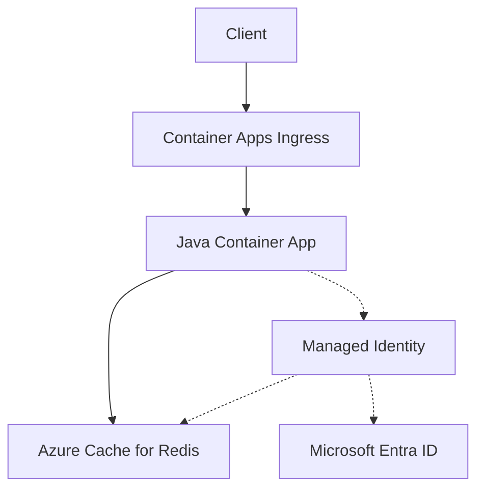

---
content_sources:
  diagrams:
    - id: architecture
      type: flowchart
      source: mslearn-adapted
      based_on:
        - https://learn.microsoft.com/azure/azure-cache-for-redis/cache-azure-active-directory-for-authentication
        - https://learn.microsoft.com/azure/redis/java-get-started
---

# Azure Cache for Redis Integration (Microsoft Entra Authentication)

Use this recipe to connect Azure Container Apps to Azure Cache for Redis with Microsoft Entra authentication first and access keys only as a fallback.

## Architecture

<!-- diagram-id: architecture -->


Solid arrows show runtime data flow. Dashed arrows show identity and authentication.

## Prerequisites

- Existing Container App: `$APP_NAME` in `$RG`
- Existing Azure Cache for Redis instance with Microsoft Entra authentication enabled
- TLS access enabled on port `6380`

## Step 1: Enable managed identity on the Container App

```bash
az containerapp identity assign \
  --name "$APP_NAME" \
  --resource-group "$RG" \
  --system-assigned

export PRINCIPAL_ID=$(az containerapp show \
  --name "$APP_NAME" \
  --resource-group "$RG" \
  --query "identity.principalId" \
  --output tsv)
```

## Step 2: Assign Redis data access

```bash
az redis access-policy-assignment create \
  --name "$REDIS_NAME" \
  --resource-group "$RG" \
  --access-policy-name "Data Owner" \
  --object-id "$PRINCIPAL_ID" \
  --object-id-alias "$APP_NAME"
```

## Step 3: Configure non-secret Redis settings

```bash
az containerapp update \
  --name "$APP_NAME" \
  --resource-group "$RG" \
  --set-env-vars REDIS_HOST="$REDIS_NAME.redis.cache.windows.net" REDIS_PORT="6380" REDIS_USERNAME="$PRINCIPAL_ID"
```

## Step 4: Java code (Microsoft Entra token authentication)

Add dependencies:

```xml
<dependency>
  <groupId>com.azure</groupId>
  <artifactId>azure-identity</artifactId>
</dependency>
<dependency>
  <groupId>io.lettuce</groupId>
  <artifactId>lettuce-core</artifactId>
</dependency>
```

Use `DefaultAzureCredential` to fetch the Redis access token:

```java
import com.azure.core.credential.AccessToken;
import com.azure.core.credential.TokenRequestContext;
import com.azure.identity.DefaultAzureCredentialBuilder;
import io.lettuce.core.RedisClient;
import io.lettuce.core.RedisURI;
import io.lettuce.core.api.StatefulRedisConnection;

public class RedisRecipe {
    public static void main(String[] args) {
        String host = System.getenv("REDIS_HOST");
        int port = Integer.parseInt(System.getenv().getOrDefault("REDIS_PORT", "6380"));

        String password = System.getenv("REDIS_ACCESS_KEY");
        if (password == null || password.isBlank()) {
            AccessToken token = new DefaultAzureCredentialBuilder()
                .build()
                .getToken(new TokenRequestContext().addScopes("https://redis.azure.com/.default"))
                .block();
            password = token.getToken();
        }

        RedisURI redisUri = RedisURI.builder()
            .withHost(host)
            .withPort(port)
            .withSsl(true)
            .withAuthentication(System.getenv("REDIS_USERNAME"), password)
            .build();

        try (RedisClient client = RedisClient.create(redisUri);
             StatefulRedisConnection<String, String> connection = client.connect()) {
            connection.sync().setex("health", 60, "ok");
            System.out.println(connection.sync().get("health"));
        }
    }
}
```

!!! warning
    The Entra token used for Redis expires. For long-lived connections, implement token refresh and reconnect logic that matches the guidance for your Redis tier and client library.

## Step 5: Access key fallback

```bash
az containerapp secret set \
  --name "$APP_NAME" \
  --resource-group "$RG" \
  --secrets redis-access-key="<redis-primary-key>"

az containerapp update \
  --name "$APP_NAME" \
  --resource-group "$RG" \
  --set-env-vars REDIS_HOST="$REDIS_NAME.redis.cache.windows.net" REDIS_PORT="6380" REDIS_ACCESS_KEY=secretref:redis-access-key REDIS_USERNAME="default"
```

## Verification

1. Confirm the access policy assignment exists.
2. Confirm application logs show successful Redis `SETEX` and `GET` operations.
3. Confirm clients are using TLS on port `6380`.

## See Also

- [Managed Identity](managed-identity.md)
- [Private Endpoints](../../../platform/networking/private-endpoints.md)
- [Networking](../../../platform/networking/vnet-integration.md)

## Sources

- [Use Microsoft Entra for cache authentication](https://learn.microsoft.com/azure/azure-cache-for-redis/cache-azure-active-directory-for-authentication)
- [Use Azure Cache for Redis with Java](https://learn.microsoft.com/azure/redis/java-get-started)
