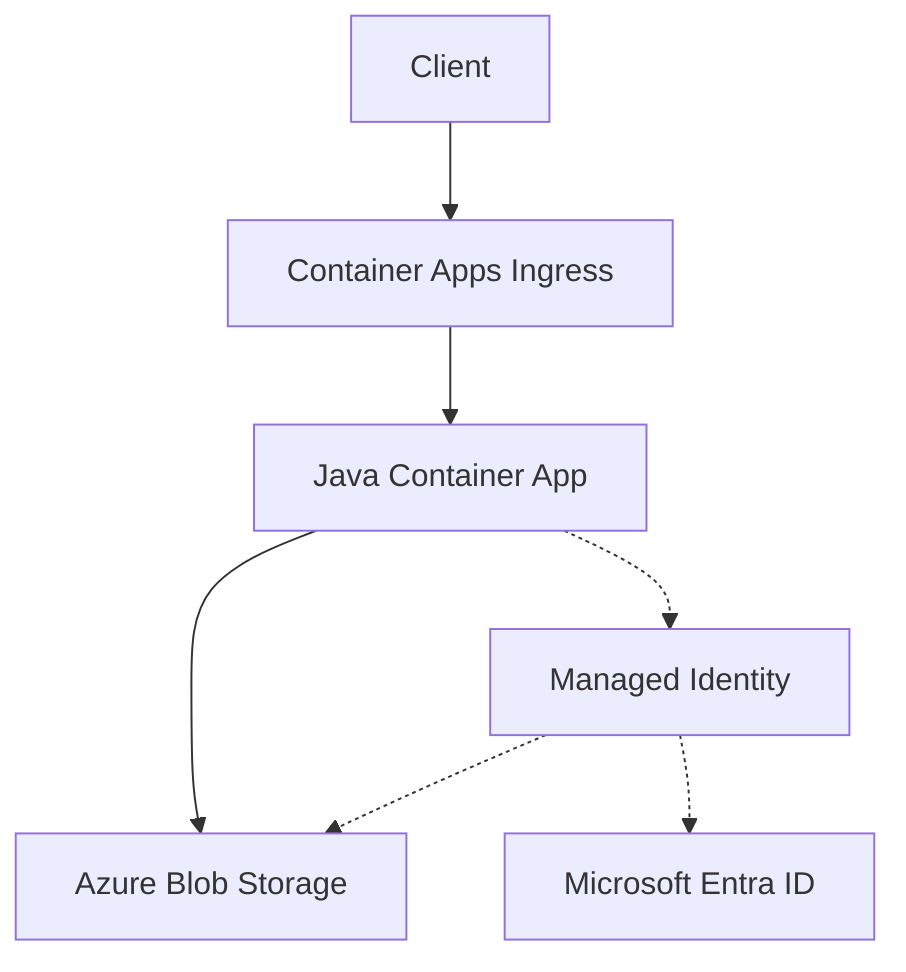

---
content_sources:
  diagrams:
    - id: architecture
      type: flowchart
      source: mslearn-adapted
      based_on:
        - https://learn.microsoft.com/azure/container-apps/storage-mounts
        - https://learn.microsoft.com/java/api/overview/azure/storage-blob-readme
---

# Blob Storage Integration (Managed Identity)

Use this recipe to connect a Java Container App to Azure Blob Storage with managed identity first and a connection string fallback when you still depend on shared keys.

## Architecture

<!-- diagram-id: architecture -->


Solid arrows show runtime data flow. Dashed arrows show identity and authentication.

## Prerequisites

- Existing Container App: `$APP_NAME` in `$RG`
- Existing storage account and blob container
- Azure CLI with the Container Apps extension

```bash
az extension add --name containerapp --upgrade
```

## Step 1: Enable managed identity on the Container App

```bash
az containerapp identity assign \
  --name "$APP_NAME" \
  --resource-group "$RG" \
  --system-assigned

export PRINCIPAL_ID=$(az containerapp show \
  --name "$APP_NAME" \
  --resource-group "$RG" \
  --query "identity.principalId" \
  --output tsv)
```

## Step 2: Grant Blob data access

```bash
export STORAGE_ID=$(az storage account show \
  --name "$STORAGE_ACCOUNT" \
  --resource-group "$RG" \
  --query "id" \
  --output tsv)

az role assignment create \
  --assignee-object-id "$PRINCIPAL_ID" \
  --assignee-principal-type ServicePrincipal \
  --role "Storage Blob Data Contributor" \
  --scope "$STORAGE_ID"
```

## Step 3: Configure non-secret settings

```bash
az containerapp update \
  --name "$APP_NAME" \
  --resource-group "$RG" \
  --set-env-vars STORAGE_ACCOUNT_URL="https://$STORAGE_ACCOUNT.blob.core.windows.net" STORAGE_CONTAINER="$STORAGE_CONTAINER"
```

## Step 4: Java code (managed identity)

Add dependencies:

```xml
<dependency>
  <groupId>com.azure</groupId>
  <artifactId>azure-storage-blob</artifactId>
</dependency>
<dependency>
  <groupId>com.azure</groupId>
  <artifactId>azure-identity</artifactId>
</dependency>
```

Upload and download a blob with `DefaultAzureCredentialBuilder`:

```java
import com.azure.identity.DefaultAzureCredentialBuilder;
import com.azure.storage.blob.BlobClient;
import com.azure.storage.blob.BlobContainerClient;
import com.azure.storage.blob.BlobServiceClient;
import com.azure.storage.blob.BlobServiceClientBuilder;
import com.azure.core.util.BinaryData;

public class BlobRecipe {
    private static BlobServiceClient createClient() {
        String connectionString = System.getenv("AZURE_STORAGE_CONNECTION_STRING");
        BlobServiceClientBuilder builder = new BlobServiceClientBuilder();

        if (connectionString != null && !connectionString.isBlank()) {
            return builder.connectionString(connectionString).buildClient();
        }

        return builder
            .endpoint(System.getenv("STORAGE_ACCOUNT_URL"))
            .credential(new DefaultAzureCredentialBuilder().build())
            .buildClient();
    }

    public static void main(String[] args) {
        BlobServiceClient service = createClient();
        BlobContainerClient container = service.getBlobContainerClient(System.getenv("STORAGE_CONTAINER"));
        BlobClient blob = container.getBlobClient("hello.txt");

        blob.upload(BinaryData.fromString("hello from aca"), true);
        BinaryData content = blob.downloadContent();
        System.out.println(content.toString());
    }
}
```

## Step 5: Connection string fallback

```bash
az containerapp secret set \
  --name "$APP_NAME" \
  --resource-group "$RG" \
  --secrets storage-connection-string="DefaultEndpointsProtocol=https;AccountName=$STORAGE_ACCOUNT;AccountKey=<storage-account-key>;EndpointSuffix=core.windows.net"

az containerapp update \
  --name "$APP_NAME" \
  --resource-group "$RG" \
  --set-env-vars AZURE_STORAGE_CONNECTION_STRING=secretref:storage-connection-string STORAGE_CONTAINER="$STORAGE_CONTAINER"
```

## Verification

1. Confirm RBAC assignment exists.
2. Confirm the uploaded blob exists with `az storage blob list --auth-mode login`.
3. Check app logs for successful upload and download operations.

## See Also

- [Managed Identity](managed-identity.md)
- [Key Vault Reference](key-vault-reference.md)
- [Java Guide Index](../index.md)

## Sources

- [Use storage mounts in Azure Container Apps](https://learn.microsoft.com/azure/container-apps/storage-mounts)
- [Azure Storage Blob client library for Java](https://learn.microsoft.com/java/api/overview/azure/storage-blob-readme)
