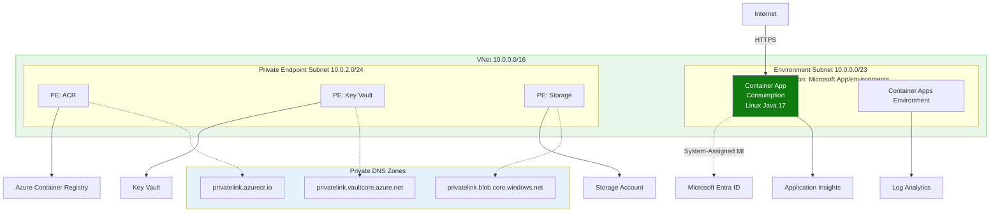
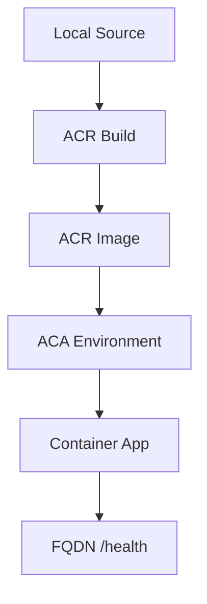

---
content_sources:
  diagrams:
    - id: this-tutorial-assumes-a-production-ready-container
      type: flowchart
      source: mslearn-adapted
      based_on:
        - https://learn.microsoft.com/azure/container-apps/quickstart-code-to-cloud
        - https://learn.microsoft.com/azure/container-apps/managed-identity-acr
    - id: deployment-workflow
      type: flowchart
      source: mslearn-adapted
      based_on:
        - https://learn.microsoft.com/azure/container-apps/quickstart-code-to-cloud
        - https://learn.microsoft.com/azure/container-apps/managed-identity-acr
---

# 02 - First Deploy to Azure

This guide walks you through the initial deployment of your Spring Boot application to Azure Container Apps. We'll use the Azure CLI to create a Container Registry, build the image in the cloud, and provision a Container App environment.

!!! info "Infrastructure Context"
    **Service**: Container Apps (Consumption) | **Network**: VNet integrated | **VNet**: ✅

    This tutorial assumes a production-ready Container Apps deployment with a custom VNet, ACR with managed identity pull, and private endpoints for backend services.

    <!-- diagram-id: this-tutorial-assumes-a-production-ready-container -->


## Deployment Workflow

<!-- diagram-id: deployment-workflow -->


## Prerequisites

- Azure CLI 2.57+
- Active Azure Subscription
- Terminal with common variables set

## Step 1: Environment Setup

Before running commands, set your common variables to ensure consistency.

```bash
# Variables
RG="rg-java-guide"
LOCATION="koreacentral"
ENVIRONMENT_NAME="cae-java-guide"
ACR_NAME="crjava$(date +%s)"
APP_NAME="ca-java-guide"
```

## Step 2: Create Infrastructure

1. **Create a Resource Group**

    ```bash
    az group create --name $RG --location $LOCATION
    ```

2. **Create a Container Registry (ACR)**

    ```bash
    az acr create --resource-group $RG --name $ACR_NAME --sku Basic
    ```

3. **Create a Container Apps Environment**

    ```bash
    az containerapp env create --resource-group $RG --name $ENVIRONMENT_NAME --location $LOCATION
    ```

## Step 3: Build and Push Image

Instead of building locally and pushing, use ACR Tasks to build the image directly in Azure from your source code.

```bash
cd apps/java-springboot
az acr build --registry $ACR_NAME --image java-guide:latest .
```

???+ example "Expected output"
    ```text
    Packing source code into tar to upload...
    Uploading 1.23 MB to registry...
    Building image...
    [build 1/5] FROM docker.io/library/maven:3.9-eclipse-temurin-21
    ... (Maven build output)
    [stage-1 3/3] COPY --from=build /app/target/*.jar app.jar
    Run ID: ce1 was successful after 1m 15s
    ```

## Step 4: Create the Container App

Deploy the application using the image from your ACR. We'll configure it to listen on port `8000` with public ingress.

```bash
az containerapp create \
  --resource-group $RG \
  --name $APP_NAME \
  --environment $ENVIRONMENT_NAME \
  --image $ACR_NAME.azurecr.io/java-guide:latest \
  --target-port 8000 \
  --ingress external \
  --query "properties.configuration.ingress.fqdn"
```

???+ example "Expected output"
    ```text
    "<your-app-name>.<environment-hash>.<region>.azurecontainerapps.io"
    ```

## Step 5: Verification

1. **Check the application URL**

    Visit the FQDN returned by the previous command. You should see the application's home page.

2. **Verify health endpoint**

    ```bash
    FQDN=$(az containerapp show --resource-group $RG --name $APP_NAME --query "properties.configuration.ingress.fqdn" --output tsv)
    curl https://$FQDN/health
    ```

    ???+ example "Expected output"
        ```json
        {"timestamp":"2026-04-04T16:12:58.973766483Z","status":"healthy"}
        ```

3. **Verify info endpoint**

    ```bash
    curl https://$FQDN/info
    ```

    ???+ example "Expected output"
        ```json
        {"runtime":{"vendor":"Eclipse Adoptium","java":"21.0.10"},"app":"azure-container-apps-java-guide","version":"1.0.0"}
        ```

## Deployment Verification Checklist

- [x] ACR Image build succeeded
- [x] Container App is in `Provisioned` state
- [x] Ingress FQDN is accessible
- [x] `/health` returns HTTP 200

!!! note "Managed Identity for ACR Pull"
    In this first deployment, the CLI handles authentication between ACR and ACA. For production-ready templates, use a User-Assigned Managed Identity for the container app to pull images from the registry.

## CLI Alternative (No Bicep)

Use these commands to deploy without Bicep templates. This creates the same resources imperatively.

### Step 1: Set variables

```bash
RG="rg-springboot-containerapp"
LOCATION="koreacentral"
APP_NAME="ca-springboot-demo"
BASE_NAME="springboot-app"
ENVIRONMENT_NAME="cae-springboot-demo"
ACR_NAME="crspringbootdemo"
LOG_NAME="log-springboot-demo"
```

???+ example "Expected output"
    ```text
    Variables set for resource group, logging workspace, registry, environment, and app.
    ```

### Step 2: Create resource group

```bash
az group create --name $RG --location $LOCATION
```

???+ example "Expected output"
    ```json
    {
      "id": "/subscriptions/<subscription-id>/resourceGroups/rg-springboot-containerapp",
      "location": "koreacentral",
      "name": "rg-springboot-containerapp",
      "properties": {
        "provisioningState": "Succeeded"
      }
    }
    ```

### Step 3: Create Log Analytics workspace

```bash
az monitor log-analytics workspace create --resource-group $RG --workspace-name $LOG_NAME --location $LOCATION
```

???+ example "Expected output"
    ```json
    {
      "customerId": "a1b2c3d4-e5f6-7890-abcd-ef1234567890",
      "id": "/subscriptions/<subscription-id>/resourceGroups/rg-springboot-containerapp/providers/Microsoft.OperationalInsights/workspaces/log-springboot-demo",
      "location": "koreacentral",
      "name": "log-springboot-demo",
      "provisioningState": "Succeeded"
    }
    ```

### Step 4: Create Azure Container Registry

```bash
az acr create --resource-group $RG --name $ACR_NAME --sku Basic
```

???+ example "Expected output"
    ```json
    {
      "id": "/subscriptions/<subscription-id>/resourceGroups/rg-springboot-containerapp/providers/Microsoft.ContainerRegistry/registries/crspringbootdemo",
      "loginServer": "crspringbootdemo.azurecr.io",
      "name": "crspringbootdemo",
      "provisioningState": "Succeeded",
      "sku": {
        "name": "Basic"
      }
    }
    ```

### Step 5: Create Container Apps environment

```bash
LOG_ID=$(az monitor log-analytics workspace show --resource-group $RG --workspace-name $LOG_NAME --query customerId --output tsv)
LOG_KEY=$(az monitor log-analytics workspace get-shared-keys --resource-group $RG --workspace-name $LOG_NAME --query primarySharedKey --output tsv)
az containerapp env create --resource-group $RG --name $ENVIRONMENT_NAME --location $LOCATION --logs-workspace-id $LOG_ID --logs-workspace-key $LOG_KEY
```

???+ example "Expected output"
    ```json
    {
      "id": "/subscriptions/<subscription-id>/resourceGroups/rg-springboot-containerapp/providers/Microsoft.App/managedEnvironments/cae-springboot-demo",
      "location": "koreacentral",
      "name": "cae-springboot-demo",
      "provisioningState": "Succeeded"
    }
    ```

### Step 6: Build and push image with ACR Tasks

```bash
az acr build --registry $ACR_NAME --image $BASE_NAME:v1 ./apps/java-springboot
```

???+ example "Expected output"
    ```text
    Packing source code into tar to upload...
    Uploading archived source code from '/tmp/build.tar.gz'...
    Queued a build with ID: cf1
    Run ID: cf1 was successful after 1m 10s
    ```

### Step 7: Create Container App

```bash
az containerapp create --resource-group $RG --name $APP_NAME --environment $ENVIRONMENT_NAME --image $ACR_NAME.azurecr.io/$BASE_NAME:v1 --target-port 8000 --ingress external --query "properties.configuration.ingress.fqdn"
```

???+ example "Expected output"
    ```text
    "ca-springboot-demo.gentlewave-1a2b3c4d.koreacentral.azurecontainerapps.io"
    ```

### Step 8: Verify deployment

```bash
FQDN=$(az containerapp show --resource-group $RG --name $APP_NAME --query "properties.configuration.ingress.fqdn" --output tsv)
curl https://$FQDN/health
```

???+ example "Expected output"
    ```json
    {"timestamp":"2026-04-09T09:14:22.103125Z","status":"healthy"}
    ```

## See Also
- [03 - Configuration and Secrets](03-configuration.md)
- [05 - Infrastructure as Code (Bicep)](05-infrastructure-as-code.md)
- [Operations Guide](../../../operations/index.md)

## Sources
- [Quickstart: Build and deploy from source to Azure Container Apps (Microsoft Learn)](https://learn.microsoft.com/azure/container-apps/quickstart-code-to-cloud)
- [Manage ACR from Azure Container Apps (Microsoft Learn)](https://learn.microsoft.com/azure/container-apps/managed-identity-acr)
