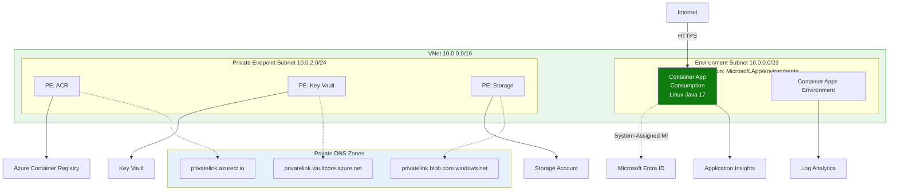
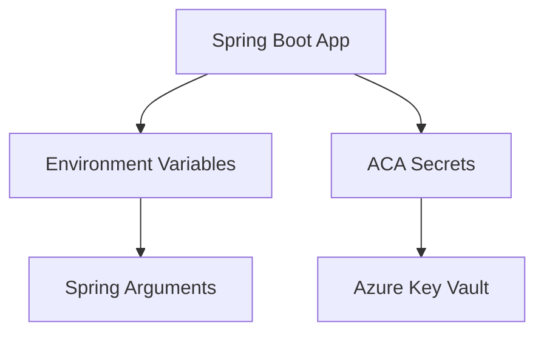

---
content_sources:
  diagrams:
  - id: this-tutorial-assumes-a-production-ready-container
    type: flowchart
    source: mslearn-adapted
    based_on:
    - https://learn.microsoft.com/azure/container-apps/manage-secrets
  - id: configuration-workflow
    type: flowchart
    source: mslearn-adapted
    based_on:
    - https://learn.microsoft.com/azure/container-apps/manage-secrets
validation:
  az_cli:
    last_tested: null
    cli_version: null
    result: not_tested
  bicep:
    last_tested: null
    result: not_tested
---
# 03 - Configuration and Secrets

Spring Boot applications on Azure Container Apps use environment variables, secrets, and Azure Key Vault for flexible, secure configuration management. This guide covers the essential patterns for configuring your Java application in production.

!!! info "Infrastructure Context"
    **Service**: Container Apps (Consumption) | **Network**: VNet integrated | **VNet**: ✅

    This tutorial assumes a production-ready Container Apps deployment with a custom VNet, ACR with managed identity pull, and private endpoints for backend services.

    <!-- diagram-id: this-tutorial-assumes-a-production-ready-container -->


## Configuration Workflow

<!-- diagram-id: configuration-workflow -->


## Prerequisites

- Existing Azure Container App (created in [02 - First Deploy](02-first-deploy.md))
- Azure CLI 2.57+

## Environment Variables

Spring Boot automatically maps environment variables to application properties using [relaxed binding](https://docs.spring.io/spring-boot/docs/current/reference/html/features.html#features.external-config.typesafe-configuration-properties.relaxed-binding).

### 1. Mapping Properties

| Application Property | Environment Variable |
| --- | --- |
| `spring.application.name` | `SPRING_APPLICATION_NAME` |
| `management.endpoint.health.show-details` | `MANAGEMENT_ENDPOINT_HEALTH_SHOW_DETAILS` |
| `logging.level.com.example` | `LOGGING_LEVEL_COM_EXAMPLE` |

### 2. Setting Environment Variables via CLI

Update your container app with new environment variables:

```bash
az containerapp update \
  --resource-group $RG \
  --name $APP_NAME \
  --set-env-vars "APP_VERSION=1.0.0" "RUNTIME_MODE=production"
```

| Command | Why it is used |
|---|---|
| `az containerapp update ...` | Updates the existing Container App configuration without recreating the app. |

???+ example "Expected output"
    ```text
    Updating container app...
    (New revision created: <your-app-name>--xxxxxxx)
    ```

## Secrets Management

Container Apps Secrets are encrypted and stored at the application level. They are often mapped to environment variables or referenced from Azure Key Vault.

### 1. Add a Local Secret

```bash
az containerapp secret set \
  --resource-group $RG \
  --name $APP_NAME \
  --secrets "db-password=<secret-value>"
```

| Command | Why it is used |
|---|---|
| `az containerapp secret set ...` | Manages Container Apps secrets without exposing secret values in plain configuration. |

### 2. Map Secret to Environment Variable

Once a secret is created, map it to an environment variable in your container:

```bash
az containerapp update \
  --resource-group $RG \
  --name $APP_NAME \
  --set-env-vars "SPRING_DATASOURCE_PASSWORD=secretref:db-password"
```

| Command | Why it is used |
|---|---|
| `az containerapp update ...` | Updates the existing Container App configuration without recreating the app. |

## Azure Key Vault Integration

For production, store your secrets in Azure Key Vault and reference them from Container Apps.

### 1. Create a Key Vault

```bash
KV_NAME="kv-java-$(date +%s)"
az keyvault create --resource-group $RG --name $KV_NAME --location $LOCATION
```

| Command | Why it is used |
|---|---|
| `az keyvault create ...` | Creates or inspects Key Vault resources used by managed identity or secret references. |

### 2. Configure Managed Identity

To access Key Vault securely, enable a System-Assigned Managed Identity for your Container App.

```bash
# Enable Managed Identity
az containerapp identity assign \
  --resource-group $RG \
  --name $APP_NAME \
  --system-assigned

# Grant Key Vault Secret User permissions
PRINCIPAL_ID=$(az containerapp identity show --resource-group $RG --name $APP_NAME --query "principalId" --output tsv)
az role assignment create \
  --role "Key Vault Secrets User" \
  --assignee $PRINCIPAL_ID \
  --scope /subscriptions/<subscription-id>/resourceGroups/$RG/providers/Microsoft.KeyVault/vaults/$KV_NAME
```

| Command | Why it is used |
|---|---|
| `az containerapp identity assign ...` | Assigns or inspects managed identity configuration for the Container App. |

### 3. Reference Key Vault Secrets

```bash
# Add a secret to Key Vault
az keyvault secret set --vault-name $KV_NAME --name "db-password" --value "<secret-value>"

# Update ACA to reference Key Vault
az containerapp secret set \
  --resource-group $RG \
  --name $APP_NAME \
  --secrets "db-password=keyvaultref:https://$KV_NAME.vault.azure.net/secrets/db-password"
```

| Command | Why it is used |
|---|---|
| `az keyvault secret ...` | Creates or inspects Key Vault resources used by managed identity or secret references. |

## Best Practices for Java Apps

- **Spring Profiles**: Use `SPRING_PROFILES_ACTIVE` to switch between `dev`, `test`, and `prod` configurations.
- **Config Server**: Consider using Spring Cloud Config or Azure App Configuration for centralized configuration management in larger microservice architectures.
- **Property Precedence**: Spring Boot prioritizes environment variables over `application.properties` and `application.yml` files, which is ideal for cloud-native deployments.

!!! info "Relaxed Binding in Java"
    Spring Boot is very flexible with environment variable naming. Both `SPRING_DATASOURCE_URL` and `spring_datasource_url` will map to the `spring.datasource.url` property. Use ALL_CAPS with underscores for standard Docker and Azure compatibility.

## Verify configuration in Azure Portal

![ca-java-d38538 | Container App | Containers | Refresh | Send us your feedback | Container | Properties | Environment variables | Health probes | Volume mounts | Container details | Name | ca-java-d38538 | Image source | Azure Container Registry | Authentication | Managed identity | Subscription | Visual Studio Enterprise Subscription | Registry | acrbasicsd38538.azurecr.io | Image | java-sample | Image tag | v1 | Command override | Arguments override | Application | Revisions and replicas | Containers | Scale | Volumes | Settings | Networking | Ingress | Custom domains | CORS | Security | Monitoring | Log stream | Logs | Console | Alerts | Metrics](../../../assets/language-guides/java/tutorial/03-containers-blade.png)

**[Observed]** `ca-java-d38538`. `Container App`. `Containers`. `Refresh`. `Send us your feedback`. `Container`. `Properties`. `Environment variables`. `Health probes`. `Volume mounts`. `Container details`. `Name`. `ca-java-d38538`. `Image source`. `Azure Container Registry`. `Docker Hub or other registries`. `Authentication`. `Managed identity`. `Secrets`. `Identity`. `System assigned`. `Subscription`. `Visual Studio Enterprise Subscription`. `Registry`. `acrbasicsd38538.azurecr.io`. `Image`. `java-sample`. `Image tag`. `v1`. `Command override`. `Arguments override`. `Application`. `Revisions and replicas`. `Containers`. `Scale`. `Volumes`. `Settings`. `Networking`. `Ingress`. `Custom domains`. `CORS`. `Security`. `Monitoring`. `Log stream`. `Logs`. `Console`. `Alerts`. `Metrics`.

**[Inferred]** The `Environment variables` tab appears to map to the `--set-env-vars` lever exercised in [Setting Environment Variables via CLI](#2-setting-environment-variables-via-cli). The mapping between any rows on the `Environment variables` tab and Spring Boot property keys appears consistent with the relaxed-binding rules described in [Mapping Properties](#1-mapping-properties). The `Secrets` left-side entry appears related to the secret-to-environment-variable flow exercised in [Map Secret to Environment Variable](#2-map-secret-to-environment-variable). The `Authentication` value `Managed identity` appears consistent with the managed-identity configuration in [Configure Managed Identity](#2-configure-managed-identity).

**[Not Proven]** Additional configuration detail and runtime parameter detail are not visible on this view.

## See Also
- [Java Runtime Reference](../java-runtime.md)
- [02 - First Deploy to Azure](02-first-deploy.md)
- [Key Vault integration (Microsoft Learn)](https://learn.microsoft.com/azure/container-apps/manage-secrets?tabs=azure-cli#key-vault-references)

## Sources
- [Externalized Configuration (Spring Boot Documentation)](https://docs.spring.io/spring-boot/docs/current/reference/html/features.html#features.external-config)
- [Azure Container Apps Secrets (Microsoft Learn)](https://learn.microsoft.com/azure/container-apps/manage-secrets)
