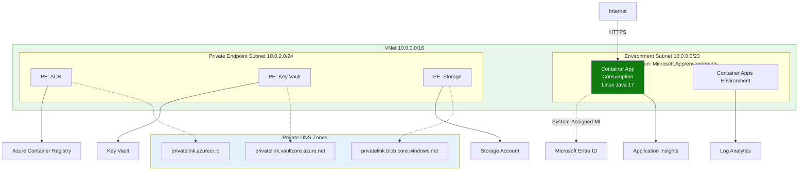
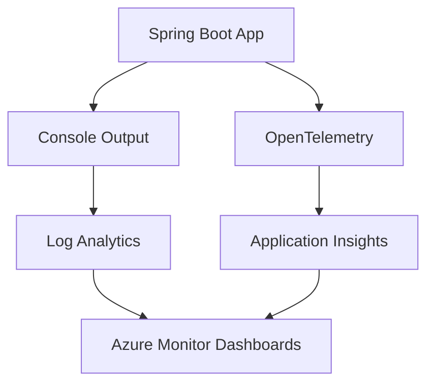
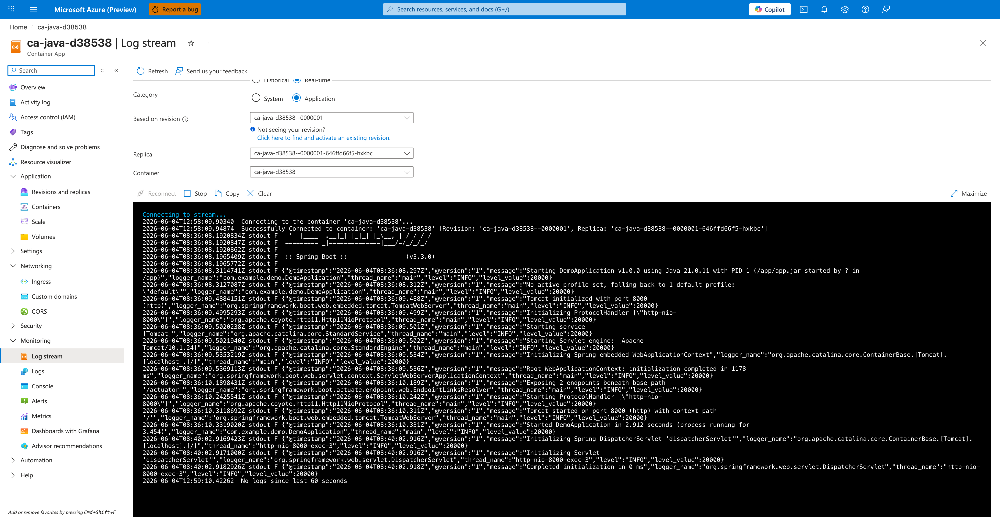

---
content_sources:
  diagrams:
  - id: this-tutorial-assumes-a-production-ready-container
    type: flowchart
    source: mslearn-adapted
    based_on:
    - https://learn.microsoft.com/azure/azure-monitor/app/java-in-process-agent
    - https://learn.microsoft.com/azure/container-apps/monitor
  - id: monitoring-workflow
    type: flowchart
    source: mslearn-adapted
    based_on:
    - https://learn.microsoft.com/azure/azure-monitor/app/java-in-process-agent
    - https://learn.microsoft.com/azure/container-apps/monitor
validation:
  az_cli:
    last_tested: null
    cli_version: null
    result: not_tested
  bicep:
    last_tested: null
    result: not_tested
content_validation:
  status: verified
  last_reviewed: '2026-05-23'
  reviewer: agent
  core_claims:
  - claim: This page uses Microsoft Learn as the primary source basis for its Azure-specific
      guidance.
    source: https://learn.microsoft.com/azure/azure-monitor/app/java-in-process-agent
    verified: true
---
# 04 - Logging and Monitoring

Azure Container Apps provides native support for observability through Azure Monitor, Log Analytics, and Application Insights. This guide covers how to configure structured logging and monitor your Spring Boot application in production.

!!! info "Infrastructure Context"
    **Service**: Container Apps (Consumption) | **Network**: VNet integrated | **VNet**: ✅

    This tutorial assumes a production-ready Container Apps deployment with a custom VNet, ACR with managed identity pull, and private endpoints for backend services.

    <!-- diagram-id: this-tutorial-assumes-a-production-ready-container -->


## Monitoring Workflow

<!-- diagram-id: monitoring-workflow -->


## Prerequisites

- Existing Azure Container App (created in [02 - First Deploy](02-first-deploy.md))
- Azure CLI 2.57+
- Azure Monitor Workspace (created automatically with ACA environment)

## Structured Logging

For production, Spring Boot should output logs to `stdout` in a format that's easy for log collectors to parse. JSON format is recommended.

### 1. Logback Configuration

The reference application includes a `src/main/resources/logback-spring.xml` file configured for structured logging.

```xml
<!-- Example logback-spring.xml snippet -->
<configuration>
    <appender name="CONSOLE" class="ch.qos.logback.core.ConsoleAppender">
        <encoder class="net.logstash.logback.encoder.LogstashEncoder">
            <!-- Custom fields for Azure integration -->
            <field name="containerApp">${CONTAINER_APP_NAME}</field>
            <field name="revision">${CONTAINER_APP_REVISION}</field>
        </encoder>
    </appender>
    <root level="INFO">
        <appender-ref ref="CONSOLE" />
    </root>
</configuration>
```

### 2. View Logs via CLI

Stream logs directly from your container app for real-time debugging:

```bash
az containerapp logs show \
  --resource-group $RG \
  --name $APP_NAME \
  --follow \
  --tail 100
```

| Command | Why it is used |
|---|---|
| `az containerapp logs show ...` | Runs the Azure CLI operation required by the documented step. |

???+ example "Expected output"
    ```text
    {"timestamp":"2026-04-05T10:00:00.000Z","level":"INFO","logger":"com.example.demo.DemoApplication","message":"Started DemoApplication in 8.67 seconds","containerApp":"<your-app-name>","revision":"<your-app-name>--xxxxxxx"}
    ```

## Application Insights Integration

Azure Monitor's Application Insights provides distributed tracing, performance monitoring, and live metrics.

### 1. Enable Application Insights

The easiest way to enable Application Insights for Spring Boot is using the [Java In-Process Agent](https://learn.microsoft.com/azure/azure-monitor/app/java-in-process-agent).

```bash
# Add Application Insights Connection String
INSTRUMENTATION_KEY=$(az monitor app-insights component show --app $APP_NAME --resource-group $RG --query "connectionString" --output tsv)

az containerapp update \
  --resource-group $RG \
  --name $APP_NAME \
  --set-env-vars "APPLICATIONINSIGHTS_CONNECTION_STRING=$INSTRUMENTATION_KEY"
```

| Command | Why it is used |
|---|---|
| `az monitor app-insights ...` | Creates or inspects Azure Monitor alerts, diagnostic settings, or metrics. |

### 2. Spring Boot Actuator

Ensure Spring Boot Actuator endpoints are exposed to provide health and metrics data to Azure Monitor.

```yaml
# application.yml
management:
  endpoints:
    web:
      exposure:
        include: health,info,metrics,prometheus
  endpoint:
    health:
      show-details: always
```

## Querying Logs with KQL via CLI

Use the Azure CLI to query logs directly from the command line. This is essential for automated monitoring and CI/CD pipelines.

### Get Log Analytics Workspace ID

```bash
WORKSPACE_ID=$(az monitor log-analytics workspace list \
  --resource-group $RG \
  --query "[0].customerId" \
  --output tsv)
```

### Query Console Logs

```bash
# Use the APP_NAME variable set in 02-first-deploy.md
az monitor log-analytics query \
  --workspace $WORKSPACE_ID \
  --analytics-query "ContainerAppConsoleLogs_CL | where ContainerAppName_s == '$APP_NAME' | project TimeGenerated, ContainerAppName_s, Log_s | take 5" \
  --output table
```

| Command | Why it is used |
|---|---|
| `az monitor log-analytics ...` | Creates or inspects Azure Monitor alerts, diagnostic settings, or metrics. |

???+ example "Expected output"
    ```text
    ContainerAppName_s    Log_s                                      TimeGenerated
    --------------------  -----------------------------------------  ----------------------------
    <your-app-name>       .   ____          _            __ _ _      2026-04-04T16:03:47.659Z
    <your-app-name>       /\\ / ___'_ __ _ _(_)_ __  __ _ \ \ \ \    2026-04-04T16:03:47.659Z
    <your-app-name>       Started DemoApplication in 8.67 seconds    2026-04-04T16:04:00.123Z
    ```

### Query Error Logs

```bash
az monitor log-analytics query \
  --workspace $WORKSPACE_ID \
  --analytics-query "ContainerAppConsoleLogs_CL | where ContainerAppName_s == '$APP_NAME' | where Log_s contains 'ERROR' | project TimeGenerated, Log_s | take 10" \
  --output table
```

| Command | Why it is used |
|---|---|
| `az monitor log-analytics ...` | Creates or inspects Azure Monitor alerts, diagnostic settings, or metrics. |

### Query System Logs (Startup Events)

```bash
az monitor log-analytics query \
  --workspace $WORKSPACE_ID \
  --analytics-query "ContainerAppSystemLogs_CL | where ContainerAppName_s == '$APP_NAME' | project TimeGenerated, Reason_s, Log_s | take 5" \
  --output table
```

| Command | Why it is used |
|---|---|
| `az monitor log-analytics ...` | Creates or inspects Azure Monitor alerts, diagnostic settings, or metrics. |

???+ example "Expected output"
    ```text
    Log_s                                                                         Reason_s            TimeGenerated
    ----------------------------------------------------------------------------  ------------------  ----------------------------
    Updating containerApp: <your-app-name>                                        ContainerAppUpdate  2026-04-04T16:03:06.835Z
    Replica '<your-app-name>--9kvcb6d-...' has been scheduled to run on a node.   AssigningReplica    2026-04-04T16:03:06.835Z
    KEDA is starting a watch for revision '<your-app-name>--9kvcb6d'...           KEDAScalersStarted  2026-04-04T16:03:06.835Z
    ```

## Monitoring Checklist

- [x] Application logs are written to `stdout` (not to a local file)
- [x] Log level is configurable via environment variable (`LOGGING_LEVEL_ROOT`)
- [x] Application Insights is receiving data (Traces, Exceptions, Requests)
- [x] Spring Boot Actuator endpoints are accessible and returning metrics

!!! warning "Avoid excessive logging"
    In a high-throughput production environment, avoid logging large request/response bodies or sensitive information (PII). Use `INFO` level for normal operations and `DEBUG` only when troubleshooting.

### Verify log stream in Azure Portal



**[Observed]** `Microsoft Azure (Preview)`. `Report a bug`. `Search resources, services, and docs (G+/)`. `Copilot`. `Home`. `ca-java-d38538`. `Container App`. `Log stream`. `Refresh`. `Send us your feedback`. `Historical`. `Real-time`. `Category`. `System`. `Application`. `Based on revision`. `ca-java-d38538--0000001`. `Not seeing your revision?`. `Click here to find and activate an existing revision.`. `Replica`. `ca-java-d38538--0000001-646ffd66f5-hxkbc`. `Container`. `ca-java-d38538`. `Reconnect`. `Stop`. `Copy`. `Clear`. `Maximize`. `Connecting to stream...`. `Connecting to the container 'ca-java-d38538'...`. `Successfully Connected to container: 'ca-java-d38538' [Revision: 'ca-java-d38538--0000001', Replica: 'ca-java-d38538--0000001-646ffd66f5-hxkbc']`. `Spring Boot`. `(v3.3.0)`. `Starting DemoApplication v1.0.0 using Java 21.0.11 with PID 1`. `com.example.demo.DemoApplication`. `Tomcat initialized with port 8000 (http)`. `Tomcat started on port 8000 (http) with context path '/'`. `Started DemoApplication in 2.912 seconds`. `No logs since last 60 seconds`. `Overview`. `Activity log`. `Access control (IAM)`. `Tags`. `Diagnose and solve problems`. `Resource visualizer`. `Application`. `Revisions and replicas`. `Containers`. `Scale`. `Volumes`. `Settings`. `Networking`. `Ingress`. `Custom domains`. `CORS`. `Security`. `Monitoring`. `Log stream`. `Logs`. `Console`. `Alerts`. `Metrics`. `Dashboards with Grafana`. `Advisor recommendations`.

**[Inferred]** The `Real-time` radio appears to map to the live tail behavior triggered by `az containerapp logs show --follow` in [View Logs via CLI](#2-view-logs-via-cli). The `Category` toggle value `Application` appears consistent with the JSON-structured `stdout` application log lines emitted via the Logback configuration in [Logback Configuration](#1-logback-configuration), each carrying `@timestamp`, `@version`, `message`, `logger_name`, `thread_name`, `level`, and `level_value` fields. The `Based on revision` selector value `ca-java-d38538--0000001` appears consistent with the `revision` identifier expected in the JSON log shape documented in [View Logs via CLI](#2-view-logs-via-cli). The `Replica` selector value `ca-java-d38538--0000001-646ffd66f5-hxkbc` appears consistent with the per-replica scoping shown in the `Successfully Connected to container` line emitted by the live tail flow described in [View Logs via CLI](#2-view-logs-via-cli).

**[Not Proven]** The Application Insights distributed traces and live metrics described in [Application Insights Integration](#application-insights-integration) are not visible on this view. The Spring Boot Actuator endpoint payloads from [Spring Boot Actuator](#2-spring-boot-actuator) are not visible on this view. The `ContainerAppConsoleLogs_CL` KQL query results from [Query Console Logs](#query-console-logs) are not visible on this view. The `ContainerAppSystemLogs_CL` KQL query rows showing `ContainerAppUpdate`, `AssigningReplica`, and `KEDAScalersStarted` reasons from [Query System Logs (Startup Events)](#query-system-logs-startup-events) are not visible on this view.

## See Also
- [07 - Revisions and Traffic](07-revisions-traffic.md)
- [Troubleshooting Playbooks](../../../troubleshooting/playbooks/index.md)
- [KQL Query Pack](../../../troubleshooting/kql/index.md)

## Sources
- [Azure Monitor Application Insights for Java (Microsoft Learn)](https://learn.microsoft.com/azure/azure-monitor/app/java-in-process-agent)
- [Spring Boot Logging (Documentation)](https://docs.spring.io/spring-boot/docs/current/reference/html/features.html#features.logging)
- [Monitor Azure Container Apps (Microsoft Learn)](https://learn.microsoft.com/azure/container-apps/monitor)
