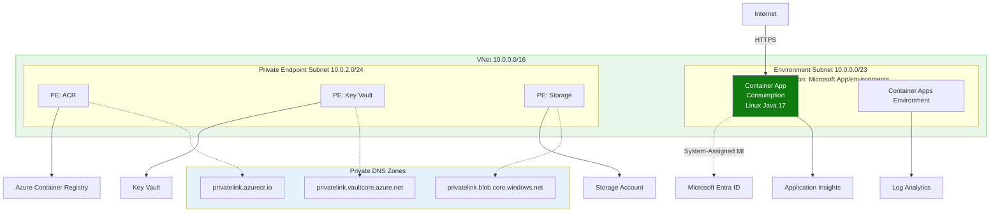
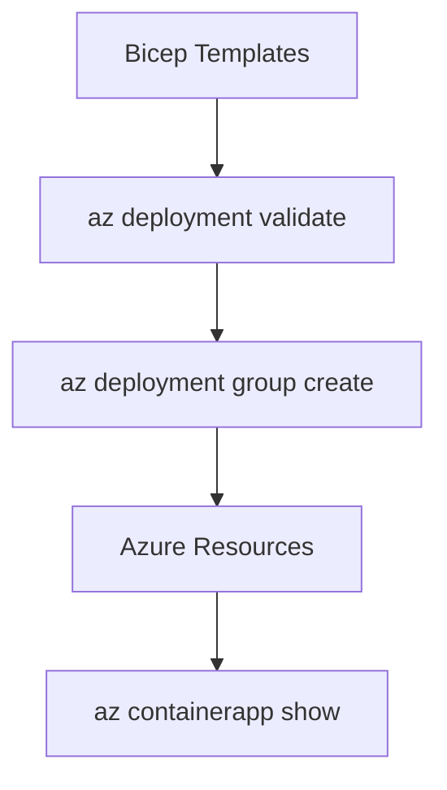

---
content_sources:
  diagrams:
    - id: this-tutorial-assumes-a-production-ready-container
      type: flowchart
      source: mslearn-adapted
      based_on:
        - https://learn.microsoft.com/azure/container-apps/get-started-xml-bicep?tabs=azure-cli
        - https://learn.microsoft.com/azure/templates/microsoft.app/containerapps
    - id: iac-workflow
      type: flowchart
      source: mslearn-adapted
      based_on:
        - https://learn.microsoft.com/azure/container-apps/get-started-xml-bicep?tabs=azure-cli
        - https://learn.microsoft.com/azure/templates/microsoft.app/containerapps
---

# 05 - Infrastructure as Code

Azure Bicep provides a declarative way to define and manage your Azure Container Apps resources. This guide covers how to define your Spring Boot environment, registry, and application using Bicep templates.

!!! info "Infrastructure Context"
    **Service**: Container Apps (Consumption) | **Network**: VNet integrated | **VNet**: ✅

    This tutorial assumes a production-ready Container Apps deployment with a custom VNet, ACR with managed identity pull, and private endpoints for backend services.

    <!-- diagram-id: this-tutorial-assumes-a-production-ready-container -->


## IaC Workflow

<!-- diagram-id: iac-workflow -->


## Prerequisites

- Existing Azure Subscription
- Azure CLI 2.57+
- Bicep CLI (included in Azure CLI)

## Defining the Container App Environment

The environment provides the networking and logging boundary for your container apps.

```bicep
// Container Apps Environment with Log Analytics
resource logAnalyticsWorkspace 'Microsoft.OperationalInsights/workspaces@2022-10-01' = {
  name: 'law-${baseName}'
  location: location
  properties: {
    sku: { name: 'PerGB2018' }
    retentionInDays: 30
  }
}

resource environment 'Microsoft.App/managedEnvironments@2023-05-01' = {
  name: 'cae-${baseName}'
  location: location
  properties: {
    appLogsConfiguration: {
      destination: 'log-analytics'
      logAnalyticsConfiguration: {
        customerId: logAnalyticsWorkspace.properties.customerId
        sharedKey: logAnalyticsWorkspace.listKeys().primarySharedKey
      }
    }
  }
}
```

## Defining the Spring Boot Container App

Configure the container app with appropriate CPU, memory, and port settings for a Java application.

```bicep
// Container App for Spring Boot
resource containerApp 'Microsoft.App/containerApps@2023-05-01' = {
  name: 'ca-${baseName}'
  location: location
  identity: {
    type: 'SystemAssigned'
  }
  properties: {
    managedEnvironmentId: environment.id
    configuration: {
      ingress: {
        external: true
        targetPort: 8000
      }
      secrets: [
        {
          name: 'db-password'
          value: dbPassword
        }
      ]
    }
    template: {
      containers: [
        {
          name: 'java-app'
          image: '${acrName}.azurecr.io/java-guide:latest'
          resources: {
            cpu: json('0.5')
            memory: '1.0Gi'
          }
          env: [
            {
              name: 'SPRING_PROFILES_ACTIVE'
              value: 'prod'
            }
            {
              name: 'DB_PASSWORD'
              secretRef: 'db-password'
            }
          ]
          probes: [
            {
              type: 'Liveness'
              httpGet: {
                path: '/health'
                port: 8000
              }
            }
            {
              type: 'Readiness'
              httpGet: {
                path: '/health'
                port: 8000
              }
            }
          ]
        }
      ]
    }
  }
}
```

## Deploying with the Azure CLI

1. **Create a Bicep template file**

    Create a `main.bicep` file with the environment and container app resources defined above, or use the shared `infra/main.bicep` template in this repository as a reference.

2. **Validate the deployment**

    ```bash
    az deployment group validate \
      --resource-group $RG \
      --template-file infra/main.bicep \
      --parameters baseName="java-guide"
    ```

3. **Deploy the infrastructure**

    ```bash
    az deployment group create \
      --resource-group $RG \
      --template-file infra/main.bicep \
      --parameters baseName="java-guide"
    ```

???+ example "Expected output"
    ```text
    Starting deployment...
    (Resources being created: ACR, Workspace, Environment, Container App)
    Deployment Name: main-2026-04-05
    State: Succeeded
    ```

## Infrastructure Checklist

- [x] ACA Environment is defined with Log Analytics
- [x] Container App specifies `targetPort: 8000`
- [x] Liveness and readiness probes point to `/health`
- [x] System-assigned managed identity is enabled for Key Vault or ACR access
- [x] Parameters are used for environment-specific values (e.g., SKU, region)

!!! tip "Use what-if to preview changes"
    Before deploying updates, use `az deployment group what-if` to see exactly what resources will be created, modified, or deleted without actually making the changes.

## CLI Alternative (No Bicep)

Use these commands when you need an imperative deployment path without Bicep.

### Step 1: Set variables

```bash
RG="rg-springboot-containerapp"
LOCATION="koreacentral"
APP_NAME="ca-springboot-demo"
BASE_NAME="springboot-app"
ENVIRONMENT_NAME="cae-springboot-demo"
ACR_NAME="crspringbootdemo"
LOG_NAME="log-springboot-demo"
```

???+ example "Expected output"
    ```text
    Variables exported for resource group, workspace, registry, environment, and app.
    ```

### Step 2: Create resource group and Log Analytics workspace

```bash
az group create --name $RG --location $LOCATION
az monitor log-analytics workspace create --resource-group $RG --workspace-name $LOG_NAME --location $LOCATION
```

???+ example "Expected output"
    ```text
    {
      "name": "rg-springboot-containerapp",
      "properties": {
        "provisioningState": "Succeeded"
      }
    }
    {
      "name": "log-springboot-demo",
      "customerId": "a1b2c3d4-e5f6-7890-abcd-ef1234567890",
      "id": "/subscriptions/<subscription-id>/resourceGroups/rg-springboot-containerapp/providers/Microsoft.OperationalInsights/workspaces/log-springboot-demo"
    }
    ```

### Step 3: Create ACR and Container Apps environment

```bash
az acr create --resource-group $RG --name $ACR_NAME --sku Basic
LOG_ID=$(az monitor log-analytics workspace show --resource-group $RG --workspace-name $LOG_NAME --query customerId --output tsv)
LOG_KEY=$(az monitor log-analytics workspace get-shared-keys --resource-group $RG --workspace-name $LOG_NAME --query primarySharedKey --output tsv)
az containerapp env create --resource-group $RG --name $ENVIRONMENT_NAME --location $LOCATION --logs-workspace-id $LOG_ID --logs-workspace-key $LOG_KEY
```

???+ example "Expected output"
    ```text
    {
      "name": "crspringbootdemo",
      "loginServer": "crspringbootdemo.azurecr.io",
      "provisioningState": "Succeeded"
    }
    {
      "name": "cae-springboot-demo",
      "id": "/subscriptions/<subscription-id>/resourceGroups/rg-springboot-containerapp/providers/Microsoft.App/managedEnvironments/cae-springboot-demo",
      "provisioningState": "Succeeded"
    }
    ```

### Step 4: Create Container App with environment variables

```bash
az containerapp create --resource-group $RG --name $APP_NAME --environment $ENVIRONMENT_NAME --image $ACR_NAME.azurecr.io/$BASE_NAME:v1 --target-port 8000 --ingress external --env-vars SPRING_PROFILES_ACTIVE=prod --query "properties.configuration.ingress.fqdn"
```

???+ example "Expected output"
    ```text
    "ca-springboot-demo.gentlewave-1a2b3c4d.koreacentral.azurecontainerapps.io"
    ```

### Step 5: Validate configuration

```bash
az containerapp show --resource-group $RG --name $APP_NAME --query "{fqdn:properties.configuration.ingress.fqdn,targetPort:properties.configuration.ingress.targetPort,environmentVariables:properties.template.containers[0].env}"
```

???+ example "Expected output"
    ```json
    {
      "environmentVariables": [
        {
          "name": "SPRING_PROFILES_ACTIVE",
          "value": "prod"
        }
      ],
      "fqdn": "ca-springboot-demo.gentlewave-1a2b3c4d.koreacentral.azurecontainerapps.io",
      "targetPort": 8000
    }
    ```

## See Also

- [06 - CI/CD with GitHub Actions](06-ci-cd.md)
- [Bicep Documentation (Microsoft Learn)](https://learn.microsoft.com/azure/azure-resource-manager/bicep/)

## Sources
- [Bicep template for Azure Container Apps (Microsoft Learn)](https://learn.microsoft.com/azure/container-apps/get-started-xml-bicep?tabs=azure-cli)
- [Bicep resource reference (Microsoft Learn)](https://learn.microsoft.com/azure/templates/microsoft.app/containerapps)
