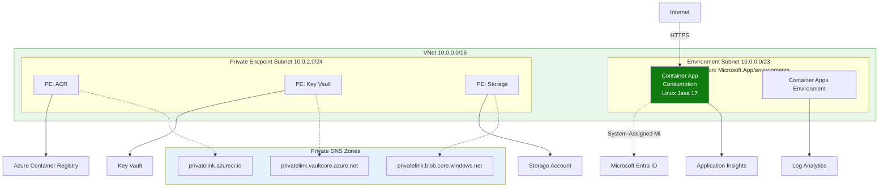
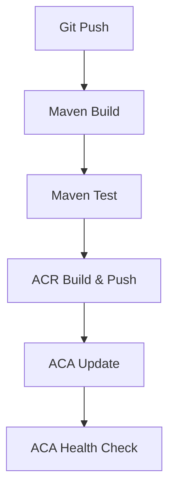
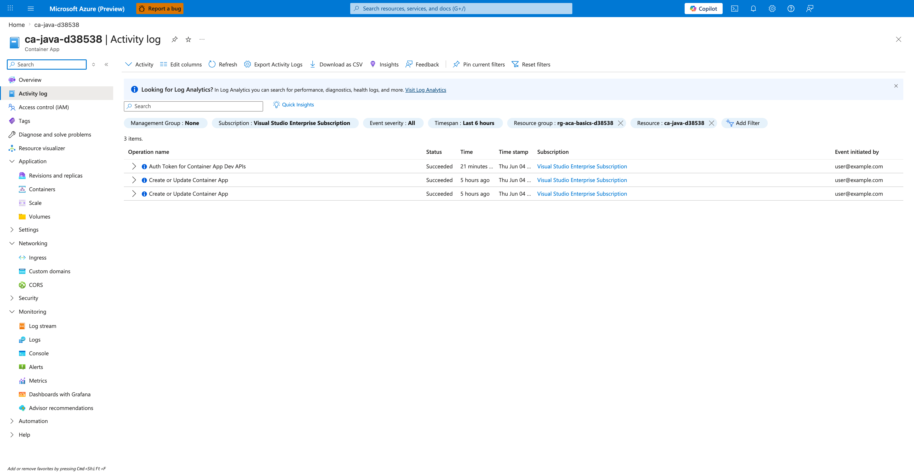

---
content_sources:
  diagrams:
  - id: this-tutorial-assumes-a-production-ready-container
    type: flowchart
    source: mslearn-adapted
    based_on:
    - https://learn.microsoft.com/azure/container-apps/github-actions
  - id: ci-cd-workflow
    type: flowchart
    source: mslearn-adapted
    based_on:
    - https://learn.microsoft.com/azure/container-apps/github-actions
validation:
  az_cli:
    last_tested: null
    cli_version: null
    result: not_tested
  bicep:
    last_tested: null
    result: not_tested
content_validation:
  status: verified
  last_reviewed: '2026-05-23'
  reviewer: agent
  core_claims:
  - claim: This page uses Microsoft Learn as the primary source basis for its Azure-specific
      guidance.
    source: https://learn.microsoft.com/azure/container-apps/github-actions
    verified: true
---
# 06 - CI/CD with GitHub Actions

Automating the build and deployment of your Spring Boot application ensures consistent, repeatable releases to Azure Container Apps. This guide covers how to set up a GitHub Actions workflow to build, push, and deploy your Java app on every commit.

!!! info "Infrastructure Context"
    **Service**: Container Apps (Consumption) | **Network**: VNet integrated | **VNet**: ✅

    This tutorial assumes a production-ready Container Apps deployment with a custom VNet, ACR with managed identity pull, and private endpoints for backend services.

    <!-- diagram-id: this-tutorial-assumes-a-production-ready-container -->


## CI/CD Workflow

<!-- diagram-id: ci-cd-workflow -->


## Prerequisites

- GitHub repository with your source code
- Existing Azure Container App and Container Registry (created in [02 - First Deploy](02-first-deploy.md))
- Azure CLI 2.57+

## Setting up GitHub Secrets

To allow GitHub Actions to authenticate with Azure, you must store credentials as [GitHub Secrets](https://docs.github.com/en/actions/security-guides/encrypted-secrets).

1. **Create a Service Principal**

    ```bash
    az ad sp create-for-rbac \
      --name "gh-actions-sp-java" \
      --role Contributor \
      --scopes /subscriptions/<subscription-id>/resourceGroups/$RG \
      --json-auth
    ```

    | Command | Why it is used |
    |---|---|
    | `az ad sp create-for-rbac ...` | Creates or inspects service principal settings for automation identity. |

2. **Add Secrets to GitHub**

    Add the following secrets in your GitHub repository's `Settings > Secrets and variables > Actions`:

    - `AZURE_CREDENTIALS`: The entire JSON output from the service principal command.
    - `AZURE_RG`: Your resource group name.
    - `ACR_NAME`: Your Azure Container Registry name.
    - `ACA_NAME`: Your Azure Container App name.

## Creating the Workflow File

Create a file named `.github/workflows/deploy.yml` in your repository.

```yaml
name: Build and Deploy Java to ACA

on:
  push:
    branches:
      - main
    paths:
      - 'apps/java-springboot/**'

jobs:
  build:
    runs-on: ubuntu-latest
    steps:
      - name: Checkout Code
        uses: actions/checkout@v4

      - name: Set up JDK 21
        uses: actions/setup-java@v4
        with:
          java-version: '21'
          distribution: 'temurin'
          cache: 'maven'

      - name: Build and Test with Maven
        run: |
          cd apps/java-springboot
          mvn package -DskipTests

      - name: Azure Login
        uses: azure/login@v2
        with:
          creds: ${{ secrets.AZURE_CREDENTIALS }}

      - name: Build and Push to ACR
        run: |
          cd apps/java-springboot
          az acr build \
            --registry ${{ secrets.ACR_NAME }} \
            --image java-guide:${{ github.sha }} \
            --file Dockerfile .

      - name: Deploy to ACA
        run: |
          az containerapp update \
            --resource-group ${{ secrets.AZURE_RG }} \
            --name ${{ secrets.ACA_NAME }} \
            --image ${{ secrets.ACR_NAME }}.azurecr.io/java-guide:${{ github.sha }}
```

| Command | Why it is used |
|---|---|
| `az acr build ...` | Builds and pushes the container image to Azure Container Registry. |

## Verifying the Deployment

1. **Check the GitHub Actions tab**

    Navigate to the `Actions` tab in your repository and verify that the workflow has run successfully.

2. **Verify the new revision**

    ```bash
    az containerapp revision list \
      --resource-group $RG \
      --name $APP_NAME \
      --query "[0].name" --output tsv
    ```

    | Command | Why it is used |
    |---|---|
    | `az containerapp revision list ...` | Lists revisions so rollout state, traffic, and health can be verified. |

    ???+ example "Expected output"
        ```text
        <your-app-name>--xxxxxxx
        ```

3. **Verify the application health**

    ```bash
    curl https://<your-aca-fqdn>/health
    ```

## CI/CD Checklist

- [x] Service principal has `Contributor` permissions on the resource group
- [x] Maven cache is enabled in GitHub Actions to speed up builds
- [x] Workflow uses specific commit SHAs for container image tags (avoid `latest`)
- [x] Workflow triggers only on changes to the application's source path
- [x] Deployment is verified by a health check endpoint

!!! info "Using Federated Credentials (OIDC)"
    For enhanced security, consider using [Workload Identity Federation](https://learn.microsoft.com/azure/developer/github/connect-from-azure?tabs=azure-portal%2Clinux) (OIDC) instead of storing secrets in GitHub. This removes the need for long-lived service principal keys.

### Verify deployment activity in Azure Portal



**[Observed]** `Microsoft Azure (Preview)`. `Report a bug`. `Search resources, services, and docs (G+/)`. `Copilot`. `Home`. `ca-java-d38538`. `Container App`. `Activity log`. `Activity`. `Edit columns`. `Refresh`. `Export Activity Logs`. `Download as CSV`. `Insights`. `Feedback`. `Pin current filters`. `Reset filters`. `Looking for Log Analytics?`. `Visit Log Analytics`. `Search`. `Quick Insights`. `Management Group`. `None`. `Subscription`. `Visual Studio Enterprise Subscription`. `Event severity`. `All`. `Timespan`. `Last 6 hours`. `Resource group`. `rg-aca-basics-d38538`. `Resource`. `ca-java-d38538`. `Add Filter`. `3 items.`. `Operation name`. `Status`. `Time`. `Time stamp`. `Subscription`. `Event initiated by`. `Auth Token for Container App Dev APIs`. `Create or Update Container App`. `Succeeded`. `21 minutes ...`. `5 hours ago`. `Thu Jun 04 ...`. `user@example.com`. `Overview`. `Activity log`. `Access control (IAM)`. `Tags`. `Diagnose and solve problems`. `Resource visualizer`. `Application`. `Revisions and replicas`. `Containers`. `Scale`. `Volumes`. `Settings`. `Networking`. `Ingress`. `Custom domains`. `CORS`. `Security`. `Monitoring`. `Log stream`. `Logs`. `Console`. `Alerts`. `Metrics`. `Dashboards with Grafana`. `Advisor recommendations`.

**[Inferred]** The resource-scoped filter chips `Resource group` value `rg-aca-basics-d38538` and `Resource` value `ca-java-d38538` appear to map to the same `${{ secrets.AZURE_RG }}` and `${{ secrets.ACA_NAME }}` values passed to `--resource-group` and `--name` by the `az containerapp update` step in [Creating the Workflow File](#creating-the-workflow-file). The `Create or Update Container App` row appears consistent with the deployment outcome that the same `az containerapp update` step in [Creating the Workflow File](#creating-the-workflow-file) is expected to trigger when the workflow runs against the configured `ACA_NAME` secret. The `Succeeded` `Status` appears consistent with the healthy rollout signal that [Verifying the Deployment](#verifying-the-deployment) looks for via `az containerapp revision list`, which returns the active revision name when the rollout completes without error. The repeated `Create or Update Container App` rows with `Succeeded` `Status` within the `Last 6 hours` `Timespan` appear consistent with multiple workflow runs invoking the `az containerapp update` step in [Creating the Workflow File](#creating-the-workflow-file) against the same `ACA_NAME` secret.

**[Not Proven]** Additional GitHub Actions workflow output and CLI command output are not visible on this view.

## See Also
- [07 - Revisions and Traffic](07-revisions-traffic.md)
- [02 - First Deploy to Azure](02-first-deploy.md)
- [GitHub Actions for Azure (Microsoft Learn)](https://learn.microsoft.com/azure/container-apps/github-actions)

## Sources
- [Deploy to Azure Container Apps with GitHub Actions (Microsoft Learn)](https://learn.microsoft.com/azure/container-apps/github-actions)
- [Setup Java Action (GitHub Marketplace)](https://github.com/marketplace/actions/setup-java-jdk-binaries)
