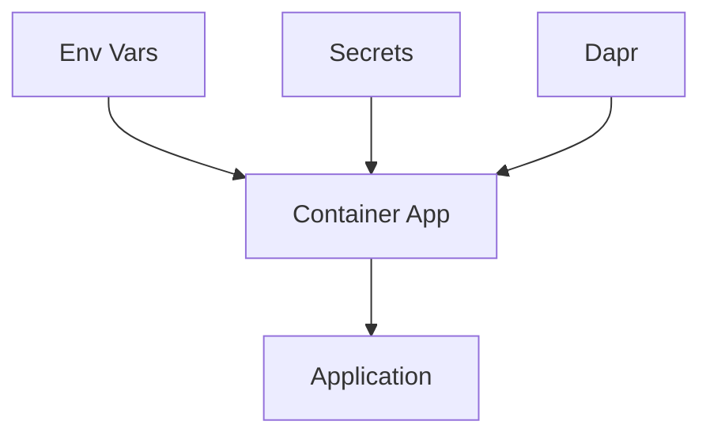

# 03 - Configuration, Secrets, and Dapr

This step configures runtime settings in Azure Container Apps, including environment variables, secrets, KEDA scaling rules, and Dapr sidecar options.

## Configuration Flow



## Prerequisites

- Completed [02 - First Deploy to Azure Container Apps](02-first-deploy.md)
- A running Container App

## Step-by-step

1. **Set standard variables**

    ```bash
    RG="rg-nodejs-guide"
    BASE_NAME="nodejs-guide"
    DEPLOYMENT_NAME="main"

    APP_NAME=$(az deployment group show \
      --name "$DEPLOYMENT_NAME" \
      --resource-group "$RG" \
      --query "properties.outputs.containerAppName.value" \
      --output tsv)
    ```

2. **Set environment variables**

    ```bash
    az containerapp update \
      --name "$APP_NAME" \
      --resource-group "$RG" \
      --set-env-vars "LOG_LEVEL=INFO" "FEATURE_FLAG=true"
    ```

    ???+ example "Expected output"
        ```json
        {
          "name": "ca-nodejs-guide-<unique-suffix>",
          "provisioningState": "Succeeded"
        }
        ```

3. **Store and reference a secret**

    ```bash
    az containerapp secret set \
      --name "$APP_NAME" \
      --resource-group "$RG" \
      --secrets "db-password=<secret-value>"
    ```

    ???+ example "Expected output"
        ```text
        Containerapp must be restarted in order for secret changes to take effect.
        ```
        ```json
        [
          {
            "name": "db-password"
          }
        ]
        ```

    ```bash
    az containerapp update \
      --name "$APP_NAME" \
      --resource-group "$RG" \
      --set-env-vars "DB_PASSWORD=secretref:db-password"
    ```

    ???+ example "Expected output"
        ```json
        {
          "name": "ca-nodejs-guide-<unique-suffix>",
          "provisioningState": "Succeeded"
        }
        ```

4. **Configure KEDA HTTP autoscaling**

    ```bash
    az containerapp update \
      --name "$APP_NAME" \
      --resource-group "$RG" \
      --min-replicas 0 \
      --max-replicas 10 \
      --scale-rule-name "http-scale" \
      --scale-rule-type "http" \
      --scale-rule-http-concurrency 50
    ```

    ???+ example "Expected output"
        ```json
        {
          "name": "ca-nodejs-guide-<unique-suffix>",
          "provisioningState": "Succeeded"
        }
        ```

5. **Enable Dapr sidecar**

    ```bash
    az containerapp dapr enable \
      --name "$APP_NAME" \
      --resource-group "$RG" \
      --dapr-app-id "$APP_NAME" \
      --dapr-app-port 8000
    ```

    ???+ example "Expected output"
        ```json
        {
          "appId": "ca-nodejs-guide-<unique-suffix>",
          "appPort": 8000,
          "appProtocol": "http",
          "enabled": true
        }
        ```

## Node.js example: read config safely

In Node.js, environment variables are accessed via `process.env`. Use the `dotenv` package (already included in the reference app) for local development.

```javascript
// src/config.js
const LOG_LEVEL = process.env.LOG_LEVEL || 'INFO';
const FEATURE_FLAG = process.env.FEATURE_FLAG === 'true';
const DB_PASSWORD = process.env.DB_PASSWORD;

module.exports = { LOG_LEVEL, FEATURE_FLAG, DB_PASSWORD };
```

## Advanced Topics

- Use Managed Identity to pull secrets directly from Azure Key Vault.
- Implement a custom KEDA scaler (e.g., Azure Service Bus) for event-driven processing.
- Use Dapr components for state management and pub/sub without writing SDK-specific code.

## See Also

- [04 - Logging, Monitoring, and Observability](04-logging-monitoring.md)
- [07 - Revisions and Traffic Splitting](07-revisions-traffic.md)
- [Recipes Index](recipes/index.md)

## Sources
- [Containers (Microsoft Learn)](https://learn.microsoft.com/azure/container-apps/containers)
- [Manage secrets in Azure Container Apps (Microsoft Learn)](https://learn.microsoft.com/azure/container-apps/manage-secrets)
