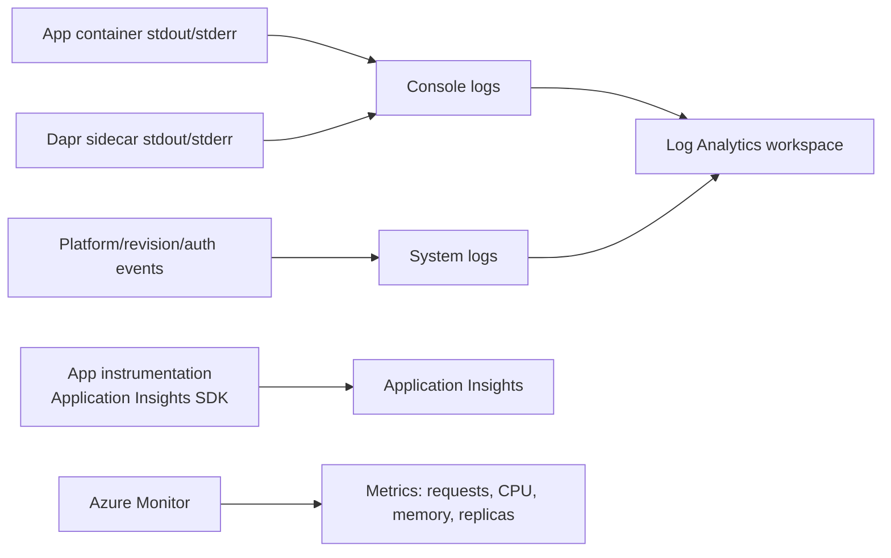

# 04 - Logging, Monitoring, and Observability

This tutorial step shows how to inspect console logs, query Log Analytics, and add Application Insights-based observability for production operations.

## How Observability Works in Container Apps



## Prerequisites

- Completed [03 - Configuration, Secrets, and Dapr](03-configuration.md)
- Log Analytics connected to your Container Apps environment

## Step-by-step

1. **Set standard variables**

    ```bash
    RG="rg-nodejs-guide"
    APP_NAME=$(az containerapp list --resource-group "$RG" --query "[0].name" --output tsv)
    ```

2. **Stream console logs**

    ```bash
    az containerapp logs show \
      --name "$APP_NAME" \
      --resource-group "$RG" \
      --follow
    ```

    ???+ example "Expected output"
        ```json
        {"timestamp":"2026-04-05T11:00:00.000Z","level":"INFO","message":"Server started on port 8000"}
        {"timestamp":"2026-04-05T11:01:00.000Z","level":"INFO","method":"GET","url":"/health","status":200}
        ```

    !!! note
        Use Ctrl+C to stop following logs.

3. **Check system logs for startup or image issues**

    ```bash
    az containerapp logs show \
      --name "$APP_NAME" \
      --resource-group "$RG" \
      --type system
    ```

    ???+ example "Expected output"
        ```json
        {"TimeStamp":"2026-04-05T11:00:00Z","Type":"Normal","ContainerAppName":"ca-nodejs-guide","Reason":"ConnectedToEventsServer","Msg":"Successfully connected to events server"}
        ```

4. **Query logs via CLI (recommended for automation)**

    Get your Log Analytics workspace ID and run KQL queries directly from the command line:

    ```bash
    # Get the workspace ID
    WORKSPACE_ID=$(az monitor log-analytics workspace list \
      --resource-group "$RG" \
      --query "[0].customerId" \
      --output tsv)

    # Query console logs
    az monitor log-analytics query \
      --workspace $WORKSPACE_ID \
      --analytics-query "ContainerAppConsoleLogs_CL | where ContainerAppName_s == 'ca-nodejs-guide' | project TimeGenerated, ContainerAppName_s, Log_s | take 5" \
      --output table
    ```

    ???+ example "Expected output"
        ```text
        ContainerAppName_s    Log_s                                                                                          TimeGenerated
        --------------------  ---------------------------------------------------------------------------------------------  ----------------------------
        ca-nodejs-guide       {"timestamp":"2026-04-04T16:10:50.376Z","level":"INFO","message":"Server started on port 8000"}  2026-04-04T16:10:51.723Z
        ca-nodejs-guide       {"timestamp":"2026-04-04T16:11:58.005Z","level":"INFO","method":"GET","path":"/health",...}      2026-04-04T16:11:58.474Z
        ```

5. **Query for errors via CLI**

    ```bash
    az monitor log-analytics query \
      --workspace $WORKSPACE_ID \
      --analytics-query "ContainerAppConsoleLogs_CL | where ContainerAppName_s == 'ca-nodejs-guide' | where Log_s has_any ('error', 'exception', 'failed') | project TimeGenerated, Log_s | take 10" \
      --output table
    ```

    ???+ example "Expected output"
        If no errors exist, the query returns an empty result set:

        ```text
        TableName
        -------------
        PrimaryResult
        ```

        If errors exist, they appear with timestamps:

        ```text
        TimeGenerated                 Log_s
        ----------------------------  -------------------------------------------------------
        2026-04-05T11:05:00.000Z      {"level":"ERROR","message":"Database connection failed"}
        ```

6. **Enable Application Insights (OpenTelemetry)**

    The reference app includes the `applicationinsights` SDK. To enable it, provide the connection string:

    ```bash
    # Get connection string from your App Insights resource
    CONNECTION_STRING="InstrumentationKey=...;IngestionEndpoint=..."

    az containerapp update \
      --name "$APP_NAME" \
      --resource-group "$RG" \
      --set-env-vars "APPLICATIONINSIGHTS_CONNECTION_STRING=$CONNECTION_STRING"
    ```

    The app will automatically start collecting:
    - HTTP request metrics (latency, throughput)
    - Exception traces
    - Console log redirection to App Insights
    - Dependency tracking (outbound HTTP calls)

## Node.js Structured Logging

The reference app uses a custom middleware to emit JSON logs. This ensures logs are easily searchable in Log Analytics.

```javascript
// src/middleware/logging.js
const jsonLogger = (req, res, next) => {
  res.on('finish', () => {
    console.log(JSON.stringify({
      timestamp: new Date().toISOString(),
      level: 'INFO',
      method: req.method,
      url: req.url,
      status: res.statusCode
    }));
  });
  next();
};
```

## Advanced Topics

- Use the `winston` or `pino` libraries for more advanced logging features like log levels and multiple transports.
- Configure custom metrics in Application Insights to track business-specific KPIs.
- Use Service Map in Application Insights to visualize dependencies between your microservices.

## See Also

- [03 - Configuration, Secrets, and Dapr](03-configuration.md)
- [06 - CI/CD with GitHub Actions](06-ci-cd.md)
- [Recipes Index](recipes/index.md)

## Sources
- [Log monitoring (Microsoft Learn)](https://learn.microsoft.com/azure/container-apps/log-monitoring)
- [Observability in Azure Container Apps (Microsoft Learn)](https://learn.microsoft.com/azure/container-apps/observability)
