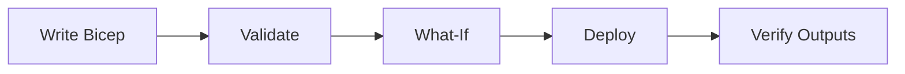

# 05 - Infrastructure as Code with Bicep

Use Bicep to define your Azure Container Apps platform consistently across environments. This step focuses on repeatable provisioning and safe updates.

## Infrastructure Lifecycle



## Prerequisites

- Completed [04 - Logging, Monitoring, and Observability](04-logging-monitoring.md)
- Bicep files under `infra/`

!!! tip "Run validate and what-if before every apply"
    Treat `az deployment group validate` and `az deployment group what-if` as required safety checks to prevent accidental production-impacting infrastructure changes.

## Step-by-step

1. **Set standard variables**

    ```bash
    RG="rg-nodejs-guide"
    BASE_NAME="nodejs-guide"
    LOCATION="koreacentral"
    DEPLOYMENT_NAME="main"
    ```

2. **Validate the Bicep template**

    ```bash
    az deployment group validate \
      --resource-group "$RG" \
      --template-file infra/main.bicep \
      --parameters baseName="$BASE_NAME" location="$LOCATION"
    ```

    ???+ example "Expected output"
        ```json
        {
          "status": "Succeeded",
          "error": null
        }
        ```

3. **Preview changes with what-if**

    ```bash
    az deployment group what-if \
      --resource-group "$RG" \
      --template-file infra/main.bicep \
      --parameters baseName="$BASE_NAME" location="$LOCATION"
    ```

    ???+ example "Expected output"
        ```text
        Resource and property changes are indicated with these symbols:
          + Create
          ~ Modify

        The deployment will update the following scope:
        Scope: /subscriptions/<subscription-id>/resourceGroups/rg-nodejs-guide

          ~ Microsoft.App/containerApps/ca-nodejs-guide [2024-03-01]
            ~ properties.template.containers[0].image: "<acr-name>.azurecr.io/nodejs-guide:v1"
        ```

4. **Deploy infrastructure**

    ```bash
    az deployment group create \
      --name "$DEPLOYMENT_NAME" \
      --resource-group "$RG" \
      --template-file infra/main.bicep \
      --parameters baseName="$BASE_NAME" location="$LOCATION"
    ```

    ???+ example "Expected output"
        ```json
        {
          "id": "/subscriptions/<subscription-id>/resourceGroups/rg-nodejs-guide/providers/Microsoft.Resources/deployments/main",
          "name": "main",
          "properties": {
            "provisioningState": "Succeeded",
            "outputs": {
              "containerAppName": { "type": "String", "value": "ca-nodejs-guide" },
              "containerAppEnvName": { "type": "String", "value": "cae-nodejs-guide" },
              "containerRegistryName": { "type": "String", "value": "<acr-name>" },
              "location": { "type": "String", "value": "koreacentral" }
            }
          }
        }
        ```

5. **Verify outputs and key resources**

    ```bash
    az deployment group show \
      --resource-group "$RG" \
      --name "$DEPLOYMENT_NAME" \
      --query properties.outputs
    ```

    ???+ example "Expected output"
        ```json
        {
          "containerAppName": {
            "type": "String",
            "value": "ca-nodejs-guide"
          },
          "containerAppEnvName": {
            "type": "String",
            "value": "cae-nodejs-guide"
          },
          "containerRegistryName": {
            "type": "String",
            "value": "<acr-name>"
          },
          "containerRegistryLoginServer": {
            "type": "String",
            "value": "<acr-name>.azurecr.io"
          }
        }
        ```

## Example Bicep snippet (environment + logs)

```bicep
param baseName string
var uniqueSuffix = uniqueString(resourceGroup().id)
var containerAppEnvName = 'cae-${baseName}-${uniqueSuffix}'

resource logAnalytics 'Microsoft.OperationalInsights/workspaces@2022-10-01' = {
  name: 'log-${baseName}-${uniqueSuffix}'
  location: resourceGroup().location
  properties: {
    sku: {
      name: 'PerGB2018'
    }
  }
}

resource environment 'Microsoft.App/managedEnvironments@2024-03-01' = {
  name: containerAppEnvName
  location: resourceGroup().location
  properties: {
    appLogsConfiguration: {
      destination: 'log-analytics'
      logAnalyticsConfiguration: {
        customerId: logAnalytics.properties.customerId
        sharedKey: logAnalytics.listKeys().primarySharedKey
      }
    }
  }
}
```

## Advanced Topics

- Use Node.js specific health probe configurations in your Bicep templates.
- Define environment variables and secrets for your Express app in the Container App resource.
- Automate the entire deployment process with GitHub Actions using the Bicep template.

!!! warning "Avoid out-of-band portal edits"
    Manual portal changes can create drift from your Bicep templates. Prefer template updates and redeployment so environments remain reproducible and auditable.

## See Also
- [02 - First Deploy to Azure Container Apps](02-first-deploy.md)
- [06 - CI/CD with GitHub Actions](06-ci-cd.md)
- [Managed Identity Recipe](../../platform/identity-and-secrets/managed-identity.md)

## Sources
- [Azure Resource Manager API spec (Microsoft Learn)](https://learn.microsoft.com/azure/container-apps/azure-resource-manager-api-spec)
- [Bicep resource definition: Microsoft.App/containerApps (Microsoft Learn)](https://learn.microsoft.com/azure/templates/microsoft.app/containerapps)
