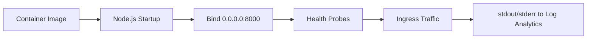

---
hide:
  - toc
---

# Node.js Runtime

This reference summarizes practical runtime defaults for Node.js workloads on Azure Container Apps so you can keep startup behavior, probe health, and logging predictable across revisions.

## Runtime Execution Model



!!! tip "Treat runtime settings as deployment contracts"
    Keep port binding, process model, and logging behavior stable between revisions. Changing all three at once makes incident triage much harder.

## Runtime Baseline (This Repo)

| Item | Value |
| --- | --- |
| Base image | `node:20-slim` |
| Web framework | Express |
| Process manager | Node.js (native) |
| Exposed/listen port | `8000` |
| Start command | `node src/app.js` |

## Node.js Memory Management

When running Node.js in containers, it's important to align the V8 heap size with the container memory limit.

| Setting | Example | When to change |
| --- | --- | --- |
| Max Heap Size | `--max-old-space-size=1536` | Set to ~75% of container memory (e.g., 1.5GB for 2GB container) |
| HTTP Keep-Alive | `server.keepAliveTimeout = 65000` | Increase to match or exceed Azure Ingress timeouts (60s) |
| Graceful Shutdown | `server.close()` | Ensure `SIGTERM` is handled to finish in-flight requests |

## Recommended Start Command Pattern

```bash
# In Dockerfile
CMD ["node", "--max-old-space-size=1536", "src/app.js"]
```

## Container Apps Alignment Checklist

| Check | Expected |
| --- | --- |
| ACA `targetPort` | `8000` |
| Express bind | `0.0.0.0:8000` |
| Health endpoint | `GET /health` returns 200 |
| Logs | stdout/stderr JSON format |
| Secrets/config | Read from `process.env` |

## Quick Diagnostics

```bash
RG="rg-nodejs-guide"

# For CLI-deployed apps, set directly:
# APP_NAME="ca-nodejs-guide"

# For Bicep-deployed apps, capture from outputs:
DEPLOYMENT_NAME="main"
APP_NAME=$(az deployment group show \
  --name "$DEPLOYMENT_NAME" \
  --resource-group "$RG" \
  --query "properties.outputs.containerAppName.value" \
  --output tsv)

az containerapp logs show \
  --name "$APP_NAME" \
  --resource-group "$RG" \
  --type console --follow

az containerapp exec \
  --name "$APP_NAME" \
  --resource-group "$RG" \
  --command "/bin/sh"

# Inside container
node --version
npm list --depth=0
ps aux
```

## Frequent Runtime Failures

| Symptom | Root cause | Action |
| --- | --- | --- |
| Container healthy locally, failing in ACA | Port/ingress mismatch | Align Express bind and ACA `targetPort` |
| Memory leaks or OOM kills | V8 heap exceeds container limit | Set `--max-old-space-size` and check for leaks |
| Requests dropped during rollout | Missing `SIGTERM` handler | Implement graceful shutdown in `src/app.js` |
| Missing logs in Log Analytics | Console output not captured | Ensure logs are written to stdout/stderr, not files |

!!! warning "Avoid hardcoding runtime assumptions"
    If your app assumes a fixed port, writable local filesystem, or shell-only startup dependencies, revisions may pass locally but fail in Container Apps. Validate behavior with environment-driven configuration and health probes.

## See Also

- [Node.js Language Guide Index](./index.md)
- [01 - Run Locally with Docker](./01-local-development.md)
- [03 - Configuration, Secrets, and Dapr](./03-configuration.md)
- [Container Design Best Practices](../../best-practices/container-design.md)

## Sources
- [Azure Container Apps containers reference (Microsoft Learn)](https://learn.microsoft.com/azure/container-apps/containers)
- [Connect to services in Azure Container Apps (Microsoft Learn)](https://learn.microsoft.com/azure/container-apps/connect-apps)
