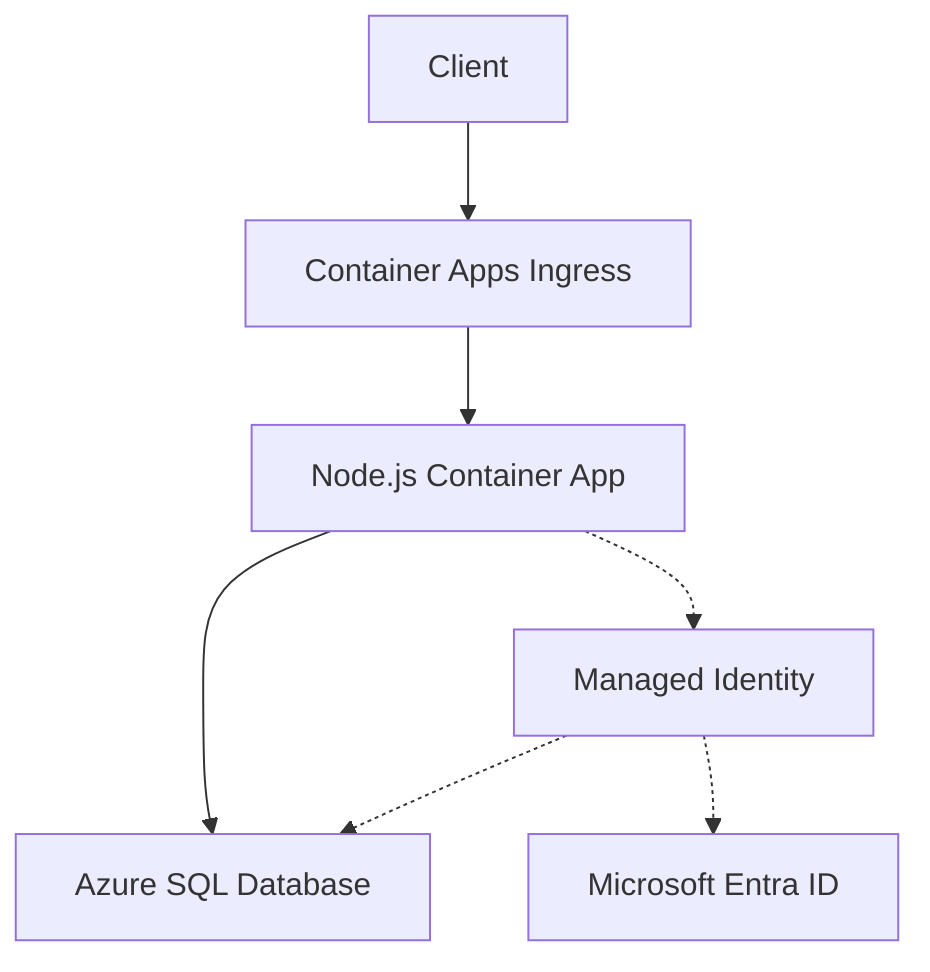

---
content_sources:
  diagrams:
  - id: architecture
    type: flowchart
    source: mslearn-adapted
    based_on:
    - https://learn.microsoft.com/azure/azure-sql/database/authentication-aad-overview
    - https://learn.microsoft.com/sql/connect/node-js/node-js-driver-for-sql-server
content_validation:
  status: verified
  last_reviewed: '2026-05-23'
  reviewer: agent
  core_claims:
  - claim: This page uses Microsoft Learn as the primary source basis for its Azure-specific
      guidance.
    source: https://learn.microsoft.com/azure/azure-sql/database/authentication-aad-overview
    verified: true
---
# Azure SQL Integration (Managed Identity)

Use this recipe to connect Azure Container Apps to Azure SQL Database with Microsoft Entra authentication first and SQL authentication only as a fallback.

## Architecture

<!-- diagram-id: architecture -->


Solid arrows show runtime data flow. Dashed arrows show identity and authentication.

## Prerequisites

- Existing Container App: `$APP_NAME` in `$RG`
- Existing Azure SQL logical server and database
- Azure SQL server configured with a Microsoft Entra admin
- Firewall rules, VNet integration, or Private Link already configured for your connectivity model

## Step 1: Enable managed identity on the Container App

```bash
az containerapp identity assign \
  --name "$APP_NAME" \
  --resource-group "$RG" \
  --system-assigned
```

| Command | Why it is used |
|---|---|
| `az containerapp identity assign ...` | Assigns or inspects managed identity configuration for the Container App. |

## Step 2: Grant SQL access to the app identity

From a Microsoft Entra-authenticated SQL session, create a contained user for the managed identity.

```sql
CREATE USER [<container-app-name>] FROM EXTERNAL PROVIDER;
ALTER ROLE db_datareader ADD MEMBER [<container-app-name>];
ALTER ROLE db_datawriter ADD MEMBER [<container-app-name>];
```

!!! warning
    The contained user name must match the Microsoft Entra display name of the managed identity or user-assigned identity you granted access to. Confirm the exact identity name before running `CREATE USER`.

## Step 3: Configure non-secret settings

```bash
az containerapp update \
  --name "$APP_NAME" \
  --resource-group "$RG" \
  --set-env-vars SQL_SERVER="$SQL_SERVER.database.windows.net" SQL_DATABASE="$SQL_DATABASE"
```

| Command | Why it is used |
|---|---|
| `az containerapp update ...` | Updates the existing Container App configuration without recreating the app. |

## Step 4: Node.js code (Entra token authentication)

Install dependencies:

```bash
npm install @azure/identity mssql
```

Use `DefaultAzureCredential` to get a token for Azure SQL:

```javascript
const sql = require("mssql");
const { DefaultAzureCredential } = require("@azure/identity");

async function createSqlConfig() {
  if (process.env.SQL_USER && process.env.SQL_PASSWORD) {
    return {
      server: process.env.SQL_SERVER,
      database: process.env.SQL_DATABASE,
      user: process.env.SQL_USER,
      password: process.env.SQL_PASSWORD,
      options: {
        encrypt: true,
        trustServerCertificate: false,
      },
    };
  }

  const credential = new DefaultAzureCredential();
  const token = await credential.getToken("https://database.windows.net/.default");

  return {
    server: process.env.SQL_SERVER,
    database: process.env.SQL_DATABASE,
    authentication: {
      type: "azure-active-directory-access-token",
      options: {
        token: token.token,
      },
    },
    options: {
      encrypt: true,
      trustServerCertificate: false,
    },
  };
}

async function run() {
  const pool = await sql.connect(await createSqlConfig());
  const result = await pool.request().query("SELECT TOP (1) name FROM sys.tables ORDER BY name");
  console.log(result.recordset);
  await pool.close();
}

run().catch((error) => {
  console.error(error);
  process.exitCode = 1;
});
```

## Step 5: SQL authentication fallback

Only use SQL authentication when Entra-only authentication is not available yet.

```bash
az containerapp secret set \
  --name "$APP_NAME" \
  --resource-group "$RG" \
  --secrets sql-password="<sql-password>"

az containerapp update \
  --name "$APP_NAME" \
  --resource-group "$RG" \
  --set-env-vars SQL_SERVER="$SQL_SERVER.database.windows.net" SQL_DATABASE="$SQL_DATABASE" SQL_USER="$SQL_USER" SQL_PASSWORD=secretref:sql-password
```

| Command | Why it is used |
|---|---|
| `az containerapp secret set ...` | Manages Container Apps secrets without exposing secret values in plain configuration. |

## Verification

1. Confirm identity is assigned to the app:

```bash
az containerapp show \
  --name "$APP_NAME" \
  --resource-group "$RG" \
  --query "identity" \
  --output json
```

| Command | Why it is used |
|---|---|
| `az containerapp show ...` | Reads the Container App configuration so the documented setting can be verified. |

2. Confirm runtime connectivity by checking application logs:

```bash
az containerapp logs show \
  --name "$APP_NAME" \
  --resource-group "$RG" \
  --follow false
```

| Command | Why it is used |
|---|---|
| `az containerapp logs show ...` | Runs the Azure CLI operation required by the documented step. |

3. Confirm Azure SQL firewall or private endpoint connectivity before blaming authentication.

## See Also

- [Managed Identity](managed-identity.md)
- [VNet Integration](../../../platform/networking/vnet-integration.md)
- [Private Endpoints](../../../platform/networking/private-endpoints.md)

## Sources

- [Azure SQL and Microsoft Entra authentication overview](https://learn.microsoft.com/azure/azure-sql/database/authentication-aad-overview)
- [Connect to Azure SQL Database using Node.js](https://learn.microsoft.com/sql/connect/node-js/node-js-driver-for-sql-server)
