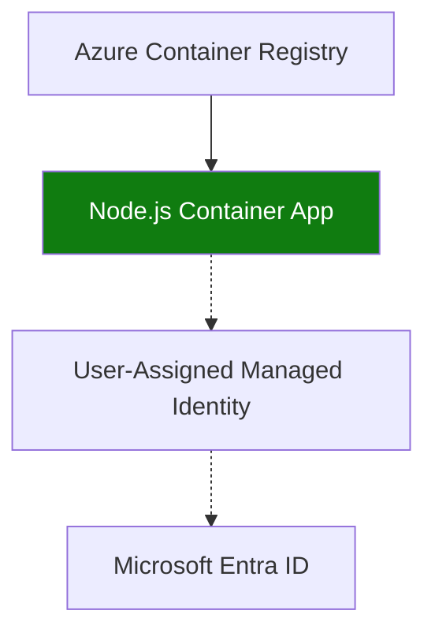

---
content_sources:
  diagrams:
    - id: use-azure-container-registry-acr-with
      type: flowchart
      source: mslearn-adapted
      based_on:
        - https://learn.microsoft.com/azure/container-apps/managed-identity-image-pull
        - https://learn.microsoft.com/azure/container-registry/container-registry-authentication
---

# Recipe: Container Registry in Node.js Apps on Azure Container Apps

Use Azure Container Registry (ACR) with managed identity to pull private Node.js images securely into Azure Container Apps.

<!-- diagram-id: use-azure-container-registry-acr-with -->


## Prerequisites

- Container Apps environment (`$ENVIRONMENT_NAME`) and app name (`$APP_NAME`)
- Resource group (`$RG`) and region (`$LOCATION`)
- ACR name (`$ACR_NAME`) and image tag (`$IMAGE_TAG`)
- Azure CLI with Container Apps extension and Docker

## Create registry and pull identity

```bash
az acr create \
  --name "$ACR_NAME" \
  --resource-group "$RG" \
  --location "$LOCATION" \
  --sku Standard

az identity create \
  --name "id-$APP_NAME" \
  --resource-group "$RG" \
  --location "$LOCATION"

export UAMI_ID=$(az identity show --name "id-$APP_NAME" --resource-group "$RG" --query id --output tsv)
export UAMI_PRINCIPAL_ID=$(az identity show --name "id-$APP_NAME" --resource-group "$RG" --query principalId --output tsv)
export ACR_ID=$(az acr show --name "$ACR_NAME" --resource-group "$RG" --query id --output tsv)

az role assignment create \
  --assignee-object-id "$UAMI_PRINCIPAL_ID" \
  --assignee-principal-type ServicePrincipal \
  --role "AcrPull" \
  --scope "$ACR_ID"
```

## Build and push Node.js image

```dockerfile
FROM node:20-alpine AS build
WORKDIR /app
COPY package*.json ./
RUN npm ci
COPY . .

FROM node:20-alpine
WORKDIR /app
COPY --from=build /app /app
ENV PORT=8000
EXPOSE 8000
CMD ["npm", "start"]
```

```bash
az acr login --name "$ACR_NAME"
docker build --file Dockerfile --tag "$ACR_NAME.azurecr.io/node-api:$IMAGE_TAG" .
docker push "$ACR_NAME.azurecr.io/node-api:$IMAGE_TAG"
```

## Configure Container Apps registry access

```bash
az containerapp create \
  --name "$APP_NAME" \
  --resource-group "$RG" \
  --environment "$ENVIRONMENT_NAME" \
  --image "$ACR_NAME.azurecr.io/node-api:$IMAGE_TAG" \
  --registry-server "$ACR_NAME.azurecr.io" \
  --registry-identity "$UAMI_ID" \
  --user-assigned "$UAMI_ID" \
  --ingress external \
  --target-port 8000
```

## Advanced Topics

- Use immutable tags and revision labels to simplify rollbacks.
- Add image scanning and signature validation in CI before push.
- Prefer `az acr build` for centralized builds when local Docker is restricted.

## See Also

- [Managed Identity](managed-identity.md)
- [Revision Validation](../../python/recipes/revision-validation.md)
- [Image Pull and Registry Operations](../../../operations/image-pull-and-registry/index.md)

## Sources

- [Authenticate with managed identity for image pull](https://learn.microsoft.com/azure/container-apps/managed-identity-image-pull)
- [Azure Container Registry authentication overview](https://learn.microsoft.com/azure/container-registry/container-registry-authentication)
