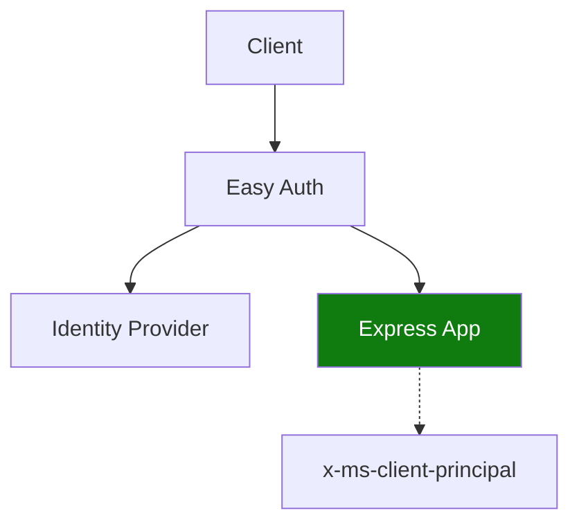

---
content_sources:
  diagrams:
    - id: use-container-apps-built-in-authentication-easy
      type: flowchart
      source: mslearn-adapted
      based_on:
        - https://learn.microsoft.com/azure/container-apps/authentication
        - https://learn.microsoft.com/azure/container-apps/authentication-identity-providers
---

# Recipe: Easy Auth in Node.js Apps on Azure Container Apps

Use Container Apps built-in authentication (Easy Auth) and parse the authenticated principal inside Express middleware.

<!-- diagram-id: use-container-apps-built-in-authentication-easy -->


## Prerequisites

- Container App with ingress enabled (`$APP_NAME`, `$RG`)
- Identity provider registration (for example Microsoft Entra ID)
- Azure CLI with Container Apps extension

```bash
az extension add --name containerapp --upgrade
```

## Enable Easy Auth

```bash
az containerapp auth update \
  --name "$APP_NAME" \
  --resource-group "$RG" \
  --enabled true \
  --platform runtimeVersion "~1" \
  --global-validation unauthenticatedClientAction RedirectToLoginPage
```

## Express middleware for principal parsing

```javascript
const express = require("express");

const app = express();

function parsePrincipal(headerValue) {
  const json = Buffer.from(headerValue, "base64").toString("utf8");
  return JSON.parse(json);
}

app.use((req, _res, next) => {
  const header = req.header("x-ms-client-principal");
  if (!header) {
    req.userContext = null;
    return next();
  }

  const principal = parsePrincipal(header);
  const claims = Object.fromEntries((principal.claims || []).map((c) => [c.typ, c.val]));
  req.userContext = {
    userId: principal.userId,
    identityProvider: principal.identityProvider,
    claims,
  };
  next();
});

app.get("/me", (req, res) => {
  if (!req.userContext) {
    return res.status(401).json({ error: "unauthenticated" });
  }
  return res.status(200).json(req.userContext);
});
```

## Authorization pattern

- Let Easy Auth handle identity verification and token/session mechanics.
- Enforce route-level authorization using claim values such as `roles` or `groups`.
- Return `403` when identity exists but required claims are missing.

## Advanced Topics

- Use separate app registrations per environment to avoid cross-environment trust issues.
- Add custom authorization middleware for tenant boundary checks.
- For service-to-service access, prefer managed identity over user session tokens.

## See Also

- [Managed Identity](managed-identity.md)
- [Key Vault Reference](key-vault-reference.md)
- [Identity and Secrets](../../../platform/identity-and-secrets/managed-identity.md)

## Sources

- [Authentication in Azure Container Apps](https://learn.microsoft.com/azure/container-apps/authentication)
- [Configure authentication providers in Azure Container Apps](https://learn.microsoft.com/azure/container-apps/authentication-identity-providers)
