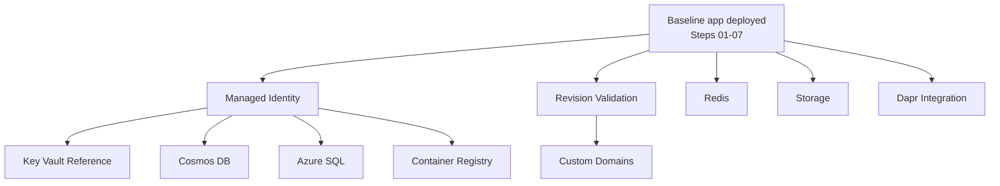

---
hide:
  - toc
content_sources:
  diagrams:
    - id: integration-dependency-map
      type: flowchart
      source: mslearn-adapted
      based_on:
        - https://learn.microsoft.com/azure/container-apps/
        - https://learn.microsoft.com/javascript/api/overview/azure/identity-readme
---

# Recipes: Integration Patterns for Azure Container Apps (Node.js)

Use these practical recipes to implement common production patterns for Node.js apps running on Azure Container Apps.

## Prerequisites

- Azure CLI 2.57+ with the Container Apps extension
- Existing Azure Container Apps environment (`$ENVIRONMENT_NAME`) and app (`$APP_NAME`)
- Resource group (`$RG`) and region (`$LOCATION`) variables set

```bash
az extension add --name containerapp --upgrade
az login
```

## Recipe Catalog

These recipes are intentionally task-oriented: each page solves a specific production integration problem without changing the core tutorial sequence.

## Recipe Selection Guide

| Recipe | Complexity | Key Concept | Prerequisites |
|---|---|---|---|
| Custom Container | Medium | Docker hardening, non-root runtime | Docker build basics, Step 01 |
| Native Dependencies | Medium | System libraries in Node.js images | Dockerfile familiarity |
| Container Registry | Low | ACR auth and pull flow | `$ACR_NAME`, `$RG`, `$APP_NAME` |
| Revision Validation | Medium | 0% traffic validation and promotion | Step 07 revisions concepts |
| Cosmos DB | Medium | Managed identity + RBAC for NoSQL | Identity basics, role assignment rights |
| Azure SQL | Medium | Entra-based auth for relational access | SQL server/database provisioned |
| Redis | Low | Cache integration and connection configuration | Redis instance available |
| Storage | Medium | Blob SDK + Azure Files mounts | Storage account and share |
| Managed Identity | Low | Secretless auth with `DefaultAzureCredential` | User/system-assigned identity enabled |
| Key Vault Reference | Medium | `secretref` and externalized secret management | Key Vault access policy / RBAC |
| Easy Auth | Medium | Built-in auth and claims consumption | Identity provider configuration |
| Dapr Integration | High | Sidecar-based service invocation/state/pubsub | Dapr concepts and component config |
| Custom Domains | Medium | DNS + certificate binding for ingress | Domain ownership and DNS control |

!!! tip "Choose by operational bottleneck"
    If your immediate issue is deployment safety, start with **Revision Validation**. If your issue is security posture, start with **Managed Identity** and **Key Vault Reference**. If your issue is integration velocity, start with data recipes (Cosmos DB, Azure SQL, Redis, Storage).

## Integration Dependency Map

<!-- diagram-id: integration-dependency-map -->


!!! warning "Apply prerequisites before recipe commands"
    Most recipe failures come from missing baseline resources or missing role assignments. Confirm `$RG`, `$APP_NAME`, `$ENVIRONMENT_NAME`, and (when needed) `$ACR_NAME` are already set and valid in your current subscription context before you run recipe commands.

### Container & Runtime

- **Custom Container** (Coming Soon): Build optimized Node.js images with non-root runtime and probe-ready configuration.
- **Native Dependencies** (Coming Soon): Package and run Node.js dependencies that require system libraries or compilation (e.g., node-gyp).

### Deployment & Revisions

- **Container Registry** (Coming Soon): Pull private images from Azure Container Registry with managed identity.
- **Revision Validation** (Coming Soon): Validate new revisions at 0% traffic and promote safely with canary routing.

### Data & Storage

- **Cosmos DB** (Coming Soon): Connect to Azure Cosmos DB with managed identity and RBAC.
- **Azure SQL** (Coming Soon): Access Azure SQL using Microsoft Entra authentication.
- **Redis** (Coming Soon): Integrate Azure Cache for Redis from Node.js apps.
- **Storage** (Coming Soon): Use Blob SDK patterns and Azure Files mounts.

### Security & Identity

- **Managed Identity** (Coming Soon): Use `@azure/identity` and RBAC to access Azure services.
- **Key Vault Reference** (Coming Soon): Reference Key Vault secrets in Container Apps configuration.
- **Easy Auth** (Coming Soon): Enable built-in authentication and consume identity claims in Express.

### Integration

- **Dapr Integration** (Coming Soon): Add pub/sub, service invocation, and state API patterns.
- **Custom Domains** (Coming Soon): Configure custom domains and certificates for ingress.

## Verification Steps

Confirm your app is healthy before applying any recipe:

```bash
az containerapp show \
  --name "$APP_NAME" \
  --resource-group "$RG" \
  --query "{name:name,provisioningState:properties.provisioningState,runningStatus:properties.runningStatus}" \
  --output json
```

## See Also

- [Node.js Tutorials](../index.md)
- [Operations](../../../operations/index.md)
- [Platform Architecture](../../../platform/index.md)

## Sources

- [Azure Container Apps documentation (Microsoft Learn)](https://learn.microsoft.com/azure/container-apps/)
- [Azure Identity client library for JavaScript](https://learn.microsoft.com/javascript/api/overview/azure/identity-readme)
- [Dapr documentation](https://docs.dapr.io/)
