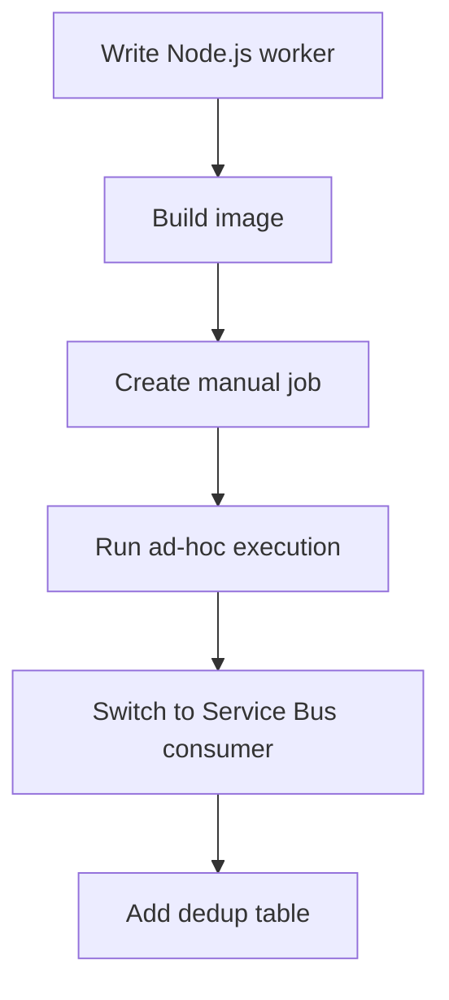

---
content_sources:
  diagrams:
    - id: nodejs-jobs-recipe-flow
      type: flowchart
      source: self-generated
      justification: Language recipe flow synthesized from Microsoft Learn Jobs guidance plus Azure SDK usage patterns.
      based_on:
        - https://learn.microsoft.com/azure/container-apps/jobs
        - https://learn.microsoft.com/javascript/api/overview/azure/identity-readme
        - https://learn.microsoft.com/javascript/api/overview/azure/service-bus-readme
---

# Recipe: Jobs in Node.js on Azure Container Apps

Use this recipe to build a Node.js console Job, turn it into a one-message Service Bus consumer, and add a dedup table pattern for safe retries.

## Prerequisites

- Azure Container Apps environment and registry
- Azure Service Bus namespace and queue for the event-driven example
- Node.js 20+, Docker, and Azure CLI

```bash
export RG="rg-aca-node-prod"
export ENVIRONMENT_NAME="aca-env-node-prod"
export ACR_NAME="acrnodeprod"
export JOB_NAME="job-node-manual"
export EVENT_JOB_NAME="job-node-servicebus"
export SERVICEBUS_NAMESPACE="sb-aca-prod"
export SERVICEBUS_QUEUE="orders"
```

## What You'll Build

- a manual Node.js Job with a console entrypoint
- an event-driven Service Bus consumer that receives one message and exits
- a dedup-table example you can port to Azure SQL or PostgreSQL for production

## Steps

<!-- diagram-id: nodejs-jobs-recipe-flow -->


### 1. Create a manual Node.js Job

`package.json`:

```json
{
  "name": "aca-node-job",
  "version": "1.0.0",
  "type": "module",
  "scripts": {
    "start": "node index.js"
  },
  "dependencies": {
    "@azure/identity": "^4.4.1",
    "@azure/service-bus": "^7.9.4",
    "sqlite3": "^5.1.7"
  }
}
```

`index.js`:

```javascript
const execution = process.env.CONTAINER_APP_JOB_EXECUTION_NAME || "local";
const task = process.env.TASK_NAME || "reconcile-orders";

console.log(JSON.stringify({ event: "job-start", execution, task }));
console.log(JSON.stringify({ event: "job-work", message: "processing batch" }));
console.log(JSON.stringify({ event: "job-end", status: "Succeeded" }));
```

`Dockerfile`:

```dockerfile
FROM node:20-alpine

WORKDIR /app
COPY package.json package-lock.json* ./
RUN npm install
COPY index.js .

CMD ["npm", "start"]
```

Deploy and trigger the Job:

```bash
az acr build \
  --registry "$ACR_NAME" \
  --image "node-jobs/manual:v1" \
  --file "Dockerfile" \
  "."

az containerapp job create \
  --name "$JOB_NAME" \
  --resource-group "$RG" \
  --environment "$ENVIRONMENT_NAME" \
  --trigger-type "Manual" \
  --image "$ACR_NAME.azurecr.io/node-jobs/manual:v1" \
  --replica-timeout 600 \
  --replica-retry-limit 1

az containerapp job start \
  --name "$JOB_NAME" \
  --resource-group "$RG"
```

### 2. Turn it into a one-message Service Bus consumer

Replace `index.js` with:

```javascript
import { DefaultAzureCredential } from "@azure/identity";
import { ServiceBusClient } from "@azure/service-bus";

const fullyQualifiedNamespace = `${process.env.SERVICEBUS_NAMESPACE}.servicebus.windows.net`;
const queueName = process.env.SERVICEBUS_QUEUE;

const client = new ServiceBusClient(fullyQualifiedNamespace, new DefaultAzureCredential());
const receiver = client.createReceiver(queueName);

try {
  const messages = await receiver.receiveMessages(1, { maxWaitTimeInMs: 15000 });
  if (messages.length === 0) {
    console.log(JSON.stringify({ event: "empty-queue" }));
  } else {
    const message = messages[0];
    console.log(JSON.stringify({ event: "message-received", messageId: message.messageId }));
    await receiver.completeMessage(message);
    console.log(JSON.stringify({ event: "message-completed", messageId: message.messageId }));
  }
} finally {
  await receiver.close();
  await client.close();
}
```

Create the event-driven Job:

```bash
az acr build \
  --registry "$ACR_NAME" \
  --image "node-jobs/servicebus:v1" \
  --file "Dockerfile" \
  "."

az containerapp job create \
  --name "$EVENT_JOB_NAME" \
  --resource-group "$RG" \
  --environment "$ENVIRONMENT_NAME" \
  --trigger-type "Event" \
  --image "$ACR_NAME.azurecr.io/node-jobs/servicebus:v1" \
  --scale-rule-name "orders-queue" \
  --scale-rule-type "azure-servicebus" \
  --scale-rule-metadata "queueName=$SERVICEBUS_QUEUE" "messageCount=1" "namespace=$SERVICEBUS_NAMESPACE.servicebus.windows.net" \
  --env-vars SERVICEBUS_NAMESPACE="$SERVICEBUS_NAMESPACE" SERVICEBUS_QUEUE="$SERVICEBUS_QUEUE"
```

### 3. Add a dedup table

For a runnable demo, add SQLite. In production, move the same insert-if-absent pattern to a shared durable database.

```javascript
import sqlite3 from "sqlite3";

function shouldProcess(messageId) {
  return new Promise((resolve, reject) => {
    const db = new sqlite3.Database("/tmp/dedup.db");
    db.serialize(() => {
      db.run("create table if not exists processed_messages (message_id text primary key)");
      db.run("insert or ignore into processed_messages(message_id) values (?)", [messageId], function (error) {
        if (error) {
          reject(error);
          return;
        }
        resolve(this.changes === 1);
      });
    });
  });
}
```

Use it before processing:

```javascript
if (await shouldProcess(message.messageId)) {
  console.log(JSON.stringify({ event: "process-message", messageId: message.messageId }));
} else {
  console.log(JSON.stringify({ event: "duplicate-message", messageId: message.messageId }));
}
```

## Verification

```bash
az containerapp job execution list \
  --name "$JOB_NAME" \
  --resource-group "$RG" \
  --output table

az containerapp job execution list \
  --name "$EVENT_JOB_NAME" \
  --resource-group "$RG" \
  --output table
```

## Next Steps / Clean Up

- Move the dedup table to a shared durable store.
- Add Application Insights correlation IDs to log payloads.
- Review [Jobs Operations](../../../operations/jobs/index.md) before production rollout.

## See Also

- [Node.js Recipes Index](index.md)
- [Container Apps Jobs Overview](../../../platform/jobs/index.md)
- [Job Design](../../../best-practices/job-design.md)

## Sources

- [Jobs in Azure Container Apps (Microsoft Learn)](https://learn.microsoft.com/azure/container-apps/jobs)
- [Azure Identity client library for JavaScript](https://learn.microsoft.com/javascript/api/overview/azure/identity-readme)
- [Azure Service Bus client library for JavaScript](https://learn.microsoft.com/javascript/api/overview/azure/service-bus-readme)
