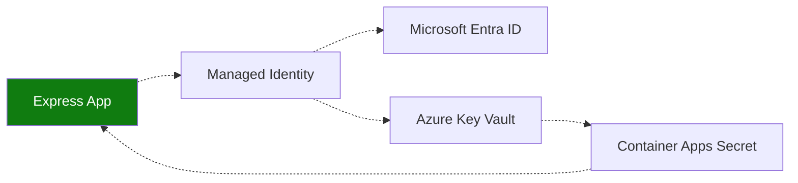

---
content_sources:
  diagrams:
    - id: use-key-vault-references-and-managed
      type: flowchart
      source: mslearn-adapted
      based_on:
        - https://learn.microsoft.com/azure/container-apps/manage-secrets
        - https://learn.microsoft.com/javascript/api/overview/azure/keyvault-secrets-readme
---

# Recipe: Key Vault Reference in Node.js Apps on Azure Container Apps

Use Key Vault references and managed identity so Express workloads can consume secrets without embedding values in code or deployment files.

<!-- diagram-id: use-key-vault-references-and-managed -->


## Prerequisites

- Container App (`$APP_NAME`) and resource group (`$RG`)
- Key Vault (`$KEYVAULT_NAME`) with secret name `api-key`
- Azure CLI with Container Apps extension

```bash
az extension add --name containerapp --upgrade
```

## Configure identity and Key Vault reference

```bash
az containerapp identity assign \
  --name "$APP_NAME" \
  --resource-group "$RG" \
  --system-assigned

export PRINCIPAL_ID=$(az containerapp show \
  --name "$APP_NAME" \
  --resource-group "$RG" \
  --query "identity.principalId" \
  --output tsv)

az role assignment create \
  --assignee-object-id "$PRINCIPAL_ID" \
  --assignee-principal-type ServicePrincipal \
  --role "Key Vault Secrets User" \
  --scope "$(az keyvault show --name "$KEYVAULT_NAME" --query id --output tsv)"

az containerapp secret set \
  --name "$APP_NAME" \
  --resource-group "$RG" \
  --secrets "api-key=keyvaultref:https://$KEYVAULT_NAME.vault.azure.net/secrets/api-key,identityref:system"

az containerapp update \
  --name "$APP_NAME" \
  --resource-group "$RG" \
  --set-env-vars "API_KEY=secretref:api-key"
```

## Express route using Key Vault SDK

```javascript
const express = require("express");
const { DefaultAzureCredential } = require("@azure/identity");
const { SecretClient } = require("@azure/keyvault-secrets");

const app = express();
const credential = new DefaultAzureCredential();
const keyVaultUrl = process.env.KEYVAULT_URL;
const client = new SecretClient(keyVaultUrl, credential);

app.get("/secret-check", async (_req, res) => {
  const secret = await client.getSecret("api-key");
  res.status(200).json({ configured: Boolean(secret.value) });
});
```

## Advanced Topics

- Prefer one vault per environment to reduce blast radius.
- Trigger a new revision after rotation when deterministic pickup timing is required.
- Use user-assigned identity for shared secret access across multiple apps.

## See Also

- [Managed Identity](managed-identity.md)
- [Container Registry](container-registry.md)
- [Key Vault Platform Guide](../../../platform/identity-and-secrets/key-vault.md)

## Sources

- [Manage secrets in Azure Container Apps](https://learn.microsoft.com/azure/container-apps/manage-secrets)
- [Azure Key Vault SecretClient for JavaScript](https://learn.microsoft.com/javascript/api/overview/azure/keyvault-secrets-readme)
