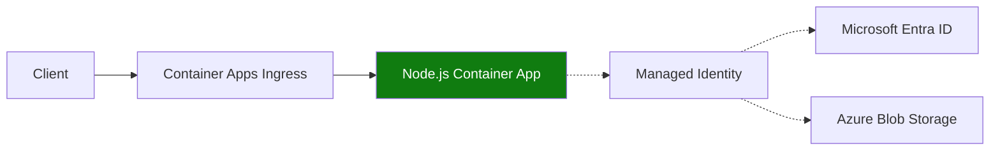

---
content_sources:
  diagrams:
    - id: use-managed-identity-and-defaultazurecredential-so
      type: flowchart
      source: mslearn-adapted
      based_on:
        - https://learn.microsoft.com/azure/container-apps/managed-identity
        - https://learn.microsoft.com/javascript/api/overview/azure/identity-readme
        - https://learn.microsoft.com/javascript/api/overview/azure/storage-blob-readme
---

# Recipe: Managed Identity in Node.js Apps on Azure Container Apps

Use managed identity and `DefaultAzureCredential` so your Express app can call Azure services without storing secrets.

<!-- diagram-id: use-managed-identity-and-defaultazurecredential-so -->


## Prerequisites

- Existing Container App (`$APP_NAME`) in resource group (`$RG`)
- Azure Storage account (`$STORAGE_ACCOUNT`) and container (`$STORAGE_CONTAINER`)
- Azure CLI with Container Apps extension

```bash
az extension add --name containerapp --upgrade
```

## Enable managed identity and RBAC

```bash
az containerapp identity assign \
  --name "$APP_NAME" \
  --resource-group "$RG" \
  --system-assigned

export PRINCIPAL_ID=$(az containerapp show \
  --name "$APP_NAME" \
  --resource-group "$RG" \
  --query "identity.principalId" \
  --output tsv)

az role assignment create \
  --assignee-object-id "$PRINCIPAL_ID" \
  --assignee-principal-type ServicePrincipal \
  --role "Storage Blob Data Reader" \
  --scope "$(az storage account show --name "$STORAGE_ACCOUNT" --resource-group "$RG" --query id --output tsv)"
```

## Use `DefaultAzureCredential` in Express

```javascript
const express = require("express");
const { DefaultAzureCredential } = require("@azure/identity");
const { BlobServiceClient } = require("@azure/storage-blob");

const app = express();
const credential = new DefaultAzureCredential();
const accountUrl = process.env.STORAGE_ACCOUNT_URL;
const containerName = process.env.STORAGE_CONTAINER || "app-data";

app.get("/blobs", async (_req, res) => {
  const service = new BlobServiceClient(accountUrl, credential);
  const container = service.getContainerClient(containerName);
  const names = [];
  for await (const blob of container.listBlobsFlat()) {
    names.push(blob.name);
  }
  res.status(200).json({ blobs: names });
});

app.listen(8000, () => console.log("listening on 8000"));
```

```bash
az containerapp update \
  --name "$APP_NAME" \
  --resource-group "$RG" \
  --set-env-vars \
    STORAGE_ACCOUNT_URL="https://$STORAGE_ACCOUNT.blob.core.windows.net" \
    STORAGE_CONTAINER="$STORAGE_CONTAINER"
```

## Advanced Topics

- Use user-assigned identities when multiple apps must share the same RBAC profile.
- Separate read and write access into distinct identities for tighter blast-radius control.
- Add startup probes that verify token acquisition and service authorization before traffic.

## See Also

- [Key Vault Reference](key-vault-reference.md)
- [Easy Auth](easy-auth.md)
- [Managed Identity Platform Guide](../../../platform/identity-and-secrets/managed-identity.md)

## Sources

- [Managed identities in Azure Container Apps](https://learn.microsoft.com/azure/container-apps/managed-identity)
- [Azure Identity client library for JavaScript](https://learn.microsoft.com/javascript/api/overview/azure/identity-readme)
- [Azure Storage Blob SDK for JavaScript](https://learn.microsoft.com/javascript/api/overview/azure/storage-blob-readme)
