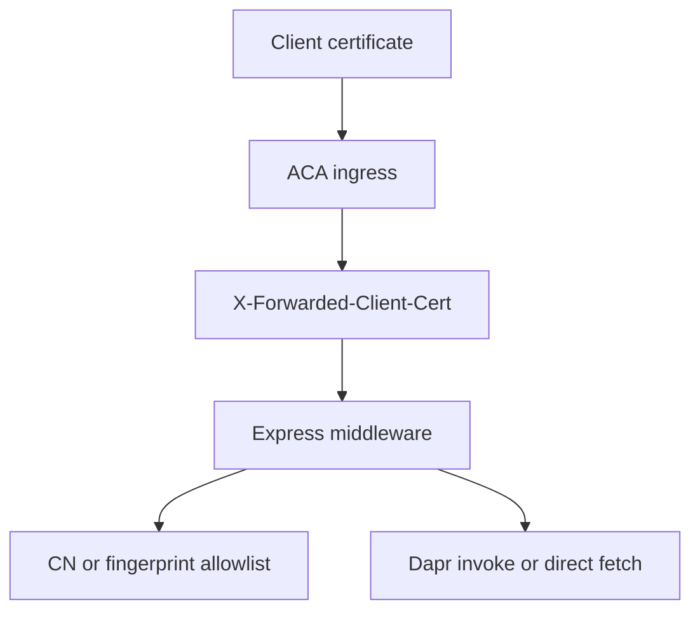

---
content_sources:
  diagrams:
    - id: express-xfcc-validation-flow
      type: flowchart
      source: mslearn-adapted
      based_on:
        - https://learn.microsoft.com/en-us/azure/container-apps/client-certificate-authorization
        - https://learn.microsoft.com/en-us/azure/container-apps/ingress-overview
        - https://learn.microsoft.com/en-us/azure/container-apps/connect-apps
---

# Recipe: mTLS Client Certificates in Node.js Apps on Azure Container Apps

Use Express middleware and the Node.js `X509Certificate` API to parse the forwarded client certificate and compare Dapr invocation with direct internal HTTP.

<!-- diagram-id: express-xfcc-validation-flow -->


## Prerequisites

- Express app running on Azure Container Apps.
- `clientCertificateMode` configured as `require` or `accept`.
- Node.js 20 or later.
- Optional Dapr sidecar enabled for internal service invocation.

`package.json` dependency note:

```json
{
  "dependencies": {
    "express": "^5.1.0"
  }
}
```

## What You'll Build

- Express middleware that reads `X-Forwarded-Client-Cert`.
- Certificate allowlist enforcement using subject CN or SHA-256 fingerprint.
- Outbound examples for Dapr `fetch` and direct `fetch`.

## Steps

### 1. Add the middleware and routes

```javascript
const crypto = require("node:crypto");
const express = require("express");

const app = express();

const allowedCommonNames = new Set(
  (process.env.ALLOWED_CERT_COMMON_NAMES || "api-client.contoso.com")
    .split(",")
    .map((value) => value.trim())
    .filter(Boolean)
);

const allowedFingerprints = new Set(
  (process.env.ALLOWED_CERT_FINGERPRINTS || "")
    .split(",")
    .map((value) => value.trim().toUpperCase())
    .filter(Boolean)
);

const directBackendUrl = process.env.DIRECT_BACKEND_URL || "http://ca-backend";
const daprHttpPort = process.env.DAPR_HTTP_PORT || "3500";
const daprTargetAppId = process.env.DAPR_TARGET_APP_ID || "backend";

function extractLeafPem(headerValue) {
  const match = headerValue.match(/Cert="([\s\S]*?)"(?:;|$)/);
  return match ? match[1].replace(/\\n/g, "\n") : null;
}

function parseCommonName(subject) {
  const match = /CN=([^,]+)/.exec(subject);
  return match ? match[1] : null;
}

app.use((req, res, next) => {
  const headerValue = req.get("X-Forwarded-Client-Cert");
  if (!headerValue) {
    return res.status(403).json({ error: "client certificate header missing" });
  }

  const leafPem = extractLeafPem(headerValue);
  if (!leafPem) {
    return res.status(403).json({ error: "leaf certificate missing from XFCC header" });
  }

  const certificate = new crypto.X509Certificate(leafPem);
  const commonName = parseCommonName(certificate.subject);
  const fingerprint = certificate.fingerprint256.replace(/:/g, "").toUpperCase();

  if (allowedFingerprints.size > 0 && allowedFingerprints.has(fingerprint)) {
    req.clientCertificate = { commonName, fingerprint };
    return next();
  }

  if (commonName && allowedCommonNames.has(commonName)) {
    req.clientCertificate = { commonName, fingerprint };
    return next();
  }

  return res.status(403).json({ error: "client certificate not allowlisted" });
});

app.get("/cert-info", (req, res) => {
  res.status(200).json(req.clientCertificate);
});

app.get("/call-backend/dapr", async (_req, res, next) => {
  try {
    const response = await fetch(
      `http://127.0.0.1:${daprHttpPort}/v1.0/invoke/${daprTargetAppId}/method/health`
    );
    res.status(200).json({ path: "dapr", status: await response.json() });
  } catch (error) {
    next(error);
  }
});

app.get("/call-backend/direct", async (_req, res, next) => {
  try {
    const response = await fetch(`${directBackendUrl}/health`);
    res.status(200).json({ path: "direct", status: await response.json() });
  } catch (error) {
    next(error);
  }
});

app.listen(8000, "0.0.0.0", () => {
  console.log("mTLS sample listening on port 8000");
});
```

### 2. Configure the app

```bash
az containerapp update \
  --name "$APP_NAME" \
  --resource-group "$RG" \
  --set-env-vars \
    ALLOWED_CERT_COMMON_NAMES="api-client.contoso.com,partner-gateway.contoso.com" \
    ALLOWED_CERT_FINGERPRINTS="" \
    DIRECT_BACKEND_URL="http://ca-backend" \
    DAPR_TARGET_APP_ID="backend"
```

### 3. Test with curl

```bash
curl --include \
  --cert "./client.pem" \
  --key "./client.key" \
  "https://${FQDN}/cert-info"
```

## Verification

- `200 OK` for an allowlisted client certificate.
- `403` for a missing or non-allowlisted certificate.
- `/call-backend/dapr` succeeds when both apps are Dapr-enabled.
- `/call-backend/direct` verifies direct internal routing separately from Dapr.

## See Also

- [Managed Identity](managed-identity.md)
- [Ingress Client Certificates](../../../platform/security/ingress-client-certificates.md)
- [mTLS Architecture in Azure Container Apps](../../../platform/security/mtls.md)

## Sources

- [Configure client certificate authentication in Azure Container Apps (Microsoft Learn)](https://learn.microsoft.com/en-us/azure/container-apps/client-certificate-authorization)
- [Ingress overview in Azure Container Apps (Microsoft Learn)](https://learn.microsoft.com/en-us/azure/container-apps/ingress-overview)
- [Communicate between container apps in Azure Container Apps (Microsoft Learn)](https://learn.microsoft.com/en-us/azure/container-apps/connect-apps)
